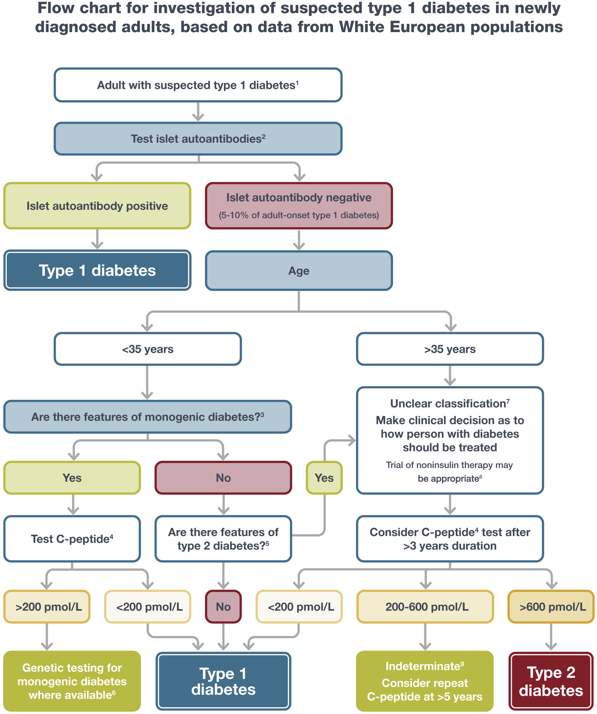
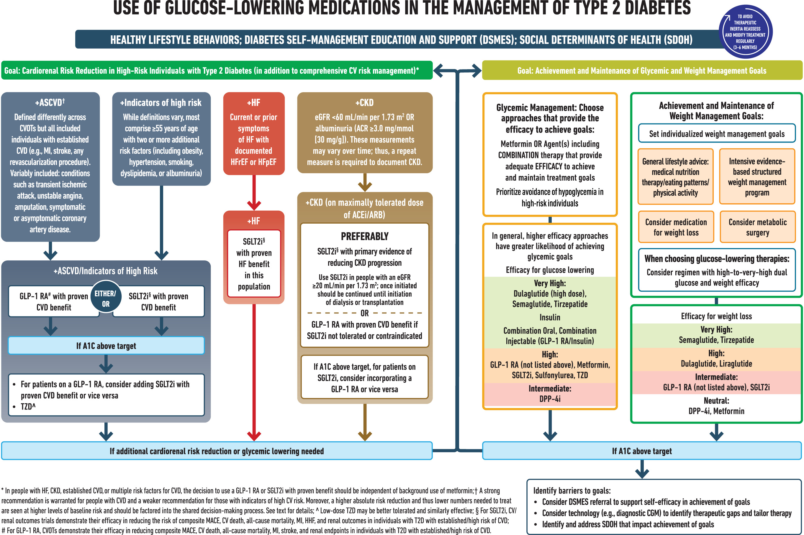
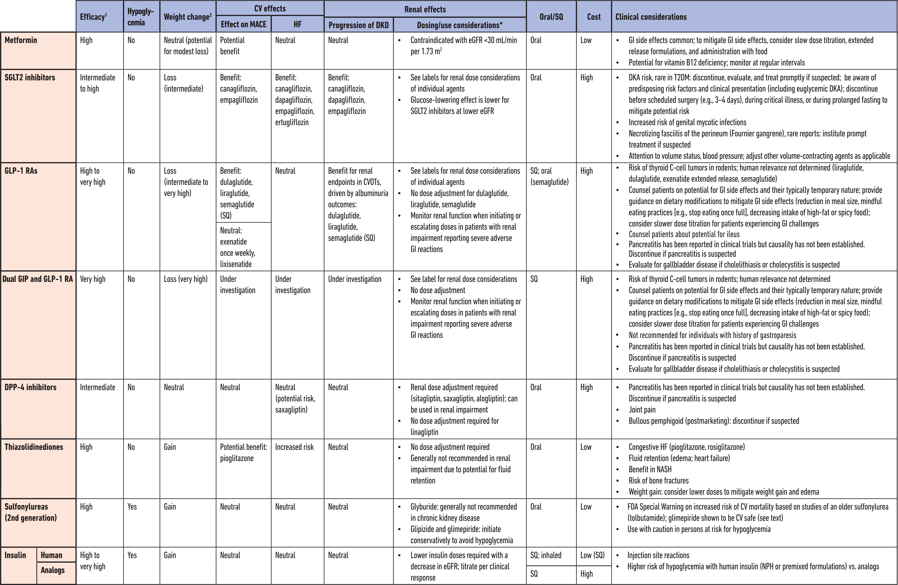
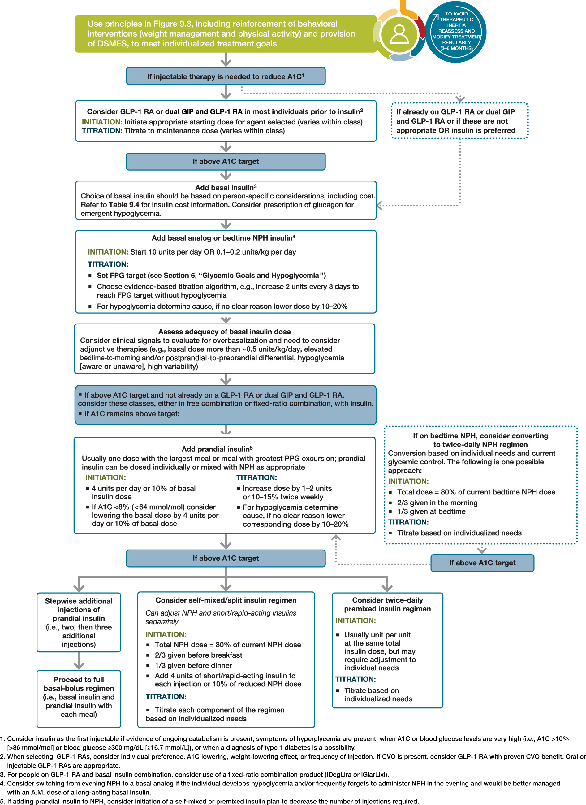

# DM  
  
## Diagnosis  
### Criteria for the diagnosis of diabetes in nonpregnant individuals [^1]  
  
* ==A1C ≥6.5% (≥48 mmol/mol)==. The test should be performed in a laboratory using a method that is NGSP certified and standardized to the DCCT assay.[^2] OR   
* ==Fasting plasma glucose (FPG) ≥126 mg/dL (≥7.0 mmol/L)==. Fasting is defined as no caloric intake for ==at least 8 h==.[^2] OR  
* ==2-h plasma glucose ≥200 mg/dL (≥11.1 mmol/L) during oral glucose tolerance test==. The test should be performed as described by the WHO, using a glucose load containing the equivalent of 75 g anhydrous glucose dissolved in water.[^2] OR   
* In an individual with ==classic symptoms of hyperglycemia or hyperglycemic crisis==, a ==random plasma glucose ≥200 mg/dL (≥11.1 mmol/L)==. Random is any time of the day without regard to time since previous meal.   
  
[^1]: DCCT, Diabetes Control and Complications Trial; NGSP, National Glycohemoglobin Standardization Program; WHO, World Health Organization.  
[^2]: In the absence of unequivocal hyperglycemia, diagnosis requires ==two abnormal test results obtained at the same time (e.g., A1C and FPG) or at two different time points==.  
  
<!-- more -->  
  
### Criteria defining prediabetes in nonpregnant individuals  
  
* ==A1C 5.7–6.4%== (39–47 mmol/mol) OR   
* ==FPG 100 mg/dL (5.6 mmol/L) to 125 mg/dL (6.9 mmol/L)== (impaired fasting glucose, IFG) OR   
* 2-h PG during 75-g OGTT 140 mg/dL (7.8 mmol/L) to 199 mg/dL (11.0 mmol/L) (impaired glucose tolerance, IGT)   
  
  
  
### Equivalent A1C levels and estimated average glucose (eAG)  
  
| A1C (%) | mg/dL[^3]     | mmol/L           |  
| ------- | ------------- | ---------------- |  
| 5       | 97 (76–120)   | 5.4 (4.2–6.7)    |  
| 6       | 126 (100–152) | 7.0 (5.5–8.5)    |  
| 7       | 154 (123–185) | 8.6 (6.8–10.3)   |  
| 8       | 183 (147–217) | 10.2 (8.1–12.1)  |  
| 9       | 212 (170–249) | 11.8 (9.4–13.9)  |  
| 10      | 240 (193–282) | 13.4 (10.7–15.7) |  
| 11      | 269 (217–314) | 14.9 (12.0–17.5) |  
| 12      | 298 (240–347) | 16.5 (13.3–19.3) |  
  
[^3]: These estimates are based on ADAG data of ∼2,700 glucose measurements over 3 months per A1C measurement in 507 adults with type 1, type 2, or no diabetes. The correlation between A1C and average glucose was 0.92.  
  
## Management  
  
### Glycemic recommendations for many nonpregnant adults with diabetes  
  
| A1C                                             | <7.0% (<53 mmol/mol) [^4]     |  
| ----------------------------------------------- | ----------------------------- |  
| Preprandial capillary plasma glucose            | 80–130 mg/dL (4.4–7.2 mmol/L) |  
| Peak postprandial capillary plasma glucose [^5] | <180 mg/dL (<10.0 mmol/L)     |  
  
[^4]: CGM may be used to assess glycemic status as noted in Recommendation 6.5b and **Fig. 6.1** . Goals should be individualized based on duration of diabetes, age/life expectancy, comorbid conditions, known CVD or advanced microvascular complications, hypoglycemia unawareness, and individual patient considerations (per **Fig. 6.2** ).  
[^5]: Postprandial glucose may be targeted if A1C goals are not met despite reaching preprandial glucose goals. Postprandial glucose measurements should be made 1–2 h after the beginning of the meal, generally peak levels in people with diabetes.  
  
### Classification of hypoglycemia  
  
|         | Glycemic criteria/description                                                                                                                           |  
| ------- | ------------------------------------------------------------------------------------------------------------------------------------------------------- |  
| Level 1 | Glucose <70 mg/dL (<3.9 mmol/L) and ≥54 mg/dL (≥3.0 mmol/L)                                                                                             |  
| Level 2 | Glucose <54 mg/dL (<3.0 mmol/L)                                                                                                                         |  
| Level 3 | A severe event characterized by altered mental and/or physical status requiring assistance for treatment of hypoglycemia, irrespective of glucose level |  
  
### Assessment of hypoglycemia risk among individuals treated with insulin, sulfonylureas, or meglitinides  
  
| Clinical/biological risk factors                                                                                                                                                                                                                                                                                                                                                            | Social, cultural, and economic risk factors                                                                                                  |  
| ------------------------------------------------------------------------------------------------------------------------------------------------------------------------------------------------------------------------------------------------------------------------------------------------------------------------------------------------------------------------------------------- | -------------------------------------------------------------------------------------------------------------------------------------------- |  
| Major risk factors  <br>• Recent (within the past 3–6 months) level 2 or 3 hypoglycemia  <br>• Intensive insulin therapy [^6]<br>• Impaired hypoglycemia awareness  <br>• End-stage kidney disease  <br>• Cognitive impairment or dementia                                                                                                                                                  | Major risk factors  <br>• Food insecurity  <br>• Low-income status [^9]  <br>• Homelessness  <br>• Fasting for religious or cultural reasons |  
| Other risk factors  <br>• Multiple recent episodes of level 1 hypoglycemia  <br>• Basal insulin therapy [^6]  <br>• Age ≥75 years [^7]  <br>• Female sex  <br>• High glycemic variability [^8]<br>• Polypharmacy  <br>• Cardiovascular disease  <br>• Chronic kidney disease (eGFR <60 mL/min/1.73 m2 or albuminuria)  <br>• Neuropathy  <br>• Retinopathy  <br>• Major depressive disorder | Other risk factors  <br>• Low health literacy  <br>• Alcohol or substance use disorder                                                       |  
  
Major risk factors are those that have a consistent, independent association with a high risk for level 2 or 3 hypoglycemia. Other risk factors are those with less consistent evidence or a weaker association. These risk factors are identified through observational analyses and are intended to be used for hypoglycemia risk stratification. Individuals considered at high risk for hypoglycemia are those with ≥1 major risk factor or who have multiple other risk factors (determined by the health care professional incorporating clinical judgment). Proximal causes of hypoglycemic events (e.g., exercise and sleep) are not included.  
  
[^6]: Rates of hypoglycemia are highest for individuals treated with intensive insulin therapy (including multiple daily injections of insulin, continuous subcutaneous insulin infusion, or automated insulin delivery systems), followed by basal insulin, followed by sulfonylureas or meglitinides. Combining treatment with insulin and sulfonylureas also increases hypoglycemia risk.  
[^7]: Accounting for treatment plan and diabetes subtype, the oldest individuals (aged ≥75 years) have the highest risk for hypoglycemia in type 2 diabetes; younger individuals with type 1 diabetes are also at very high risk.  
[^8]: Tight glycemic control in randomized trials increases hypoglycemia rates. In observational studies, both low and high A1C are associated with hypoglycemia in a J-shaped relationship.  
[^9]: Includes factors associated with low income, such as being underinsured or living in a socioeconomically deprived area.  
  
### Use of glucose-lowering medications in the management of type 2 diabetes  
  
ACEi, angiotensin-converting enzyme inhibitor; ACR, albumin-to-creatinine ratio; ARB, angiotensin receptor blocker; ASCVD, atherosclerotic cardiovascular disease; CGM, continuous glucose monitoring; CKD, chronic kidney disease; CV, cardiovascular; CVD, cardiovascular disease; CVOT, cardiovascular outcomes trial; DPP-4i, dipeptidyl peptidase 4 inhibitor; eGFR, estimated glomerular filtration rate; GLP-1 RA, glucagon-like peptide 1 receptor agonist; HF, heart failure; HFpEF, heart failure with preserved ejection fraction; HFrEF, heart failure with reduced ejection fraction; HHF, hospitalization for heart failure; MACE, major adverse cardiovascular events; MI, myocardial infarction; SDOH, social determinants of health; SGLT2i, sodium-glucose cotransporter 2 inhibitor; T2D, type 2 diabetes; TZD, thiazolidinedione.  
  
### Medications for lowering glucose, summary of characteristics  
  
CV, cardiovascular; CVOT, cardiovascular outcomes trial; DKA, diabetic ketoacidosis; DKD, diabetic kidney disease; DPP-4, dipeptidyl peptidase 4; eGFR, estimated glomerular filtration rate; GI, gastrointestinal; GIP, glucose-dependent insulinotropic polypeptide; GLP-1 RA, glucagon-like peptide 1 receptor agonist; HF, heart failure; NASH, nonalcoholic steatohepatitis; MACE, major adverse cardiovascular events; SGLT2, sodium–glucose cotransporter 2; SQ, subcutaneous; T2DM, type 2 diabetes mellitus.  
  
\*For agent-specific dosing recommendations, please refer to manufacturers’ prescribing information.  
  
### Intensifying to injectable therapies in type 2 diabetes  
  
DSMES, diabetes self-management education and support; FPG, fasting plasma glucose; GLP-1 RA, glucagon-like peptide 1 receptor agonist; dual GIP and GLP-1 RA, dual glucose-dependent insulinotropic polypeptide and glucagon-like peptide 1 receptor agonist; max, maximum; PPG, postprandial glucose.  
  
### Median cost of insulin products in the U.S. calculated as AWP and NADAC per 1,000 units of specified dosage form/product  
  
| Insulins                           | Compounds                                 | Dosage form/product                 | Median AWP (min, max) | Median NADAC      |  
| ---------------------------------- | ----------------------------------------- | ----------------------------------- | --------------------- | ----------------- |  
| Rapid-acting                       | • Aspart                                  | U-100 vial                          | $174                  | $139              |  
|                                    |                                           | U-100 cartridge                     | $215                  | $172              |  
|                                    |                                           | U-100 prefilled pen                 | $224                  | $179              |  
|                                    | • Aspart (“faster acting product”)        | U-100 vial                          | $347                  | $277              |  
|                                    |                                           | U-100 cartridge                     | $430                  | $344              |  
|                                    |                                           | U-100 prefilled pen                 | $447                  | $357              |  
|                                    | • Glulisine                               | U-100 vial                          | $341                  | $273              |  
|                                    |                                           | U-100 prefilled pen                 | $439                  | $351              |  
|                                    | • Inhaled insulin                         | Inhalation cartridges               | $1,503                | NA                |  
|                                    | • Lispro                                  | U-100 vial                          | $30                   | $24               |  
|                                    |                                           | U-100 cartridge                     | $408                  | $326              |  
|                                    |                                           | U-100 prefilled pen                 | $127                  | $102              |  
|                                    |                                           | U-200 prefilled pen                 | $424                  | $339              |  
|                                    | • Lispro-aabc                             | U-100 vial                          | $330                  | $261              |  
|                                    |                                           | U-100 prefilled pen                 | $424                  | $339              |  
|                                    |                                           | U-200 prefilled pen                 | $424                  | $338              |  
|                                    | • Lispro follow-on product                | U-100 vial                          | $118                  | $94               |  
|                                    |                                           | U-100 prefilled pen                 | $151                  | $121              |  
| Short-acting                       | • Human regular                           | U-100 vial                          | $172 ($165, $178)     | $137 ($132, $142) |  
|                                    |                                           | U-100 prefilled pen                 | $208                  | $166              |  
| Intermediate-acting                | • Human NPH                               | U-100 vial                          | $172 ($165, $178)     | $137 ($132, $143) |  
|                                    |                                           | U-100 prefilled pen                 | $208 ($208, $377)     | $234 ($166, $303) |  
| Concentrated human regular insulin | • U-500 human regular insulin             | U-500 vial                          | $178                  | $142              |  
|                                    |                                           | U-500 prefilled pen                 | $230                  | $184              |  
| Long-acting                        | • Detemir                                 | U-100 vial; U-100 prefilled pen     | $370                  | $295              |  
|                                    | • Degludec                                | U-100 vial                          | $142                  | $327              |  
|                                    |                                           | U-100 prefilled pen                 | $142                  | $114              |  
|                                    |                                           | U-200 prefilled pen                 | $85                   | $113              |  
|                                    | • Glargine                                | U-100 vial; <br>U-100 prefilled pen | $136                  | $109              |  
|                                    |                                           | U-300 prefilled pen                 | $363                  | $290              |  
|                                    | • Glargine biosimilar/ follow-on products | U-100 prefilled pen                 | $190 ($74, $323)      | $95               |  
|                                    |                                           | U-100 vial                          | $118                  | $95               |  
| Premixed insulin products          | • Aspart 70/30                            | U-100 vial                          | $180                  | $145              |  
|                                    |                                           | U-100 prefilled pen                 | $224                  | $179              |  
|                                    | • Lispro 50/50                            | U-100 vial                          | $342                  | $274              |  
|                                    |                                           | U-100 prefilled pen                 | $424                  | $341              |  
|                                    | • Lispro 75/25                            | U-100 vial                          | $342                  | $274              |  
|                                    |                                           | U-100 prefilled pen                 | $127                  | $102              |  
|                                    | • NPH/regular 70/30                       | U-100 vial                          | $172 ($165, $178)     | $138 ($132, $143) |  
|                                    |                                           | U-100 prefilled pen                 | $208 ($208, $377)     | $234 ($166, $302) |  
| Premixed insulin/GLP-1 RA products | • Degludec/liraglutide                    | 100/3.6 µg prefilled pen            | $991                  | $795              |  
|                                    | • Glargine/lixisenatide                   | 100/33 µg prefilled pen             | $679                  | $543              |  
  
AWP, average wholesale price; GLP-1 RA, glucagon-like peptide 1 receptor agonist; NA, data not available; NADAC, National Average Drug Acquisition Cost.  
  
```meta-bind-button  
label: "Upload"  
style: default  
id: "upload"  
actions:  
  - type: updateMetadata  
    bindTarget: date.updated  
    evaluate: true  
    value: moment().format("YYYY-MM-DDTHH:mm:ss")  
  - type: command  
    command: obsidian-mkdocs-publisher:share-one  
```  
  
