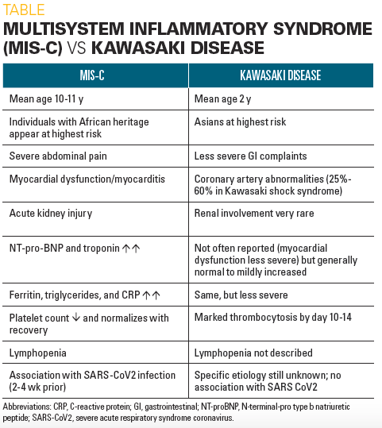
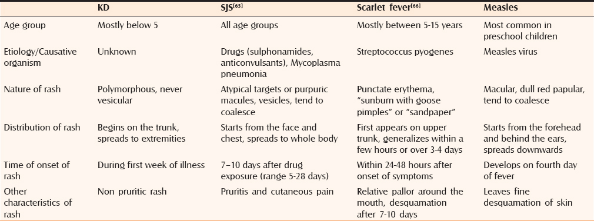
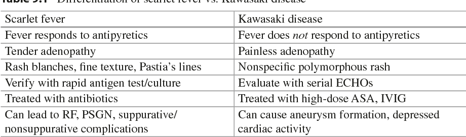
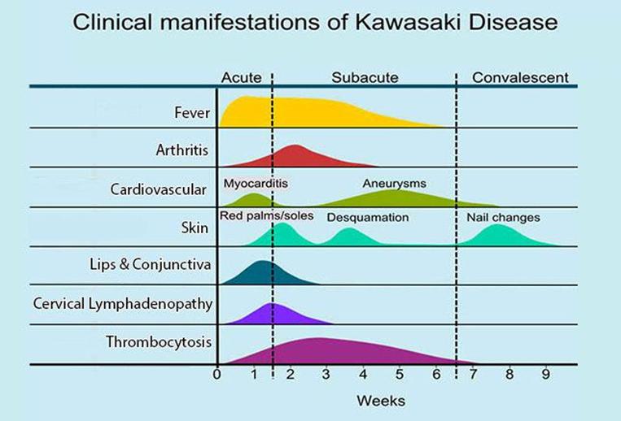
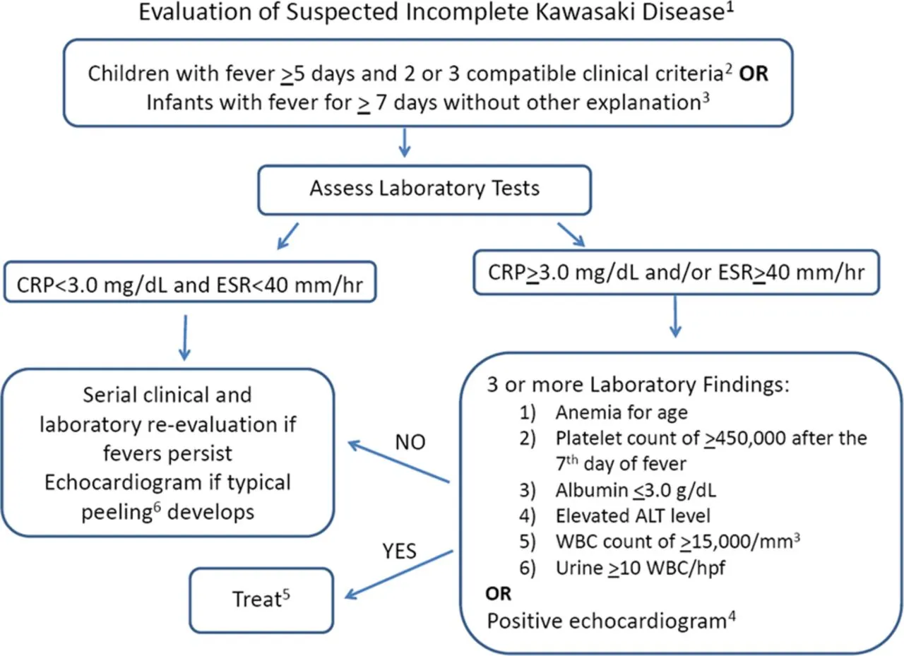

# Immunoglobulins  
  
<!-- more -->  
  
## Indication  
  
| Immunoglobulin                       | Indication                                                                                                                                               | Time                                                | Dose & Route                                                                                                                 |  
| ------------------------------------ | -------------------------------------------------------------------------------------------------------------------------------------------------------- | --------------------------------------------------- | ---------------------------------------------------------------------------------------------------------------------------- |  
| IVIG                                 | Kawasaki disease: coronary artery aneurysms   Enterovirus: 急性腦炎、急性腦脊髓炎、自主神經機能失調、敗血症候群   孕婦或免疫不全患者暴露麻疹、水痘                                           | Kawasaki: 10天內      Measles: 6天內; VZV: 4-10天內 | Kawasaki: **2g/kg** IVD over 12hr x 1-2 doses   EV71: **1g/kg** IVD over 12hr x 1-2 doses   Measles, VZV: **400mg/kg** |  
| HBV (HBIG)                           | 暴露後預防：接觸者HBsAg (+)，暴露者HBsAg & HBsAb (-)                                                                                                                  | 24小時內、（一個月後）                                        | 0.06 ml/kg IM                                                                                                                |  
| Measles (IMIG)                       | 暴露後預防：一歲以下（六個月以上也可在72小時內打MMR）；一歲以上除非有MMR禁忌症才打IMIG                                                                                                        | **6天內**                                             | 0.5 mL/kg (max 15mL) IM                                                                                                      |  
| Rabies (HRIG)                        | 暴露後預防：   任何暴露：蝙蝠 (aerosol possible)   第二類暴露（表皮層抓咬傷）：鑑定**陽性動物**   第三類暴露（真皮層抓咬傷有流血、破損皮膚被舔舐、黏膜接觸到唾液）：**鼬獾、白鼻心、黃喉貂、台東市錢鼠**   排除條件：**已接受暴露前預防接種** | **首劑疫苗**後**7天**內                                    | 20 IU/kg, IM                                                                                                                 |  
| Varicella (VZIG)                     | 新生兒母親在產前5天或產後2天內長水痘、28週以下早產兒、28週以上早產兒且母親沒有抗體、免疫低下患者且無免疫力                                                                                                 | 96小時 (ACIP) 至10天內 (免疫低下)                            | 1.25 U/kg, IM                                                                                                                |  
| Tetanus immune globulin (TIG)        | 出現痛性之肌肉收縮（最初在咬肌及頸部肌肉，而後為軀幹肌肉）、腹部僵硬（abdominal rigidity）、 肌肉痙攣（spasm）、角弓反張（opisthotonus）、臉部表情出現「痙笑」（risus sardonicus）之疑似病患                                 | ASAP                                                | Prophylaxis: 250 IU, IM   Treatment: 3000-6000 IU IM                                                                      |  
| Botulism Antitoxin Heptavalent (BAT) | 避免血液中游離的毒素繼續傷害神經肌肉接合處，無法移除已與神經肌肉接合處連結的毒素                                                                                                                 | ASAP                                                | 1 vial IV                                                                                                                    |  
  
## Pavilizumab  
- RSV prevention  
- 健保給付條件：  
    1. 出生時懷孕週數**≤28週**之早產兒  
    2. 併有慢性肺疾病 (Chronic Lung Disease) 之早產兒 (**≤35週**)  
    3. **一歲**以下患有血液動力學上顯著異常之先天性心臟病童，符合以下條件：  
        1. 納入條件：符合下列條件之一  
            1. 非發紺性先天性心臟病**合併心臟衰竭**，符合下列三項中至少兩項：  
                1. **生長遲滯**，體重小於第三百分位  
                2. 有明顯**心臟擴大**現象  
                3. 需**兩種以上抗心臟衰竭藥物**控制症狀  
            2. 發紺性先天性心臟病：完全矯正手術（含心導管或是外科手術矯正）前或是矯正手術後仍有發紺或是心臟衰竭症狀者  
  
## Kawasaki Disease  
  
### 診斷標準  
1. 發燒五天或**五天以上**且合併下列五項臨床症狀中至少**四項**  
    1. 兩眼眼球**結膜充血**  
    2. 嘴唇及口腔的變化：嘴唇紅、乾裂或**草莓舌**或咽喉泛紅  
    3. 肢端病變：手（足）水腫或指（趾）尖**脫皮**  
    4. 多形性**皮疹**  
    5. 頸部**淋巴腺腫**  
2. 排除其他可能引起類似臨床疾病  
3. 或只符合三項臨床症狀，但心臟超音波檢查已發現有**冠狀動脈病變**    
    **（risk:** Age <1 year and >9 years, male sex)  
  
  
  
  
  
  
  
  
  
### Incomplete Kawasaki Disease  
  
- When to consider:      
    - **<6m/o** with unexplained fever ≥7 days, even if they have no clinical findings of KD children with unexplained fever ≥5 days and only two or three clinical criteria  
    - Lab findings suggest KD (supplementary criteria)  
        - Elevated acute-phase reactants (CRP ≥3 mg/dL [≥30 mg/L] or ESR ≥40 mm/hour) + 3 or more following:  
            - WBC count ≥15,000/microL  
            - Normocytic, normochromic anemia for age  
            - Platelet cell count ≥450,000/microL after seven days of illness  
            - Non-neutrophilic (sterile) pyuria (≥10 WBCs/high-power field)  
            - Serum alanine aminotransferase level >50 units/L  
            - Serum albumin ≤3 g/dL  
        - Elevated acute-phase reactants + positive echocardiogram  
        