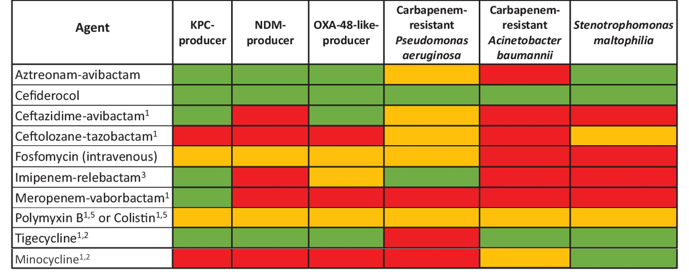

# Treatment of MDR Gram-negative bacilli  
  
  
> Green, susceptibility anticipated to be >80%; yellow, susceptibility anticipated to be 30% to 80%; red, intrinsic resistance or susceptibility anticipated to be <30%.   
> 1, US Food and Drug Administration–approved agent; 2, synthetic tetracycline derivative; 3, imipenem-cilastatin–relebactam; 4, synthetic aminoglycoside; 5, polymyxin class.   
> Abbreviations: KPC, Klebsiella pneumoniae carbapenemase; NDM, New Delhi metallo-β-lactamase. (Tamma et al., 2024)  
  
<!-- more -->  
  
## ESBL  
- ==Carbapenem==  
- Fluoroquinolone (UTI)  
- TMP-SMX (UTI)  
- Aminoglycoside (UTI)  
- Fosfomycin (uncomplicated cystitis, E. coli only)  
- Pip/tazo (uncomplicated cystitis, clinically improving)  
- Cefepime (uncomplicated cystitis, clinically improving)  
  
## AmpC β-lactamase  
- ==Cefepime==  
- TMP-SMX (UTI)  
- Fluoroquinolone (UTI)  
- Single-dose aminoglycoside (uncomplicated cystitis)  
- Ceftriaxone (uncomplicated cystitis)  
  
## CRE  
### R to ertapenem only  
- Extended-infusion meropenem or imipenem/cilastatin  
### UTI  
- TMP-SMX  
- Fluoroquinolone  
- Aminoglycoside  
- ==Cefiderocol==  
- ==Ceftazidime-avibactam==  
- Imipenem-cilastatin-relebactam  
- Meropenem-vaborbactam  
- Colistin (uncomplicated cystitis)   
- Fosfomycin (uncomplicated cystitis, E. coli only)  
### KPC  
- ==Ceftazidime/avibactam==  
- Imipenem-cilastatin-relebactam  
- Meropenem-vaborbactam  
- Cefiderocol  
- Minocycline (non-UTI or BSI)  
- Tigecycline (non-UTI or BSI)  
### OXA-48  
- ==Ceftazidime/avibactam==  
- Cefiderocol  
### NDM  
- ==Cefiderocol==  
- Ceftazidime/avibactam + aztreonam  
  
## CRPA  
- Extended-infusion non-carbapenem β-lactam (if S)  
- ==Ceftazidime/avibactam==  
- ==Cefiderocol==  
- Ceftolozane-tazobactam  
- Imipenem-cilastatin-relebactam  
- Aminoglycoside (UTI)  
- Colistin (uncomplicated cystitis)  
  
## CRAB  
- ==Colistin + (sulbactam or fosfomycin)==  
- High-dose minocycline (200mg Q12H)  
- High-dose tigecycline (100mg Q12H)  
- Cefiderocol（上述治療無效或沒其他藥可用時）  
- Sulbactam-durlobactam + (meropenem or imipenem/cilastatin)  
  
### Colistin Dosage  
- 本院1 vial 66.8 CBA or 2,000,000U  
  
| Colistimethate Sodium | Colistimethate Sodium | Colistin-Base Activity |  
| --------------------- | --------------------- | ---------------------- |  
| 12,500 units          | 1 mg                  | 0.4 mg                 |  
| 150,000 units         | 12 mg                 | 5 mg                   |  
| 1,000,000 units       | 80 mg                 | 34 mg                  |  
| 4,500,000 units       | 360 mg                | 150 mg                 |  
| 9,000,000 units       | 720 mg                | 300 mg                 |  
  
- Loading: 300 mg colistin base activity (CBA)  
- Maintenance: 12 hours after loading dose, in 2 or 3 divided doses  
	- CrCl ≥90 mL/minute: 360 mg CBA/day  
	- CrCl 80 to <90 mL/minute: 340 mg CBA/day  
	- CrCl 70 to <80 mL/minute: 300 mg CBA/day  
	- CrCl 60 to <70 mL/minute: 275 mg CBA/day  
	- CrCl 50 to <60 mL/minute: 245 mg CBA/day  
	- CrCl 40 to <50 mL/minute: 220 mg CBA/day  
	- CrCl 30 to <40 mL/minute: 195 mg CBA/day  
	- CrCl 20 to <30 mL/minute: 175 mg CBA/day  
	- CrCl 10 to <20 mL/minute: 160 mg CBA/day  
	- CrCl 5 to <10 mL/minute: 145 mg CBA/day  
	- CrCl <5 mL/minute: 130 mg CBA/day  
  
### Ampicillin/Sulbactam Dosage Adjustment Recommendations for Kidney Impairment when Treating Multidrug-resistant *A. baumannii* Infection  
  
| **CrCl (mL/min)** | **Traditional Intermittent Infusion** (3 g IV every 4 hours over ≤30 min) | **Extended Infusion** (9 g IV every 8 hours over 4 hours) | **Continuous Infusion** (27 g IV over 24 hours) |  
| ----------------- | ------------------------------------------------------------------------- | --------------------------------------------------------- | ----------------------------------------------- |  
| **≥90 to 130**    | No dosage adjustment necessaryb                                | No dosage adjustment necessaryc,d              | No dosage adjustment necessary                  |  
| **60 to <90**     | No dosage adjustment necessaryb                                | 6 g IV every 8 hours over 4 hoursc,d           | 18 g IV over 24 hoursc               |  
| **30 to <60**     | 3 g IV every 6 hoursb                                          | 3 g IV every 6 hours over 4 hoursc,d           | 12 g IV over 24 hoursc               |  
| **15 to <30**     | 3 g IV every 8 hoursb                                          | 3 g IV every 8 hours over 4 hoursc,d           | 9 g IV over 24 hoursc                |  
| **<15**           | 3 g IV every 12 hoursb                                         | 3 g IV every 12 hours over 4 hourse            | 6 g IV over 24 hourse                |  
  
> a The proposed renal dose adjustments are aimed at achieving pharmacokinetic/pharmacodynamic targets based on in-vitro or pharmacokinetic modeling. Clinical data are not available.    
> b Expert opinion derived from Yokoyama 2015. Doses in Yokoyama 2015 are in grams of sulbactam; the doses listed below are multiplied by 3 to account for both ampicillin and sulbactam components.    
> c Expert opinion derived from Jaruratanasirikul 2019. Doses in Jaruratanasirikul 2019 are in grams of sulbactam; the doses listed below are multiplied by 3 to account for both ampicillin and sulbactam components.    
> d Lower doses may be sufficient for patients with lower albumin concentrations (e.g., 1.7 to 2.4 g/dL) and isolates with lower minimum inhibitory concentrations. See Jaruratanasirikul 2019 for patient-specific recommendations.    
> e Expert opinion.  
  
Ref: [UpToDate](https://www.uptodate.com/contents/ampicillin-and-sulbactam-drug-information?sectionName=Kidney%20Impairment%20(Adult)&topicId=8745&search=ampicillin%2Fsulbactam&usage_type=panel&anchor=F50991106&source=panel_search_result&selectedTitle=1~82&showDrugLabel=true&kp_tab=drug_general&display_rank=1#F50991106)  
  
## *S. maltophila*  
- TMP-SMX (10–15 mg/kg TMP)  
- Levofloxacin (750mg QD)  
- High-dose minocycline (200mg Q12H)  
- Cefiderocol  
  
## Reference  
  
Tamma, P.D., Heil, E.L., Justo, J.A., Mathers, A.J., Satlin, M.J. & Bonomo, R.A. (2024) Infectious Diseases Society of America 2024 Guidance on the Treatment of Antimicrobial-Resistant Gram-Negative Infections. _Clinical Infectious Diseases_. ciae403. doi:[10.1093/cid/ciae403](https://doi.org/10.1093/cid/ciae403).