# 疫苗種類  
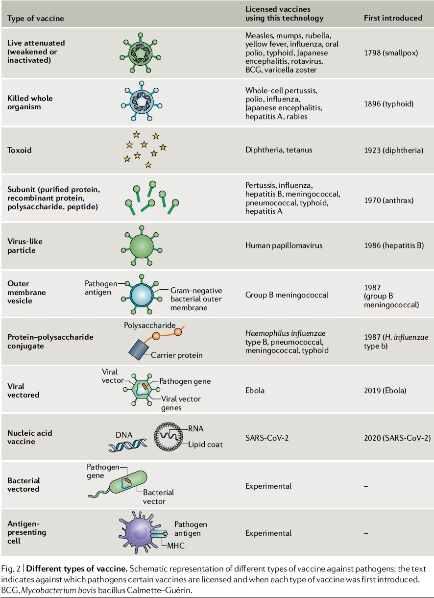  
  
<!-- more -->  
  
# 兒童預防接種時程  
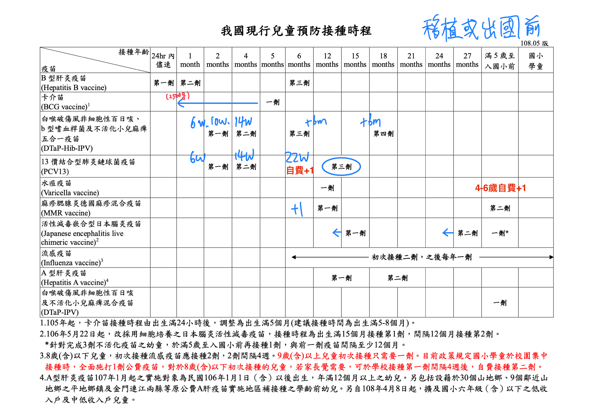  
  
### 早產兒  
- 除B型肝炎疫苗應在體重達**2000公克或出生一個月**後接種（在此之前接種的劑次不納入計算），以及體重**2500公克**時需接種卡介苗之外，其餘疫苗的接種年齡與足月兒並無不同，且疫苗劑量不應減少  
  
## 青少年  
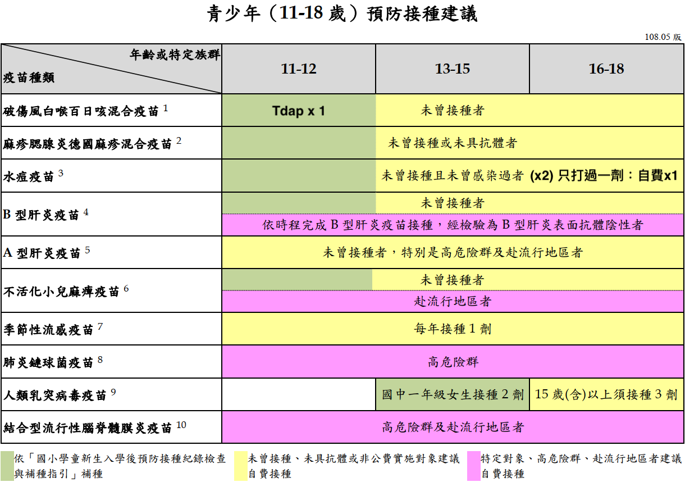  
  
# 成人接種建議  
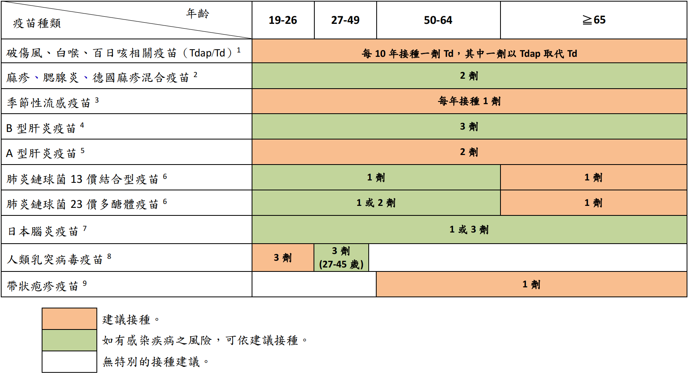  
  
## 活性減毒與不活化疫苗比較  
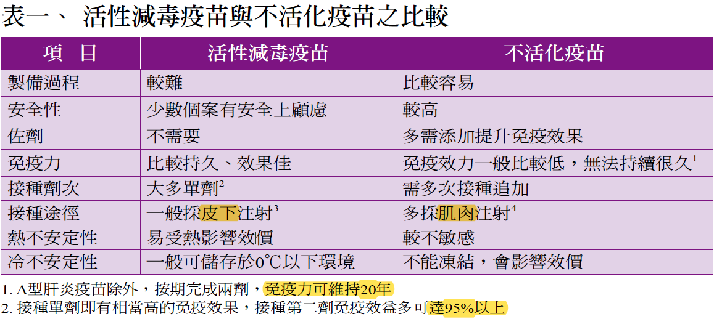  
  
# 接種間隔時間  
  
## 不活化疫苗  
- 與其他不活化疫苗可同時（分開不同部位接種）或間隔任何時間接種  
- COVID-19：can be administered concomitantly with any other vaccines  
  
## 不活化疫苗與活性減毒疫苗  
- Zostavax不可與PSV23一起施打  
- 霍亂疫苗與黃熱病疫苗應間隔3週以上  
- 其他可同時分開不同部位接種或間隔任何時間接種  
  
## 活性減毒疫苗與immunoglobulins  
- HBV, tetanus IG: 間隔**3個月**後再打**MMR, VZV, JE**（下略）  
- HRIG (rabies): 間隔**4個月**  
- VZIG: 間隔**5個月**  
- Measles, botulism, CMV IG: 間隔**6個月**  
- 血液製品:  
    - Washed RBC除外不用間隔  
    - pRBC, whole blood: 間隔**6個月**後再打MMR, VZV, JE  
    - Plasma or platelet: 間隔**7個月**後再打MMR, VZV, JE  
- IVIG:  
    - 低劑量 (400mg/kg): 間隔**8個月**  
    - 中劑量 (800mg/kg): 間隔10個月  
    - 高劑量 (≥ 1g/kg): 間隔**11個月**後再接受MMR, VZV, JE  
  
## 活性減毒疫苗  
- 同時接種或間隔28天以上（例外：BCG, rotavirus, OPV)  
  
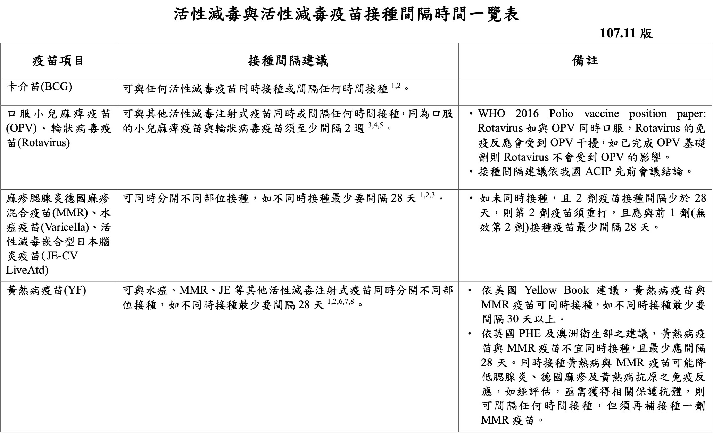  
  
# 免疫不全患者  
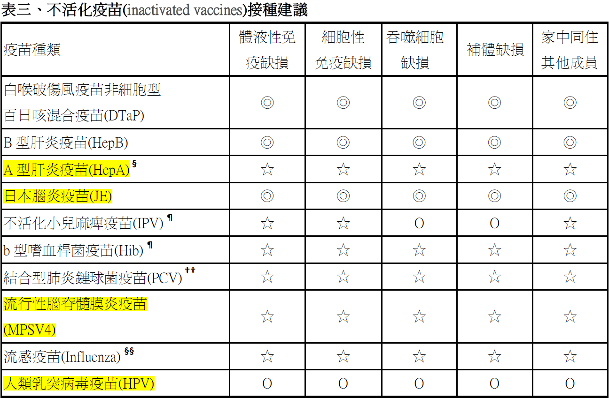  
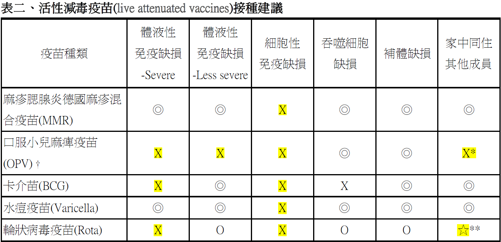  
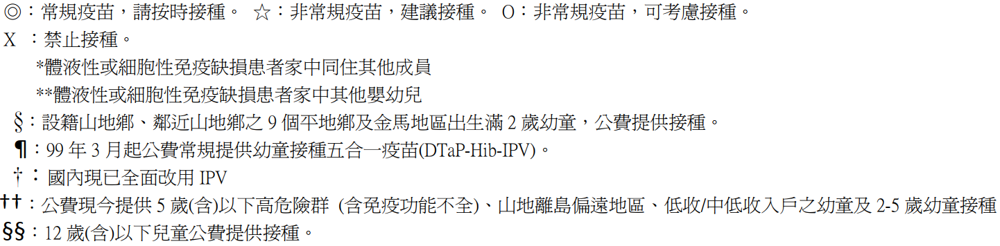  
  
- 使用類固醇 ≧ 2mg/kg/day 或體重10公斤以上 ≧ 20mg/day  
    - 使用不到2週 → 可於停藥**2週**後再施打  
    - 使用超過2週 → 於停藥**一個月**後或確認免疫力狀況再施打  
  
## PCV施打建議  
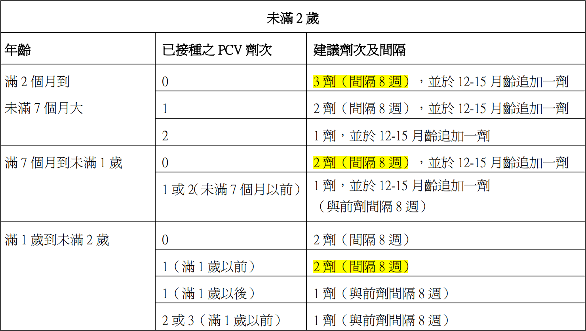  
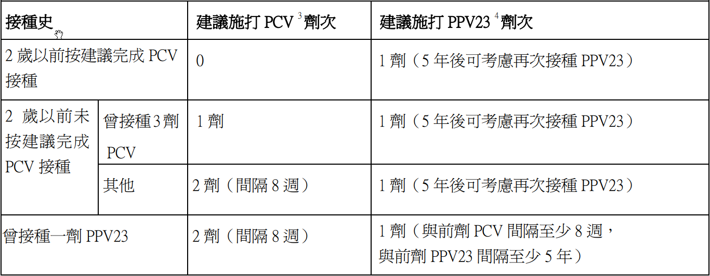  
  
## HIV  
- 所有愛滋病患都建議施打肺炎球菌疫苗  
    - 從未接種過肺炎鏈球菌疫苗的成人：**PCV13** **x 1**，之後追加情況如下：  
        - CD4 count ≥200 cells/μL: 打完後至少**8週**，再追加PPV23  
        - CD4 count <200 cells/μL: 打完後至少8週再追加PPV23，如果可行，PPV23最好等到使用抗病毒藥物後，待CD4 **>200** cells/μL時再施打  
    - 曾經接種過PPV23疫苗的成人：  
        - PCV13建議需施打，並且和最後一劑PPV23施打時間需間隔**一年**以上再給予  
        - 若欲追加PPV23，每劑PPV23之間相隔需超過**5年**，一生中施打PPV23不要超過**三劑**  
  
- 建議每年施打一劑流行性感冒疫苗  
- Varicella:  
    - 愛滋病毒感染的小孩在CD4百分比**>15%**時，可以安全地使用活性減毒水痘疫苗（Varivax，2劑，間隔3個月）  
    - 假如病患>8歲，CD4 **>200** cells/μL且合併VZV血清陰性反應時，可考慮施打Varivax水痘疫苗  
- Zoster:  
    - Shingrix為非活性重組疫苗 (recombinant zoster vaccine)，在年紀**50歲以上**的愛滋病毒感染病患，不管CD4數多少都可施打（2劑，間隔6週）  
    - **Zostavax**為活性減毒疫苗 (live-attenuated vaccine)，在CD4數**小於200 cells/μL**的病患為禁忌症  
- MMR:  
    - CD4 ≥ 15%和CD4 ≥ 200 cells/µL，無明顯臨床免疫缺陷病症者可施打  
  
- 針對愛滋媽媽生下的疑似愛滋感染嬰幼兒，在其檢驗確定是否有感染以前，非活性疫苗之接種時程與一般嬰兒無異，活性疫苗除**口服輪狀病毒疫苗**可以照正常時間給予以外，其他包括卡介苗、麻疹-德國麻疹-腮腺炎疫苗、與水痘疫苗皆應在HIV NAT檢驗流程確定為**陰性**以後再給予  
    - 疑似愛滋感染嬰幼兒的愛滋病毒檢驗時程近似於常規疫苗接種時程，可以安排在**接種疫苗時一併檢驗HIV NAT**，以增加順從率  
    - 若有非活性疫苗可選擇，則不用活性減毒疫苗，例如口服小兒麻痺疫苗應改用注射不活性小兒麻痺疫苗；**確定感染的愛滋病童不應給予卡介苗**；免疫功能已出現嚴重低下者不應給予痲疹、腮腺炎、德國麻疹、水痘、活性日本腦炎等**活性減毒疫苗**  
    - 另一方面，愛滋病毒帶原者對疫苗無法產生終生免疫，疫苗效果可能只持續短暫期間。由於**麻疹**疫苗於愛滋病毒感染兒的效果不佳，所以接種過的病童一旦接觸麻疹，仍應視情況接受**免疫球蛋白**的治療；接觸**水痘**、**破傷風**的考慮亦相同  
- 疑似愛滋感染嬰幼兒的哥哥姐姐等家人，則依其家人本身免疫力決定是否施打疫苗。若免疫力正常，應按時接種各種疫苗，包括活性減毒的卡介苗、麻疹-德國麻疹-腮腺炎疫苗，和水痘疫苗等。一般而言，**家人施打疫苗中，並不會由家人接種者傳染疫苗的病毒或細菌給疑似愛滋感染嬰幼兒**，反而可因家人免於感染而間接保護這些寶寶  
    - 若父母或其他同住的家人是愛滋病毒**帶原者**，家裡的小孩也不能接種口服小兒麻痺減毒疫苗，因為小兒麻痺病毒可以由小孩傳染給父母，有引起父母罹患小兒麻痺的顧慮  
  
## Transplant Recipients  
### 提早接種建議  
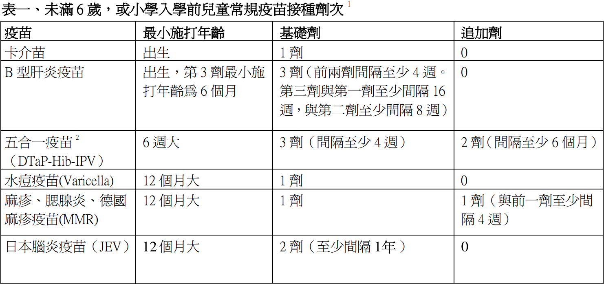  
  
### Solid organ transplantation  
- 不活化疫苗：移植前未完成接種的於移植後**6個月****以上**再補打；除常規疫苗，特別建議要打肺鏈和流感  
- 活性減毒疫苗：移植後不建議接種，建議至少於移植前**一個月**以前完成接種  
- B肝疫苗建議於移植前完成接種，接種後一個月可驗anti-HBs，理想上希望於移植前維持> **200** IU/mL  
  
### HSCT  
- 不活化疫苗：不論移植前是否接種完成，造血幹細胞移植完成至少**1年**後，應重新注射所有常規不活化疫苗；除常規疫苗，特別建議要打**肺鏈和流感**  
    - TBI: functional asplenism      
    - Hib: **3-dose** series **4 weeks** apart starting 6–12 months after successful transplant, regardless of Hib vaccination history  
- 活性減毒疫苗：移植後**2年**若無GVHD者且沒有使用免疫抑制劑的話，則可施打活性減毒疫苗  
  
### 患者同住家屬及親密接觸者預防接種建議  
- 若考慮麻疹-腮腺炎-德國麻疹混合疫苗(MMR)疫苗與水痘 (Varicella)疫苗接種，應盡可能於病患移植前至少**3周前**完成  
    - 同住家屬及親密接觸者注射這些疫苗**1個月**內，若皮膚出現紅疹或水疱，應避免接觸患者，直到症狀緩解  
- 家中有嬰兒接種輪狀病毒疫苗，照顧者在**2星期**內也應注意排泄物處理及手部衛生，避免傳染病毒給免疫低下病人  
  
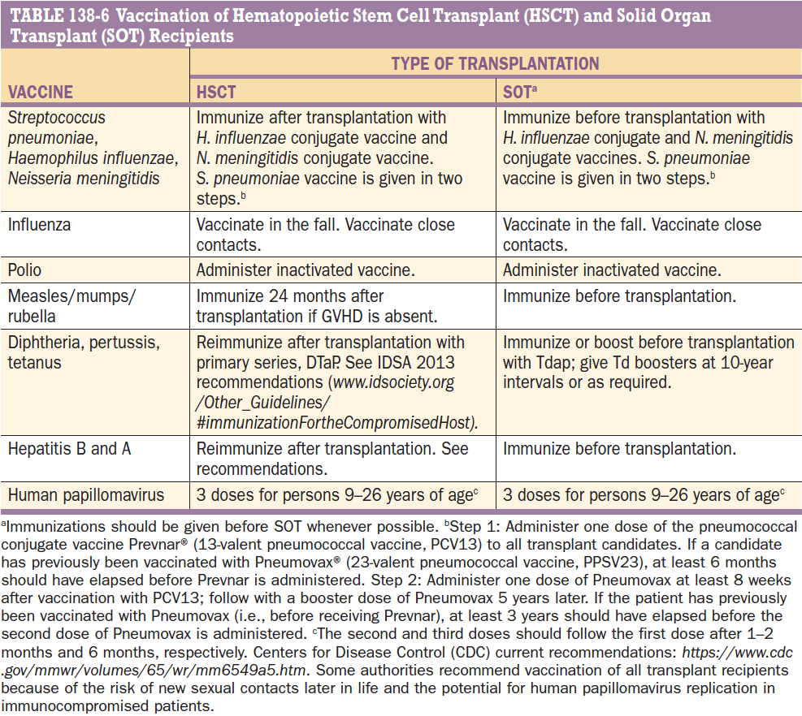  
  
## Splenectomy  
- 計畫性切除：建議於術前**10-14天**前接受肺炎鏈球菌疫苗、B型嗜血桿菌疫苗、流行性腦脊髓膜炎疫苗及流感疫苗  
- 非計劃性切除：術後**14天後**始盡早接種疫苗  
  
# 活性減毒疫苗  
  
> [!important]   
> 皮下注射（例外：BCG**皮內**，OPV, Rotavirus**口服**）    
> 副作用大多在5天後出現  
  
## BCG 卡介苗  
### **接種時程**  
- 出生滿**5-8個月**  
    - 接種3個月後檢視是否有卡介苗疤痕，無疤痕者得進行結核菌素測驗，TST陰性者 (<10mm)，家屬依嬰兒最大健康利益評估接種與否  
- 長住高發生率地區或即將前往結核病高盛行國家，可建議家屬考慮提早接種卡介苗（最早出生後滿2500g可打）  
- 漏打：一歲以下幼兒可在**任何時間**補打，如果已超過**一歲**，需做**結核菌素試驗**，若為陰性反應才須補打，陽性反應者不需再補打  
  
### **接種禁忌**  
- 接種本疫苗或對本疫苗任何成分曾發生嚴重過敏反應者  
- 嚴重濕疹與有**明顯皮膚缺損**的皮膚病  
- 免疫功能不全  
- 人類免疫不全病毒感染者，**無論是否有症狀**  
- 孕婦  
- 下列情況請先經醫師評估診察後，再決定是否接種：  
    - 疑似結核病人及疑似被結核菌感染者，勿直接接種卡介苗。應先進行結核菌素測驗及胸部X光檢查  
    - 發燒或正患有急性中重度疾病者，宜待病情穩定後再接種  
    - 麻疹及水痘感染，待**復原期（6週後）**再接種  
    - 請父母確認父母雙方家人沒有疑似先天性免疫缺失之家族史(如幼年因不明原因感染而死亡)  
    - 生母為愛滋病毒感染者，其嬰幼兒應待追蹤滿4個月後，確定未受感染再接種  
    - 提早接種之嬰兒體重應達**2500公克**以上  
  
### 副作用  
- 局部膿瘍：  
    - 小紅結節期：約1-2週，注射部位會呈現一個小紅結節  
    - 膿泡或潰爛期：約4-6週，變成膿瘍或潰爛，不必擦藥或包紮，只要保持清潔及乾燥，如果有膿流出可用無菌紗布或棉花拭淨，應避免擠壓  
    - 癒合結痂：約2-3個月，自動癒合結痂，留下一個淡紅色小疤痕，經過一段時間後會變成膚色  
        - 若三個月後膿瘍或紅腫未消退，可使用**細針抽吸**排膿，不宜採手術切除  
        - 若三個月傷口持續有滲出液，可考慮口服或局部抗結核藥物，如INH或INH + RMP  
- 淋巴腺炎：超過**1公分**且經過**3個月**後未消退或持續變大，可考慮INH或INH + RMP治療到痊癒為止  
    - 若決定使用藥物治療，必須**通報疑似結核病**，但確定為卡介苗不良反應者，不需要施行胸部 X 光與痰液培養等細菌學檢驗，待排除結核病之後，再行銷案  
- Osteomyelitis：Surgical evacuation plus administration of isoniazid and rifampin for `**6-12 months**`  
  
## MMR  
  
### 公費  
- 出生滿**12個月** → 滿**5歲**至入國小前  
### 自費  
- 未曾接種、接種史不清楚者或檢驗未具麻疹或德國麻疹抗體者，應完成2劑MMR疫苗接種，且間隔至少**4週**  
- 一般育齡婦女：無疫苗接種紀錄或是麻疹/德國麻疹抗體陽性證明之育齡婦女，應接種2劑（公費提供1劑）  
    - 產後補種：婦女若於懷孕期間經檢測未具德國麻疹抗體，於產後持該胎次檢驗日起之2年內德國麻疹抗體檢驗報告者，公費提供1劑  
- 醫療照護人員：對於不具有麻疹或德國麻疹抗體陽性證明的醫療照護人員，建議應接種**2劑**MMR，且間隔至少4週；1981年（含）以後出生未持有麻疹或德國麻疹抗體陽性證明者，優先接種1劑  
- 工作性質會頻繁接觸外國人者：1981年（含）以後出生者，建議自費接種1劑（疫苗世代抗體已下降）  
- 前往流行地區者：  
    - 近期將前往中國大陸、菲律賓、越南等麻疹流行地區之民眾，針對**1981年**以後出生的成人，建議自費接種一劑MMR疫苗後再行前往  
    - 前往流行地區之**6個月以上**未滿1歲之嬰兒，可先行自費接種1劑MMR疫苗（至少要在旅遊**2週前**完成），惟**滿12個月後**仍須按時程完成**2劑**公費MMR疫苗接種（與前一劑至少間隔4週）  
  
### 禁忌  
- 對**蛋**之蛋白質或疫苗的成份有嚴重過敏者  
- 孕婦  
    - 女性接種後4週內應避免懷孕，但疫苗施打後4週內發現懷孕，不應被視為中止懷孕之適應症  
- 已知患有嚴重免疫缺失者（包括嚴重免疫不全的愛滋病毒陽性個案、先天性免疫缺失症與白血病、淋巴癌等惡性腫瘤病人或接受化療、免疫抑制藥物治療及高劑量類固醇者）  
- 接受結核菌素測驗者，如未於接種前或接種當天接受測驗，應於接種**一個月後**再進行測驗  
  
### 副作用  
- 接種後5-12天，偶有疹子、咳嗽、鼻炎、發燒、柯氏班等症狀；febrile seizures  
- 接受腮腺炎疫苗之孩童約有**十萬分之9∼100**的機率可能產生**無菌性腦膜炎**  
- 約有百萬分之一的機會因接種麻疹疫苗而引起**亞急性硬化性腦炎或腦病變 (measles inclusion body encephalitis)**  
- 德國麻疹疫苗偶有引起發燒、暫時性關節痛、關節炎及神經炎等副作用  
  
### 暴露後預防  
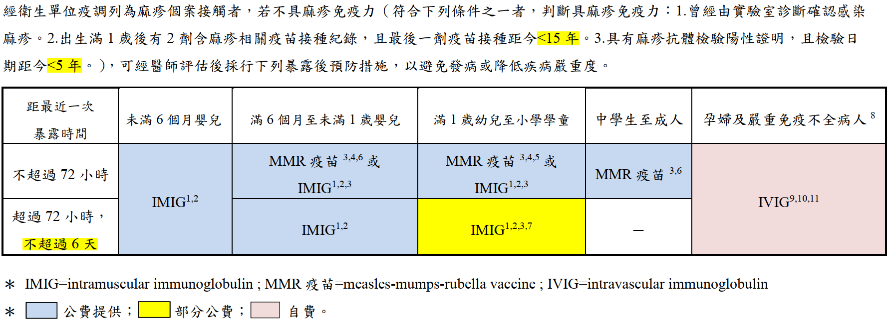  
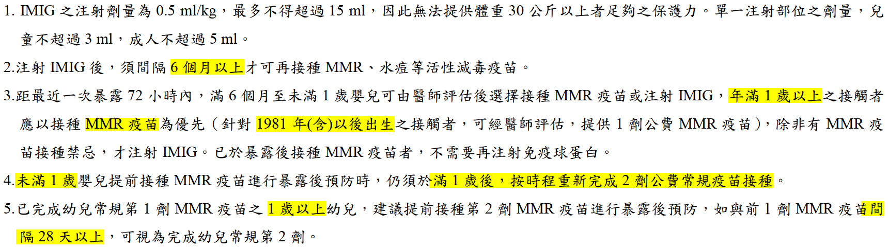  
  
## Varicella (Varivax)  
- 1-12歲兒童：出生**滿12個月**接種第1劑公費疫苗  
    - 接種1劑水痘疫苗後，仍會有2.8%孩童得到突破性水痘感染  
        - >42天後得到**野生株**水痘  
        - 病程較短（4–6天）、水疱數約50顆以下且症狀表現溫和，傳染力約為未曾接種疫苗患者的1/3  
        - 有25-30％可能出現較嚴重的水痘症狀，若水疱多於50處，則傳染力與未曾接種疫苗患者相似，罹病期間仍應與他人區隔  
        - 5-6歲為水痘突破感染的高峰期      
- 滿4到6歲或13歲以上：**自費**接種第2劑  
- 13歲以上未曾接種疫苗且未得過水痘者，應自費接種接種兩劑，間隔**4-8週**  
  
### 禁忌  
- 孕婦  
- 已知患有嚴重免疫缺失者（包括嚴重免疫不全的愛滋病毒陽性個案、先天性免疫缺失症與白血病、淋巴癌等惡性腫瘤病人或接受化療、免疫抑制藥物治療及高劑量類固醇者）  
- 接受結核菌素測驗者，如未於接種前或接種當天接受測驗，應於接種**一個月後**再進行測驗  
  
### 副作用  
- 可能有輕微的發燒，偶有發生高燒、抽搐之現象  
- 接種後**5-26天**於注射部位或身上可能出現類似水痘的水泡  
- 與自然感染水痘病毒一樣，疫苗的病毒可能潛伏在體內，在免疫功能低下時，病毒再活化而表現成帶狀疱疹，但其發生率與症狀都低於自然感染  
- 18歲以下兒童接種水痘疫苗後**6週內**宜避免使用水楊酸類藥品  
  
### 暴露後預防  
- 免疫力正常但無水痘免疫力者：暴露後**72小時****（最晚6天）**內給予  
- VZIG/IVIG: 96小時至十天內  
  
## Zoster (Zostavax)  
- The minimum potency of zoster vaccine is at least 14 times the potency of varicella vaccine  
- **50歲(含)以上**未曾接種過帶狀疱疹疫苗者，不論之前是否有水痘或帶狀疱疹病史，建議接種**1劑**活性減毒帶狀疱疹疫苗  
- 接種前24小時內曾接受特定抗病毒藥物者（如：acyclovir、famciclovir或valacyclovir），於接種後間隔14天以後再重新開始服用這些藥物  
- 女性接種後4週內應避免懷孕  
- 與其他活性減毒疫苗（例如MMR、活性減毒日本腦炎疫苗）如未同時接種，應間隔至少**28天**以上  
- **不應與PSV23同時接種（會導致ZOSTAVAX的免疫生成性降低）**  
- 疫苗效果可維持至少**7-10年**  
  
## 日本腦炎  
- 臺灣自1960年代推動日本腦炎預防接種，使用的是以鼠腦製程之不活化日本腦炎疫苗（inactivated mouse brain-derived JE vaccine）  
- 2017年5月22日起改採用細胞培養製程之**活性減毒**嵌合型日本腦炎疫苗（**live attenuated JE chimeric vaccine, IMOJEV**）  
	- 以**黃熱病疫苗**使用之**17D病毒株**為載體，將SA14-14-2日腦病毒株之**prM及E蛋白**以**基因重組**技術置換入此載體所製成。  
	- 疫苗接種後，此活的嵌合型病毒會在接種者體內局部增生並產生對一般日本腦炎病毒具專一性的中和性抗體及細胞免疫反應  
	- 不適合接種於免疫功能缺損者。  
- 活性減毒嵌合型日本腦炎疫苗幼兒常規接種時程：應接種**2劑**，出生滿**15個月**接種第1劑，間隔**12個月**接種第2劑  
    - 漏打：依我國時程缺幾劑補幾劑  
- 已接種鼠腦製程之不活化日本腦炎疫苗的幼童，疫苗銜接原則如下：  
    1. 已接種1劑鼠腦製程不活化日本腦炎疫苗：與前一劑鼠腦疫苗間隔**14天**以上接種第1劑，間隔**12個月**接種第2劑  
    2. 已接種2劑鼠腦製程不活化日本腦炎疫苗：與最後一劑鼠腦疫苗間隔至少**12個月**後接種1劑，其後不必再追加  
    3. 已接種3劑鼠腦製程不活化日本腦炎疫苗：**滿5歲至入學前**接種1劑，與最後一劑鼠腦疫苗間隔至少**12個月**  
- 經醫師評估不適合接種活性減毒嵌合型日本腦炎疫苗者，地方政府衛生局（所）有提供不活化日本腦炎疫苗，可請醫療院所協助申請，依其接種時程完成  
- 成人若居住地或工作場所接近豬舍、其他動物畜舍或病媒蚊孳生地點等高風險地區，建議於流行期前（每年**3-4月**）自費接種日本腦炎疫苗，若至流行地區旅遊，可至旅遊醫學門診諮詢，並依醫師之評估建議自費接種疫苗。  
    - 活性疫苗：打**一劑**即可  
    - 不活化疫苗：第1、2劑間隔4週，隔年接種第3劑，第2劑至少要在旅遊**1週**前完成  
- AE: 少數於接種後3-7天可能出現輕微或中度全身無力、肌痛、易怒、食慾不振、發燒、頭痛等症狀，會在數天內恢復  
  
## Rotavirus  
  
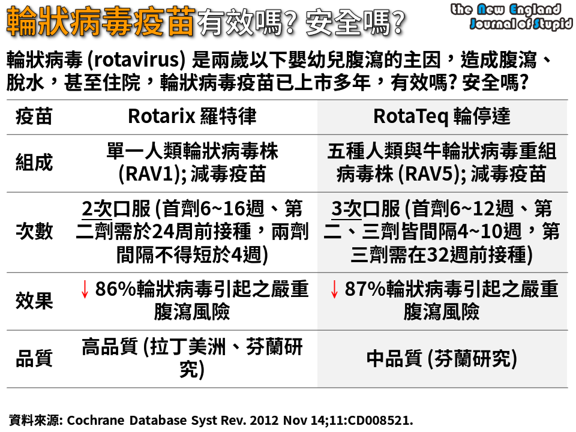  
  
### 禁忌  
- 先前接種本疫苗或對本疫苗任何成分曾發生嚴重過敏反應者  
- 患有嚴重複合型免疫功能不全（SCID）相關疾病者  
- 有**腸套疊病史**或有未經矯正之胃腸道畸形（如**梅爾氏憩室**）者  
- 出生後滿**6-8個月**以上  
### 副作用  
- 腹瀉  
  
## Yellow Fever  
  
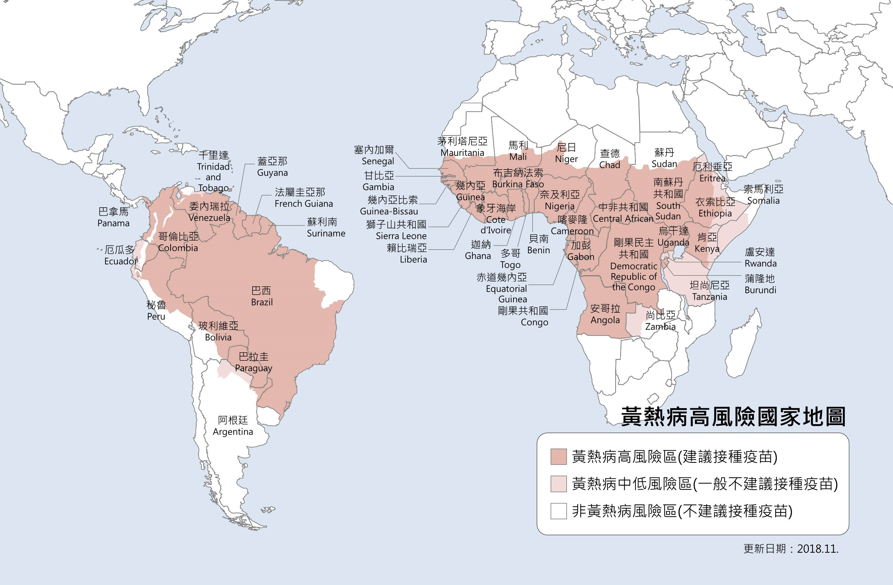  
  
- 以**雞胚蛋**培養的病毒製成  
- 前往高風險地區的旅客：年齡滿**9個月**以上者，皆建議接種黃熱病疫苗，且應於出國**10天以前**接種。接種疫苗後90%以上的人可產生**長期保護力**，故不需例行追加接種。  
    - 霍亂疫苗與黃熱病疫苗應間隔3週以上  
  
- 追加接種對象：  
    - 前往流行地區前追加1劑：  
        - 在**懷孕期間**接種過黃熱病疫苗者  
        - 接種過黃熱病疫苗後，接受**造血幹細胞移植**  
    - 欲前往流行地區前且距上次接種**超過10年**，追加1劑：  
        - **HIV感染者**  
        - 因旅行季節、地點、活動或停留時間而有較**高感染風險**者  
    - 常規性處理野生型黃熱病病毒的實驗室工作者，每**10年**追加1劑  
  
### **副作用**  
- 約10~30%接種者在5~12天內出現頭痛、肌肉痛、輕微發燒等類似感冒症狀，症狀約1~2天會恢復  
- 曾在國外造成接種者神經或臟器病變，但發生率極低（<十萬分之1），且好發於高齡及幼齡（未滿9個月）的接種者  
  
# 不活化疫苗  
  
> [!important]   
> 副作用大多在三天內消失  
> 效力：HAV 20年，DT/Td 10年，aP/PSV/MSV4 5年，Rabis 3-5年，Typhoid 3年，Influenza <6個月，COVID-19 mRNA 6個月？  
  
## COVID-19  
- COVID-19疫苗與其他疫苗的接種間隔建議至少7天  
### AZD1222 (ChAdOx1, Vaxzevria)  
- 含有SARS-CoV-2病毒棘蛋白(S protein)基因之非複製型腺病毒載體疫苗  
- 冷儲條件：**2~8°C**  
- 適用接種年齡為**18歲**以上，接種劑量為0.5 mL，接種劑次為2劑，依我國衛生福利部傳染病防治諮詢會預防接種組建議為至少**8週**以上，而間隔**10-12週**，疫苗接種效果更佳  
- 完成2劑接種可預防63%有症狀感染之風險，當接種間隔12週且完成2劑接種，保護力約81% (60% ~ 91%)  
- 副作用：接種疫苗後可能有發燒反應(≧38℃)，通常約48小時可緩解。其他可能反應包含疲倦、頭痛、肌肉痠痛、體溫升高、畏寒、關節痛及噁心，這些症狀隨年齡層增加而減少，通常輕微並於數天內消失；第二劑之副作用發生比率低**於第一劑**  
    - VITT (Vaccine-Induced Immune Thrombocytopenia and Thrombosis):  
        - Caused by platelet-activating antibodies directed against ==**platelet factor 4 (PF4)**==, onset range: 5 to 48 days (median, 14) after vaccination  
        - 接種疫苗後**28天**內，若出現以下任一症狀，請立即就醫並說明疫苗接種史：  
            - 嚴重持續性頭痛、視力改變或癲癇  
            - 嚴重且持續腹痛超過24小時以上  
            - 嚴重胸痛或呼吸困難  
            - 下肢腫脹或疼痛  
            - 皮膚出現自發性出血點、瘀青、紫斑等  
- 接種禁忌：對於疫苗成分有嚴重過敏反應史、先前接種本項疫苗劑次曾發生嚴重過敏反應或血栓合併血小板低下症候群者，以及過去曾發生微血管滲漏症候群 (Capillary leak syndrome) 之病人，不予接種；過去曾發生血栓合併血小板低下症候群，或肝素引起之血小板低下症者，應避免接種  
  
### BNT162b2 (Comirnaty)  
- 含有SARS-CoV-2病毒棘蛋白(S protein)之mRNA疫苗  
### mRNA-1273 (Spikevax)  
- 含有SARS-CoV-2病毒棘蛋白(S protein)之mRNA疫苗  
### MVC-COV1901 (高端)  
- Aa recombinant protein vaccine containing pre-fusion-stabilised spike protein **S-2P** adjuvanted with CpG 1018 and aluminium hydroxide  
### Novavax JN.1  
- 含佐劑Matrix-M之SARS-CoV-2(Omicron JN.1)重組棘蛋白之蛋白質次單元疫苗  
- 適用於滿12歲以上青少年及成人接種  
- 2~8°C冷藏保存  
### Moderna LP.8.1  
- 含SARS-CoV-2(LP.8.1)變異株棘蛋白之單價mRNA疫苗  
- 適用於滿6個月以上兒童、青少年及成人接種  
- -50~-15°C冷凍保存，不得低於-50°C且不得使用乾冰冷運冷儲  
- 若轉置到2~8°C冷藏設備保存必須於30天內使用完畢  
- 與其他疫苗可同時分開不同手臂接種，亦可間隔任何時間接種  
- 未滿2歲之嬰幼兒接種於大腿前外側股外側肌，2歲以上幼童接種非慣用手之上臂三角肌  
  
## PCV13/PPV23  
  
### 13價結合型肺炎鏈球菌疫苗 (PCV13)  
- Serotypes 1, 3, 4, 5, 6A, 6B, 7F, 9V, 14, 18C, **19A**, 19F, 23F  
- 適用於出生滿**6週**以上幼兒、青少年、成人與長者  
- 如可能應先接種PCV13再接種PPV23  
### 23價肺炎鏈球菌多醣體疫苗 (PPV23)  
- Serotypes 1, 2, 3, 4, 5, 6B, 7F, 8, 9N, 9V, 10A, 11A, 12F, 14, 15B, 17F, 18C, 19F, **19A**, 20, 22F, 23F, 33F  
- 適用於一般成人與**兩歲以上**兒童  
### 20價結合型肺炎鏈球菌疫苗 (PCV20)  
- Serotypes 1, 3, 4, 5, 6A, 6B, 7F, 8, 9V, 10A, 11A, 12F, 14, 15B, 18C, 19A, 19F, 22F, 23F, 33F  
- 適用於出生滿**6週**以上兒童、青少年及成人  
- 自2026年1月15日起，以1劑新肺炎鏈球菌疫苗取代昔日PCV13/15及PPV23之2 劑接種  
  
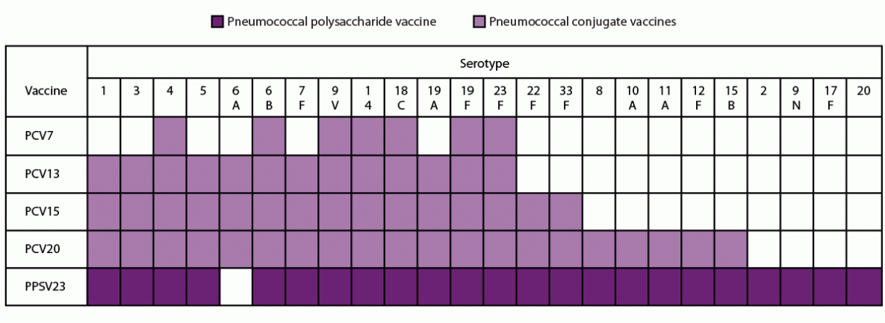  
  
### 施打間隔  
- 每個人一生最多接種三劑PPV23，兩劑PPV之間需間隔五年  
- <18歲：PCV13與PSV23無論先後皆間隔八週  
- 18-64歲：PCV13八週後PSV23，PSV23一年後PCV13  
- ≥65歲：PCV13與PSV23無論先後需間隔一年  
  
### 公費  
  
#### 兒童  
- 出生滿**2, 4, 12-15個月**接種3劑PCV13  
- 漏打：  
    - 小於6個月寶寶：分別在2、4個月打完二劑，之後在滿**1歲**之後再追加一劑，共施打三劑  
    - 7~12個月寶寶：間隔2個月打兩劑（第1劑如於出生滿7個月才開始接種，與第2劑之接種間隔可縮短至4週），1歲以後的追加劑於滿**12個月**以後接種，且與前一劑至少間隔**8週**  
    - 1歲以上寶寶：間隔2個月打兩劑  
    - **2歲**以上寶寶：只要打**一劑**  
#### 成人  
- 具中華民國國民身分之65歲以上（「接種年」減「出生年」計算大於等於65歲者）  
- 55-64歲原住民（「接種年」減「出生年」大於等於55歲者）  
- 19-64歲符合IPD高風險對象定義之民眾  
	- 脾臟功能缺損  
	- 先天或後天免疫功能不全（含括愛滋病毒感染者）  
	- 人工耳植入  
	- 腦脊髓液滲漏  
	- 「一年內」接受免疫抑制劑或放射治療的惡性腫瘤者及器官移植者  
  
| 過往接種史                      | 公費銜接疫苗                                                                                                    |  
| -------------------------- | --------------------------------------------------------------------------------------------------------- |  
| 從未接種過                      | PCV20                                                                                                     |  
| 僅接種過PPV23                  | 間隔至少滿1年後，接種PCV20                                                                                          |  
| 僅接種過PCV13/15               | 間隔至少滿==1年==或8週（IPD高風險對象、65歲以上機構住民及洗腎患者）後，接種PPV23，至PPV23用罄後則以PCV20取代接種                                     |  
| PCV13/15+PPV23或   PCV20 | 1. 已完整接種肺炎鏈球菌疫苗，無需再接種PCV20 2. 19-64歲IPD高風險對象，如於65歲前完整接種PCV13/15+  PPV23，可於滿65歲且與前劑間隔滿≧5年後，再追加接種1劑PCV20 |  
  
### 自費  
- 慢性疾病：慢性腎病變、慢性心臟疾病、慢性肺臟病、糖尿病、慢性 肝病與肝硬化患者、酒癮者、菸癮者等  
- 部分65-75歲之間患者  
  
#### 青少年及19-64歲高危險群之自費接種建議  
  
| 過往接種史                      | 接續接種建議                     |  
| -------------------------- | -------------------------- |  
| 從未接種過                      | PCV20                      |  
| 僅接種過PPV23                  | 間隔滿1年，可接種PCV20或PCV13或PCV15 |  
| 僅接種過PCV13/15               | 間隔滿8週，可接種PPV23或PCV20       |  
| PCV13/15+PPV23或   PCV20 | 已完整接種肺炎鏈球菌疫苗，無需再接種PCV20    |  
  
- 已自費接種 PCV13/15 者，建議先至原接種之醫療院所或衛生所進行接種紀錄補登，如已間隔滿 1 年（IPD 高風險對象或 65 歲以上「機構住民」及「洗腎患者」間隔至少 8 週），可經醫師依循接種原則評估後，接種 1 劑公費 PPV23；經查找仍無法取得接種紀錄之特例情形者，視為從未接種肺炎鏈球菌疫苗，可經醫師評估後，接種 1 劑公費PCV20，接種 PCV20 後即代表已完整接種，無需再接種 PPV23。  
- 已自費接種PPV23者，建議間隔至少1年可接種1劑PCV20。  
- 若已「自費完成接種 PCV13/15 及 PPV23」或「自費接種 PCV13/15及公費 PPV23」或「自費接種 PCV20」，民眾仍有公費接種 PCV20需求，與前劑間隔至少 5 年，經醫師評估可公費提供 1 劑公費 PCV20  
- 如已「自費完成接種 PPV23 及公費 PCV13」，民眾仍有肺炎鏈球菌疫苗接種需求，與前劑間隔至少 5 年，經醫師評估可公費提供 1 劑公費 PPV23。惟因已公費提供過 PCV13，故不再提供公費 PCV20接種。  
  
## DTaP-Hib-IPV  
- 含全量**非細胞性**百日咳成分，對於百日咳能提供更佳的免疫保護力  
- 出生滿**2, 4, 6, 18個月**各接種一劑DTaP-Hib-IPV疫苗  
    - 最早可提前於出生滿**6週**時接種  
    - 漏打：前三劑間隔至少**4週**，第四劑與第三劑至少間隔**6個月**  
- **滿5歲至未滿7歲**時接種一劑**DTaP-IPV**  
  
### 禁忌症  
- 對本疫苗中的成份，特別是neomycin、polymyxin、streptomycin或其他成份過敏者  
- 接種含百日咳疫苗後7天內曾發生不明原因之**腦或神經系統**病變者  
    - 不適宜接種含百日咳疫苗之**6歲以下**幼兒，可改接種**DT + IPV**  
        - 若兒童小於1歲，則三劑DT需間隔2個月給予，第四劑則需在第三劑注射完6∼12個月給予，第五劑DT則在4∼6歲給予  
        - 若為1歲至6歲之間未注射過白喉之疫苗者，則給予兩劑DT，間隔2個月，6∼12個月後給予第三劑DT，除非第三劑DT施打時超過4歲，否則4∼6歲仍需施打DT，若一歲以內已施打過一至二劑DTaP, DTP或DT，而百日咳疫苗無法使用，則接下來應注射DT，直到完成五劑的白喉、破傷風疫苗  
- 患有進行性、發展中、或不穩定的神經性疾病（包括癲癇發作）的孩童，應該暫緩接種  
- 接種含破傷風類毒素疫苗後發生**Arthus過敏反應 (type III hypersensitivity reaction, previously sensitized with circulating antibody)** 者，與次劑含破傷風類毒素疫苗應間隔**10年以上**再接種  
  
### 副作用  
- 接種後1-3天可能發生注射部位紅腫、酸痛，偶爾有哭鬧不安、疲倦、食慾不振或嘔吐等症狀，通常2-3天後會恢復  
  
## Tdap/Td  
### **減量破傷風白喉非細胞性百日咳混合疫苗（Tdap）**  
- 比起DTaP有較少的白喉類毒素（diphtheria toxoid）及百日咳抗原（acellular pertussis antigen）  
	- **4歲**以上適用  
    - DTaP的**百日咳**保護效果只有**5年**，**11-12歲**建議再自費追加一劑Tdap  
    - 每次懷孕應接種1劑Tdap疫苗，可在**任何孕程**接種，但為使母親抗體傳遞給嬰兒的接種效益最大化，建議於懷孕第**28-36週**接種；若懷孕時未接種，則應於**生產後**立即接種  
    - 若考量風險需要，Tdap與前一次破傷風相關疫苗不需有間隔上的考量，可隨時施打  
- **破傷風、減量白喉混合疫苗（Td）：**  
	- 將白喉疫苗的劑量降低至**1/4**以減低副作用，**7歲**以上適用  
    - 一般完成DTwP/DTaP疫苗接種的小孩，95％可以維持10年左右的**破傷風、白喉**預防效果，最好每隔**10年**追加一劑Td疫苗  
    - 若距離最後一次破傷風疫苗接種超過10年，可依建議每**10年**追加1劑Td，而其中高危險群如**醫療照護人員、孕前婦女、嬰兒照顧者**應優先以**Tdap**疫苗接種1劑  
  
- 對自身破傷風、白喉或百日咳相關的疫苗接種史不清楚或是未完成基礎接種時，建議應先完成**3劑**的破傷風、減量白喉混合疫苗（Td）  
    - 前兩劑至少間隔**4週**，第三劑與第二劑至少間隔**6個月**  
    - 成人可使用**Tdap**取代其中**任1劑**Td  
  
## TT (toxoid)  
- **7歲**以上適用  
- 同一部位不宜反覆注射  
- **Chloramphenicol**可能干擾本製劑的作用，應避免同時使用  
- Immunization should be deferred during the course of any febrile illness or acute infection  
- Persons who experience Arthus-type hypersensitivity reactions or temperature greater than 39℃ after a previous dose of tetanus toxoid usually have very high serum tetanus antitoxin levels and should not be given even emergency doses of tetanus toxoid more frequently than every 10 years, even if they have a wound that is neither clean nor minor  
  
## IPV/OPV  
  
### OPV (Sabin)  
- 活性減毒疫苗  
- 可有效在腸道原發感染部位複製，但無法在神經系統組織複製，可提供更長久的免疫力  
- Vaccine-associated paralytic poliomyelitis (VAPP) → 先進國家已不使用  
    - 免疫健全者引起之VAPP最常見為第三型小兒麻痺病毒，免疫功能不全者最常見則為第二型，很少見第一型引起VAPP  
- 用來緊急控制小兒麻痺爆發  
    - 與IPV比較，投予一劑的OPV有較高的血清陽性率  
    - 有較佳的腸胃道免疫力，可阻斷野生小兒麻痺病毒在社區的傳播  
    - 疫苗株可經由腸胃道的釋放、傳播，提高社區整體保護力  
  
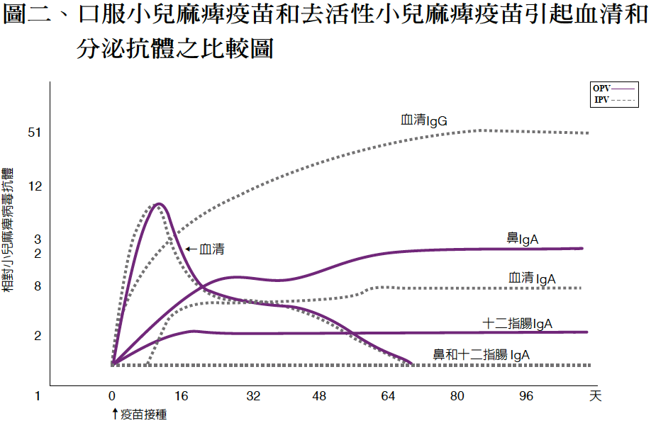  
  
- 前往高風險國家可視情況追加接種（**4週至一年前**）  
    - States infected with WPV1, cVDPV1 or cVDPV3 with potential risk of international spread: all residents and long­term visitors (i.e. > four weeks) of all ages should receive a dose of bivalent oral poliovirus vaccine (**bOPV**) or inactivated poliovirus vaccine (**IPV**) between four weeks and 12 months **prior to** (at least by the time of departure) international travel  
        - WPV1：阿富汗、巴基斯坦  
        - cVDPV1：葉門、馬達加斯加  
        - **cVDPV3：中國**  
    - States infected with cVDPV2, with or without evidence of local transmission: Encourage residents and long­term visitors to receive a dose of **IPV** four weeks to 12 months prior to international travel  
        - Asia: 阿富汗、巴基斯坦、塔吉克、伊朗  
        - 非洲一半國家  
    - States no longer infected by WPV1 or cVDPV, but which remain vulnerable to re-infection by WPV or cVDPV:  
        - cVDPV: Myanmar, Philippines, Malaysia, Zambia, Angola  
  
## Influenza  
- 出生滿6個月以上者，每年接種1劑。  
- 未滿9歲兒童，若是初次接種，應接種2劑，2劑間隔4週以上  
- ≥9歲：每年接種一劑  
    - 僅接種單一流感季流感疫苗疫苗效力 (vaccine effectiveness) 會隨時間而減弱，H3N2的減弱現象會比H1N1及Influenza B更明顯，且這現象在老年人也比較顯著  
    - 一篇回顧性研究發現，在接種流感疫苗後，大於60歲成人，其抗體保護水平 (seroprotection levels) 對 H3N2 只達**四個月**以上，而在對 H1N1 及 Influenza B略長，可至五個月  
  
### 公費實施對象（2025）  
- 醫事及衛生防疫相關人員  
- 50歲以上成人(分2階段實施，第1階段為65歲以上長者及55至64歲原住民，第2階段為50至64歲無高風險慢性病成人)  
- 安養、長期照顧(服務)等機構之受照顧者及其所屬工作人員  
- 滿6個月以上至國小入學前幼兒  
- 孕婦  
- 具有潛在疾病者：高風險慢性病患、罕見疾病患者及重大傷病患者  
- 6個月內嬰兒之雙親  
- 幼兒園托育人員、托育機構專業人員及居家托育人員（保母）  
- 國小、國中、高中、高職、五專一至三年級學生  
- 禽畜相關及動物防疫相關人員。  
  
### 病毒株  
- **A型 H1N1：** A/Wisconsin/67/2022 (H1N1)pdm09 類病毒株  
- **A型 H3N2：** A/Croatia/1654/2025 (克羅埃西亞株 - 雞蛋培養) 或 A/District of Columbia/27/2025 (哥倫比亞特區株 - 細胞培養)  
- **B型 Victoria：** B/Austria/1359417/2021 類病毒株  
  
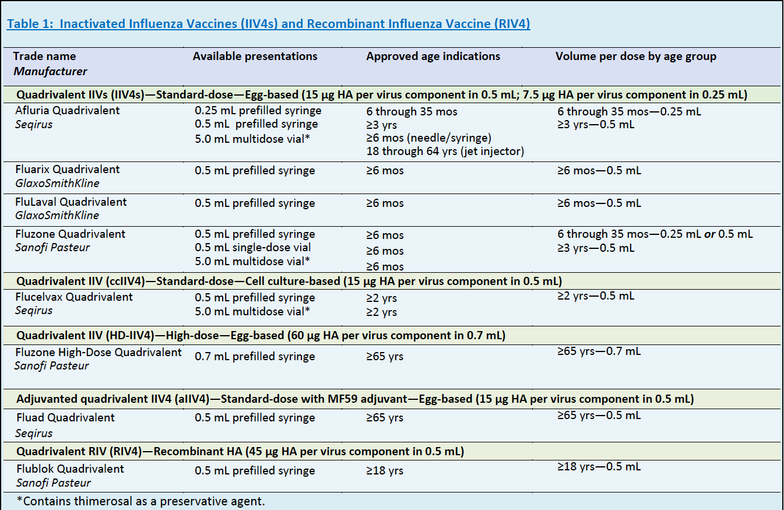  
> IIV = Inactivated Influenza Vaccine, RIV = Recombinant Influenza Vaccine, LAIV = Live Attenuated Influenza Vaccine  
  
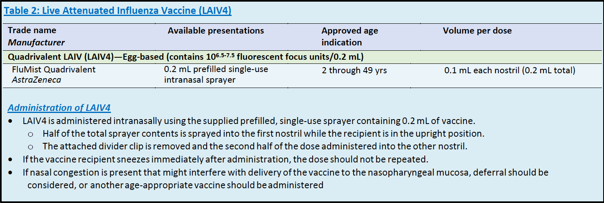  
  
### 副作用  
- 接種流感疫苗後**48小時內**約有1-2%可能有發燒反應  
- 零星報告過之不良事件  
    - 神經系統症狀：臂神經叢炎、顏面神經麻痺、熱痙攣、腦脊髓炎、對稱性神經麻痺為表現的**Guillain-Barré Syndrome**  
    - 血液系統症狀：暫時性血小板低下，臨床表現包括皮膚出現紫斑或出血點、出血時不易止血  
- 先前接種本疫苗6週內曾發生Guillain-Barré症候群（GBS）者，宜請醫師評估  
- 已知對「蛋」之蛋白質有嚴重過敏者，可在門/住診由熟悉處理過敏症狀之醫事人員提供接種，並於接種後觀察30 分鐘，無不適症狀再離開  
  
## HBV  
  
### 公費  
- 0（出生24小內儘速接種，愈早愈好）、1、6個月  
- 漏打者補打：第1劑和第2劑最小間隔**4周**，第2劑和第3劑最小間隔**8周**  
### 自費  
- 已依時程完成 B 型肝炎疫苗接種者，經檢驗HBsAb陰性 (<10 mIU/ml)  
    - B型肝炎感染高危險群（血液透析病人、器官移植病人、接受血液製劑治療者、免疫不全者；多重性伴侶、注射藥癮者；同住者或性伴侶為帶原者；身心發展遲緩收容機構之住民與工作者；可能接觸血液之醫療衛生等工作者…）：  
        - 自費追加1劑B型肝炎疫苗，1個月後再抽血檢驗，若表面抗體仍為陰性，可以採「0-1-6 個月」之時程，接續完成第2、3劑疫苗  
        - 如經此補種仍無法產生抗體者，則無需再接種，但仍應採取B型肝炎之相關預防措施，並定期追蹤HBsAg  
	- HIV患者：immunogenecity較差，建議打完三劑  
    - 非B型肝炎感染高危險群：尚無須全面再追加1劑B型肝炎疫苗，惟個案可自費追加1劑  
  
### 暴露後預防  
  
- **HBIG** + HBV vaccine  
- 新生兒：  
    - 不論其出生體重亦或早產，如臨床狀況穩定，於出生後應儘速注射1劑**HBIG**及B型肝炎**疫苗**，**越早越好，不要晚於24小時**  
        - 出生體重低於**2000公克**：出生體重**滿2000公克或出生滿1個月**後，依時程接種**3劑**B型肝炎疫苗，**出生接種劑次不列入計算**  
        - 出生體重若小於**600公克**：HBIG於出生儘速接種，至於其第1劑B肝疫苗，建議於臨床狀況穩定且其生命安全無疑慮後再行接種  
        - 在滿12個月大時，應進行HBsAg、anti-HBs等檢測，以瞭解其預防接種成效與感染狀況，及早採取後續補接種與追蹤措施  
    - HBIG給付條件：  
        - 97年7月1日至108年6月30日(含)以前出生：母親HBsAg & HBeAg (+)  
        - 108年7月1日(含)以後出生：母親**HBsAg (+)**  
  
- HBsAg (-) + HBcAb (-)之醫院工作人員：HBIG + HBV vaccine x 3 (0, 1, 6m)      
    - 若已打過兩個療程HBV vaccine抗體仍 < 10 IU則在**一個月後**追加一劑HBIG  
  
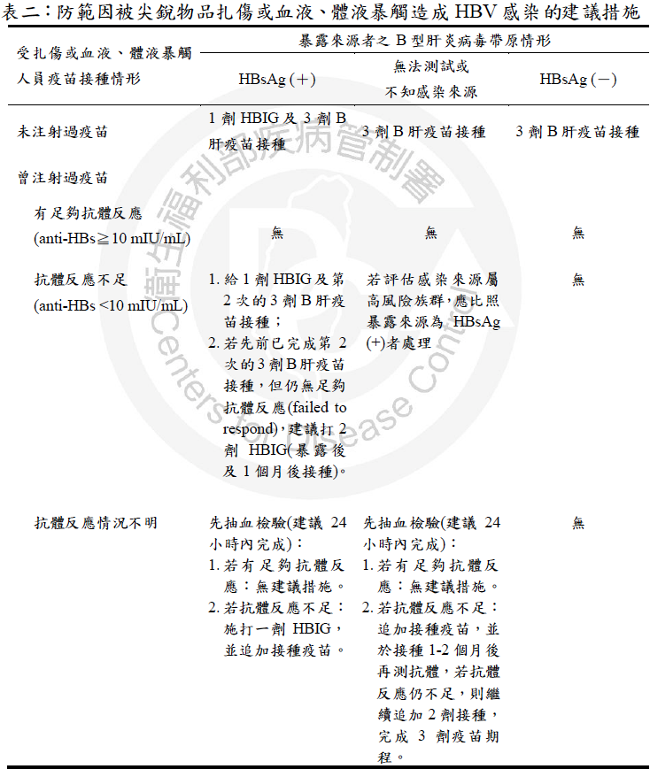  
  
## HAV  
- 兩劑間隔**6-12**個月，施打後免疫力可維持**20年**  
### 公費  
- 民國**106年(含)以後**出生年滿**12個月**以上幼兒  
- 設籍於30個山地鄉、9個鄰近山地鄉之平地鄉及金門連江兩縣等地區，於民國105年(含)以前出生年滿12個月以上之學齡前幼兒  
- 國小六年級(含)以下之低收入戶及中低收入戶兒童  
### 自費  
- 前往A型肝炎流行地區（例如非洲、南美洲、中國大陸、東南亞及南亞地區等）旅遊或工作者等  
- 患有**慢性肝病**、血友病、曾經**移植肝臟**的病人、**靜脈藥癮**者、男男間性行為者  
- 特殊職業如**廚師及餐飲食品從業人員、醫療照護者、嬰幼兒保育工作者**  
  
## HPV  
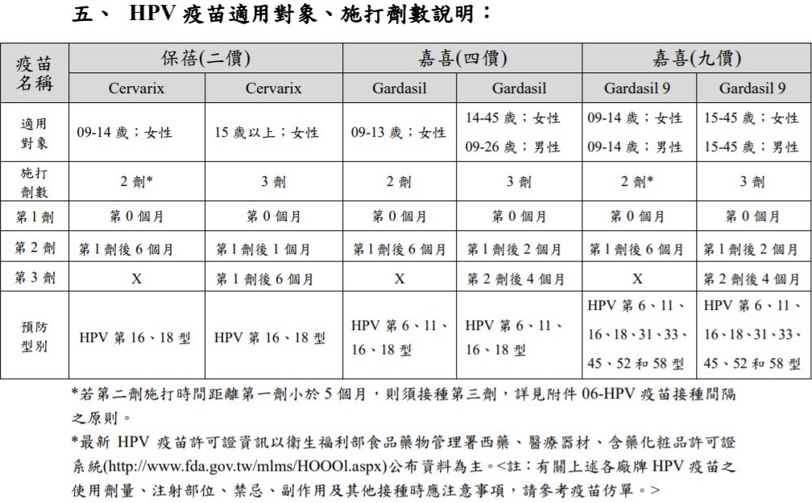  
  
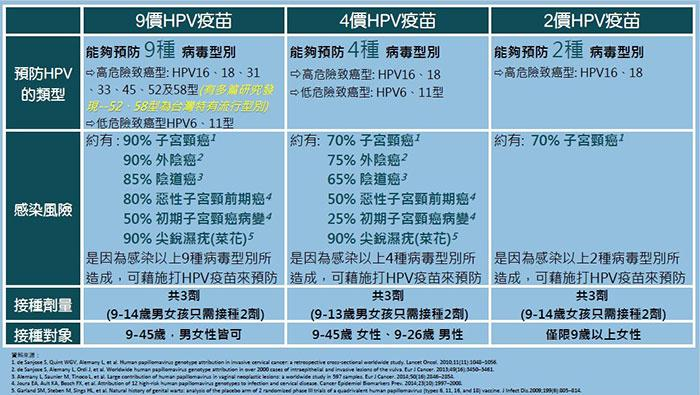  
  
- 19-26 歲成人均建議接種， 27-45歲**高感染風險者**如免疫功能不全（含括愛滋病毒感染者）及**男同性戀**建議接種  
- 2價僅適用於女性，4價及9價適用於男性及女性  
  
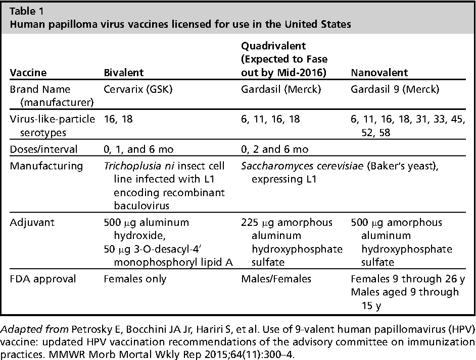  
  
## Rabies  
  
### 暴露前  
- 狂犬病毒實驗室工作人員、動物防疫人員、捕犬人員、動物保育人員、獸醫從業人員、消防隊員、巡山員及經常出入深山者等高風險族群，考量其因工作性質暴露風險較高，可考慮暴露前接種，一般建議接種**3劑**，分別於**0, 7, 21或28天**注射狂犬病疫苗，以便達到免疫效果  
- 針對實驗室工作人員等持續暴露高風險族群，依疫苗仿單及各國建議，每6個月檢測一次中和抗體濃度，低者追加一劑疫苗  
- 其他風險族群（如動物防疫人員、獸醫師等），完成暴露前三劑基礎免疫，在無動物致傷前提下，**一年後**追加一劑，以後每隔**3至5年**追加一劑  
  
### 暴露後預防  
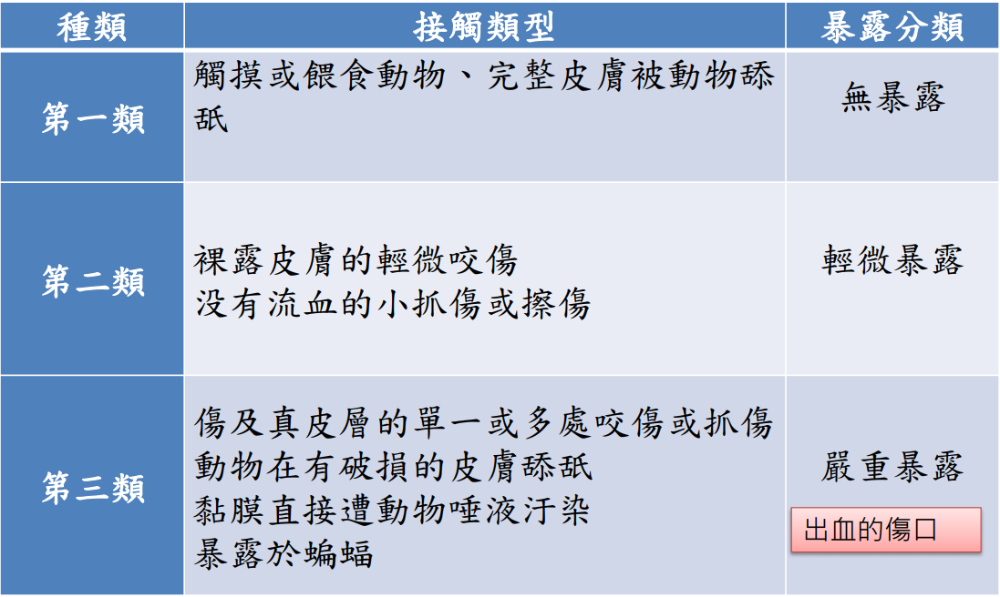  
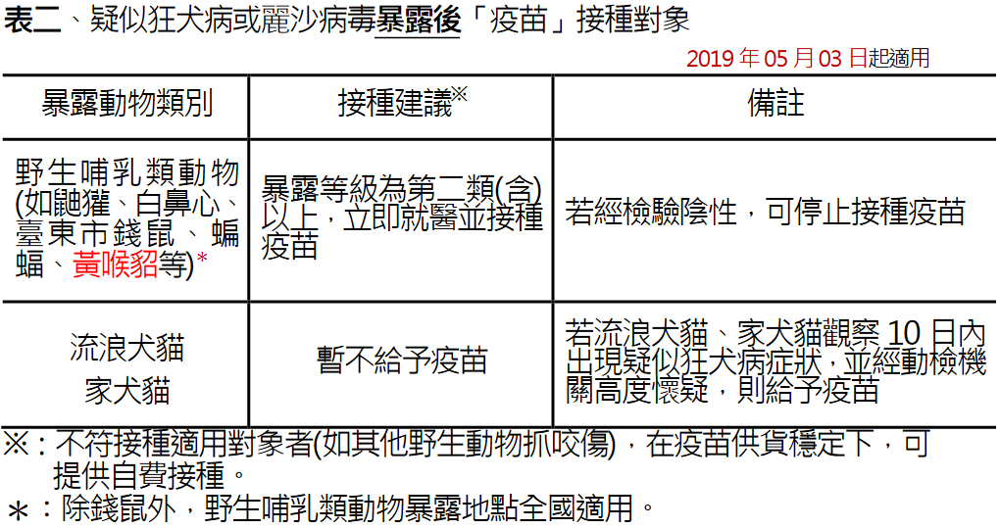  
- 以前未曾接種過狂犬病疫苗者，需接種**4劑**；第一劑儘可能在被患有狂犬病之動物咬傷後即注射（與免疫球蛋白在不同之部位注射，同時接種)，其餘的則在第一劑注射後第**3, 7, 14**天施打  
- 以前曾完整接種過狂犬病疫苗者，只需接種**2劑**；第一劑最好要在動物咬傷當天接種，第二劑的則在第一劑注射後**第3天**施行  
- 對新霉素有過敏者不建議接種，除非有高度接觸狂犬病的風險或者需要作傷後治療  
  
## 流行性腦脊髓膜炎  
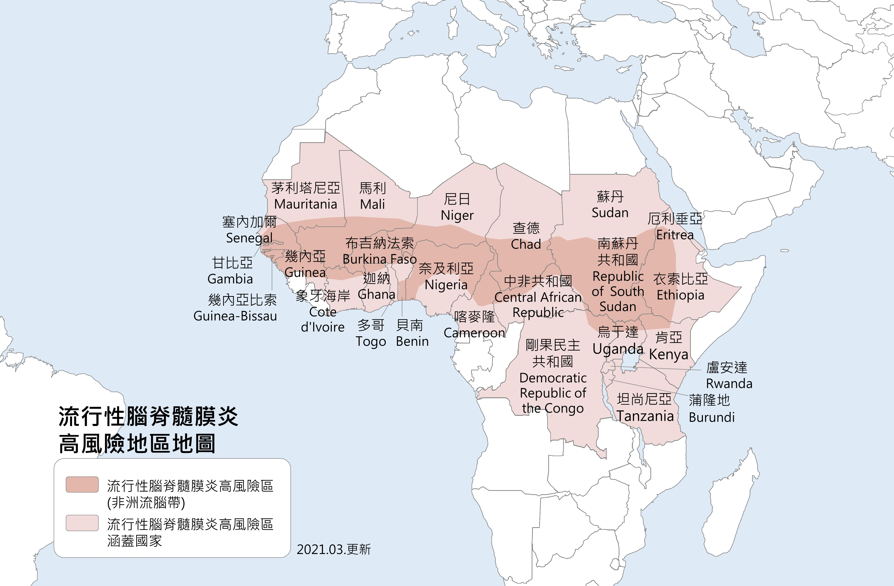  
  
- Indications  
    - Anatomical or functional asplenia (including sickle cell disease), HIV infection, persistent complement component deficiency, complement inhibitor (e.g., eculizumab, ravulizumab) use: **2-dose** series MenACWY-D (Menactra, Menveo or MenQuadfi) at least **8 weeks** apart and revaccinate every 5 years if risk remains  
    - Travel in countries with hyperendemic or epidemic meningococcal disease, microbiologists routinely exposed to Neisseria meningitidis: 1 dose MenACWY (Menactra, Menveo or MenQuadfi) and revaccinate every 5 years if risk remains  
  
- 流行性腦脊髓膜炎疫苗是一種不活化疫苗，現用疫苗（商品名Menveo，腦寧安）是純化**A, C, W-135, Y**四種血清型細菌的細胞壁多醣體後，以**白喉桿菌蛋白**作為載體蛋白，結合製成疫苗，對其他血清型的腦膜炎雙球菌（如B型）並沒有保護效果  
    - 接種年齡及劑次：**2至55歲**接種1劑  
- 單劑接種（0.5 ml）後約7~10天可產生保護力，保護力可維持**5年**  
    - 流行性腦脊髓膜炎疫苗預防接種證明書於接種**10天**後生效  
    - 沙烏地阿拉伯政府要求赴沙國朝覲(Hajj)必須接種流行性腦脊髓膜炎疫苗，並出示國際預防接種證明書  
- 追加接種建議：  
    1. 暴露於高風險環境者建議每**5年**追加接種1劑  
    2. 已知可能**暴露**於A型腦膜炎雙球菌感染風險且曾經接種過疫苗(Menveo，腦寧安)建議**追加**接種1劑，且應與最後一次接種間隔至少**12個月**  
  
## Typhoid Fever  
  
- 純化傷寒桿菌的細胞壁多醣體製成，肌肉注射或**皮下**注射  
- 接種後約**14天**可產生保護力，保護力約可維持2~3年，如持續暴露於高風險環境，可考慮每**3年**追加接種一劑疫苗  
- **2歲**以上可施打  
  
# 血體液曝觸  
  
# Immunoglobulins  
  
#### Indication  
  
| Immunoglobulin                       | Indication                                                                                                                                               | Time                                                | Dose & Route                                                                                                                 |  
| ------------------------------------ | -------------------------------------------------------------------------------------------------------------------------------------------------------- | --------------------------------------------------- | ---------------------------------------------------------------------------------------------------------------------------- |  
| IVIG                                 | Kawasaki disease: coronary artery aneurysms   Enterovirus: 急性腦炎、急性腦脊髓炎、自主神經機能失調、敗血症候群   孕婦或免疫不全患者暴露麻疹、水痘                                           | Kawasaki: 10天內      Measles: 6天內; VZV: 4-10天內 | Kawasaki: **2g/kg** IVD over 12hr x 1-2 doses   EV71: **1g/kg** IVD over 12hr x 1-2 doses   Measles, VZV: **400mg/kg** |  
| HBV (HBIG)                           | 暴露後預防：接觸者HBsAg (+)，暴露者HBsAg & HBsAb (-)                                                                                                                  | 24小時內、（一個月後）                                        | 0.06 ml/kg IM                                                                                                                |  
| Measles (IMIG)                       | 暴露後預防：一歲以下（六個月以上也可在72小時內打MMR）；一歲以上除非有MMR禁忌症才打IMIG                                                                                                        | **6天內**                                             | 0.5 mL/kg (max 15mL) IM                                                                                                      |  
| Rabies (HRIG)                        | 暴露後預防：   任何暴露：蝙蝠 (aerosol possible)   第二類暴露（表皮層抓咬傷）：鑑定**陽性動物**   第三類暴露（真皮層抓咬傷有流血、破損皮膚被舔舐、黏膜接觸到唾液）：**鼬獾、白鼻心、黃喉貂、台東市錢鼠**   排除條件：**已接受暴露前預防接種** | **首劑疫苗**後**7天**內                                    | 20 IU/kg, IM                                                                                                                 |  
| Varicella (VZIG)                     | 新生兒母親在產前5天或產後2天內長水痘、28週以下早產兒、28週以上早產兒且母親沒有抗體、免疫低下患者且無免疫力                                                                                                 | 96小時 (ACIP) 至10天內 (免疫低下)                            | 1.25 U/kg, IM                                                                                                                |  
| Tetanus immune globulin (TIG)        | 出現痛性之肌肉收縮（最初在咬肌及頸部肌肉，而後為軀幹肌肉）、腹部僵硬（abdominal rigidity）、 肌肉痙攣（spasm）、角弓反張（opisthotonus）、臉部表情出現「痙笑」（risus sardonicus）之疑似病患                                 | ASAP                                                | Prophylaxis: 250 IU, IM   Treatment: 3000-6000 IU IM                                                                      |  
| Botulism Antitoxin Heptavalent (BAT) | 避免血液中游離的毒素繼續傷害神經肌肉接合處，無法移除已與神經肌肉接合處連結的毒素                                                                                                                 | ASAP                                                | 1 vial IV                                                                                                                    |  
  
## Pavilizumab  
- RSV prevention  
- 健保給付條件：  
    1. 出生時懷孕週數**≤28週**之早產兒  
    2. 併有慢性肺疾病 (Chronic Lung Disease) 之早產兒 (**≤35週**)  
    3. **一歲**以下患有血液動力學上顯著異常之先天性心臟病童，符合以下條件：  
        1. 納入條件：符合下列條件之一  
            1. 非發紺性先天性心臟病**合併心臟衰竭**，符合下列三項中至少兩項：  
                1. **生長遲滯**，體重小於第三百分位  
                2. 有明顯**心臟擴大**現象  
                3. 需**兩種以上抗心臟衰竭藥物**控制症狀  
            2. 發紺性先天性心臟病：完全矯正手術（含心導管或是外科手術矯正）前或是矯正手術後仍有發紺或是心臟衰竭症狀者  
  
## Kawasaki Disease  
  
### 診斷標準  
1. 發燒五天或**五天以上**且合併下列五項臨床症狀中至少**四項**  
    1. 兩眼眼球**結膜充血**  
    2. 嘴唇及口腔的變化：嘴唇紅、乾裂或**草莓舌**或咽喉泛紅  
    3. 肢端病變：手（足）水腫或指（趾）尖**脫皮**  
    4. 多形性**皮疹**  
    5. 頸部**淋巴腺腫**  
2. 排除其他可能引起類似臨床疾病  
3. 或只符合三項臨床症狀，但心臟超音波檢查已發現有**冠狀動脈病變**    
    **（risk:** Age <1 year and >9 years, male sex)  
  
  
  
  
  
  
  
  
  
### Incomplete Kawasaki Disease  
  
- When to consider:      
    - **<6m/o** with unexplained fever ≥7 days, even if they have no clinical findings of KD children with unexplained fever ≥5 days and only two or three clinical criteria  
    - Lab findings suggest KD (supplementary criteria)  
        - Elevated acute-phase reactants (CRP ≥3 mg/dL [≥30 mg/L] or ESR ≥40 mm/hour) + 3 or more following:  
            - WBC count ≥15,000/microL  
            - Normocytic, normochromic anemia for age  
            - Platelet cell count ≥450,000/microL after seven days of illness  
            - Non-neutrophilic (sterile) pyuria (≥10 WBCs/high-power field)  
            - Serum alanine aminotransferase level >50 units/L  
            - Serum albumin ≤3 g/dL  
        - Elevated acute-phase reactants + positive echocardiogram  
        