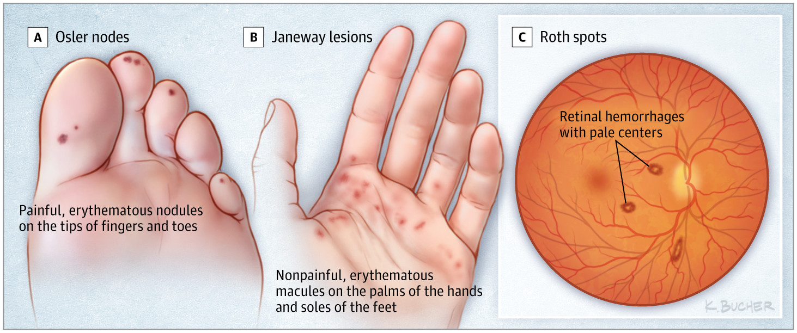

# BACTEREMIA  
  
## Definitions  
  
- Primary bacteremia: bloodstream infection due to direct inoculation of the blood  
- Central line associated bloodstream infection (CLABSI): bacteremia in which the same organism is growing from peripheral and catheter cultures (CID 2009;49:1)  
- Secondary bacteremia: infection of another site (eg, UTI, pneumonia, colitis, etc.) spreading to blood  
- Contaminant: bacteria growing in a blood culture that does not represent a true infection  
  
## Risk factors for bloodstream infections (JAMA 2012;308:502; CID;2020;71)  
  
- Syndromes with high likelihood of bacteremia:  
	- Sepsis  
	- Endovascular infections: endocarditis, infection of pacemaker, vascular graft or IV catheter  
	- Vertebral osteomyelitis, epidural abscess, septic arthritis  
- Risk factors: indwelling lines, IVDU, immunosupp. (neutropenic, transplant)  
- Organisms  
	- More likely pathogenic: *S. aureus*, β-hemolytic strep, enterococci, GNR, *S. pneumo*, *Neisseria*, *Candida*  
	- Less likely pathogenic: coag-neg staph, diphtheroids, Cutibacterium  
- Time to growth: <24 h → higher risk, >72 h → lower risk (except slow-growing, eg, HACEK)  
- Factors increasing likelihood of endocarditis: high-grade bacteremia w/o source, persisting after line removal or drainage of focal source, in hosts at risk for endocarditis or w/ organisms known to cause IE; emboli  
  
## Diagnosis  
  
- ≥2 sets blood culture prior to antibiotics (set = aerobic + aneaerobic culture) at separate puncture sites  
- If proven bacteremia, daily surveillance cultures until **48 hrs of ⊖ cultures**. May not need for GNRs (ClD 2017;65:1776)  
- Transthoracic echocardiography (TTE)/transesophageal echocardiography (TEE) if concern for endocarditis (see IE section)  
- **TTE** and **urgent ophthalmology** evaluation if yeast is growing in blood culture  
  
  
  
  
## Treatment (CID 2009;49:1; JAMA 2020;323:2160)  
  
- Empiric antibiotics based on Gram stain, culture, & clinical syndrome, then tailor based on sensitivity  
  
### Short-Term Central Venous Catheter-Related Bloodstream Infections  
  
| Pathogen                   | Management                                                                                                                                                                                                                                                                                                                                                                                                          |  
| -------------------------- | ------------------------------------------------------------------------------------------------------------------------------------------------------------------------------------------------------------------------------------------------------------------------------------------------------------------------------------------------------------------------------------------------------------------- |  
| **_S. aureus_**            | Risk of endocarditis in bacteremia: ˜25% (_JACC_ 1997;30:1072)  ID consult a/w ↓ mortality (_ClD_ 2015;60:1451)  Remove CVC, evaluate for endocarditis, osteo, hardware infections  Preferred antibiotics: MSSA → nafcillin, oxacillin, or cefazolin. MRSA → vancomycin. Duration: 2 wks if normal host, no implants, no evidence of endocarditis or metastatic complications. Otherwise 4-6 wks. |  
| **Coag-neg staphylococci** | CVC retention does not ↓ rate of resolution, but a/w ↑ rate of recurrence (_CID_ 2009;49:1187). If CVC left, treat 10-14 days; if removed 5-7 days.                                                                                                                                                                                                                                                                 |  
| **_Enterococcus_**         | Remove CVC & treat for 7-14 days                                                                                                                                                                                                                                                                                                                                                                                    |  
| GNR**                      | Remove CVC esp if _Pseudomonas._ Therapy for 14 days (7 if uncomplicated).                                                                                                                                                                                                                                                                                                                                          |  
| **Yeast**                  | Remove CVC & treat for 14 from first ⊖ BCx. ID consult a/w ↓ mortality.                                                                                                                                                                                                                                                                                                                                             |  
- Persistently ⊕ BCx: remove CVCs, look for metastatic infection (endocarditis, septic arthritis, osteo), infected thrombosis, or prosthetic material (vascular graft, PPM)  
  
# BACTERIAL ENDOCARDITIS  
  
## Definition  
  
- Infection of endothelium of heart (including but not limited to the valves) including both prosthetic valve endocarditis (PVE) and native valve endocarditis (NVE)  
  
## Risk Factors  
- Abnormal valve (JAMA 1997;277:1794; JACC 2018;72:2443)  
	- High risk: prior endocarditis, prosthetic valve or ring, some congenital heart disease (unrepaired cyanotic; shunt/conduit; prosthesis in past 6 mos), transplant heart, valvulopathy, ventricular assist device  
	- Medium risk: previous rheumatic fever, non-rheumatic valve disease (including MVP w/ MR or thickened leaflet), HCM, bicuspid AoV  
- Risk of bacteremia: IVDU, indwelling venous catheters, hemodialysis, prosthetic material in heart (eg, pacemaker, ICD, graft), poor dentition  
  
## Microbiology of Endocarditis  
  
|                      | **Native Valve (NVE)** |          | **Prosthetic Valve (PVE)** |                  |  
| -------------------- | ---------------------- | -------- | -------------------------- | ---------------- |  
| **Etiology**         | **Non-IVDA**           | **IVDU** | **Early** (≤60 days)       | **Late** (>60 d) |  
| _S. viridans_ et al. | **36%**                | **13%**  | <5%                        | **20%**          |  
| _Enterococcus_       | **11%**                | 5%       | 8%                         | 13%              |  
| _S. aureus_          | **28%**                | **68%**  | **36%**                    | **20%**          |  
| _S. epidermidis_     | **9%**                 | <5%      | **17%**                    | **20%**          |  
| GNR                  | <5%                    | <**5**%  | **6%**                     | <5%              |  
| Other                | <5%                    | <5%      | 10%                        | 10%              |  
| Fungal^              | 1%                     | 1%       | 9%                         | 3%               |  
| Culture ⊖^^          | 11%                    | <5%      | 17%                        | 12%              |  
^ ↑ risk w/DM, indwelling lines, immunosupp.  
^^ Cx ⊖ = abiotrophic strep, HACEK (Haemophilus para-influenzae & aphrophilus, Actinobacillus, Cardiobacterium, Eikenella, and Kingella), T. whipplei, Bartonella, Coxiella, Chlamydia, Legionella, Brucella (JAMA 2007;297:1354; Annals 2007;147:829; J Clin Microbiol 2012;50:216)  
  
## Clinical manifestation (Lancet 2016;387:882)  
  
- Persistent bacteremia → fever (80-90%), rigors, night sweats, anorexia, myalgias  
- Valvular or perivalvular infection → HF, conduction abnormalities (eg, AVB)  
- Septic emboli: stroke, embolic MI, renal/splenic/pulmonary infarcts, septic arthritis, osteo  
- Immune complex phenomena: arthritis, glomerulonephritis  
- Subacute endocarditis can present with subacute progressive “B” sx (fatigue, wt loss)  
  
## Physical exam  
  
- Cardiac murmur (85%), s/s of new HF (pulmonary edema, JVP elevation, edema)  
- Skin/ocular changes (uncommon but highly specific)  
- Janeway lesions (painless hemorrhagic macules on palms/ soles due to septic emboli)  
- Osler's nodes (painful nodules on pads of digits due to immune complex deposition)  
- Splinter hemorrhages in fingernails or toenails  
- Roth spots (retinal hemorrhages)  
- MSK: point tenderness along spine, red/hot joints  
- Neurologic deficits c/f embolic stroke; vertebral tenderness c/f osteo or epidural abscess  
- Devices: evaluate CVCs, PM/ICD pocket, and sites of other hardware/ prosthetics  
  
  
  
## Diagnosis (CID 2010;51:131; EHJ 2015;36:3075; Circ 2015;132:1435)  
  
- Blood cultures (before abx): 3 sets (aerobic & anaerobic bottles) from different sites, ideally spaced ≥1 h apart. ✓ BCx (at least 2 sets) after appropriate abx have been initiated to document clearance; repeat q24-48h until ⊖.  
- Serial ECGs to assess for conduction disease and ↑ PR interval (c/f perivalvular abscess)  
- Echocardiogram: TTE in all Pts. TEE if (i) TTE abnl but nondx, (ii) TTE ⊖ but high suspicion, (iii) complications suspected or present (eg, AVB), (iv) high-risk (prosthetic valve, CIED, prior IE, congenital heart dis.), (v) S. aureus, enterococcus, or fungus, (vi) Δ in signs or sx (eg, new conduction abnl, regurgitation, etc.) (vii) if considering a shortened course (10-14 d) of abx (vide infra)  
  
|                           | **Sensitivity** |         |             |  
| ------------------------- | --------------- | ------- | ----------- |  
|                           | **NVE**         | **PVE** | **Abscess** |  
| **Transthoracic (TTE)**   | 39-58%          | 33%     | 18-63%      |  
| **Transesophageal (TEE)** | >90%            | 86%     | 76-100%     |  
  
- Gated cardiac CT useful if TTE/TEE equivocal or suspected paravalvular abscess  
- PET/CT using FDG useful for suspected PVE or CIED infxn if TTE/TEE equivocal  
- Brain/spine imaging if concern for CNS spread (mycotic aneurysms, embolic stroke) or spinal involvement (vertebral osteo, epidural abscess)  
- Cx ⊖ endocarditis: may be due to abx prior to BCx. PCR, bacterial 16S ribosomal RNA, serol. may be helpful. Detailed hx: animal exposure, travel, unpast. dairy, etc. ID eval. Consider organisms listed in Cx ⊖ footnote in microbiology table (vide supra).  
  
### Modified Duke Criteria  
  
- **Definitive**: 2 major _or_ 1 major+3 minor _or_ 5 minor; **Possible**: 1 major+1 minor _or_ 3 minor  
  
| **Major**                                                                                                                                                                                                                                       | **Minor**                                                                                                                                                                                                                                                                                               |  
| ----------------------------------------------------------------------------------------------------------------------------------------------------------------------------------------------------------------------------------------------- | ------------------------------------------------------------------------------------------------------------------------------------------------------------------------------------------------------------------------------------------------------------------------------------------------------- |  
| - Blood cultures with common endocarditis pathogen (grown in 2 separate culture)      - _Coxiella_ serology ≥1:800      - **Endocardial involvement**: vegetation, abscess, prosthetic dehiscence or **new valvular regurgitation** | - Predisposing condition (see risk factors)      - Fever      - Vascular phenomena: septic arterial or pulmonary emboli, mycotic aneurysms, ICH, Janeway lesions      - Immune phenomena: ⊕ RF, GN, Osler's nodes, Roth spots      - ⊕ blood culture not meeting major criteria |  
Se ˜90%, Sp >95%, NPV ≥92% (CID 2000;30:633).  
  
### Features Guiding the Need for Echocardiographic Assessment in Patients with Selected Monomicrobial Bacteremia  
  
| ***S. AUREUS***                       | ***E. FAECALIS***                            | **NON-β-HEMOLYTIC STREPTOCOCCI**                                         |  
| ------------------------------------- | -------------------------------------------- | ------------------------------------------------------------------------ |  
| Intracardiac device                   | Symptoms ≥7 days                             | Symptoms ≥7 days                                                         |  
| Prior endocarditis                    | Emboli                                       | Greater than two positive cultures                                       |  
| Injection drug use                    | Greater than two positive cultures           | One species: S. gallolyticus, S. sanguinis, S. mutans (not S. anginosus) |  
| Cerebral/peripheral emboli            | Unknown origin (no focus)                    |                                                                          |  
| Meningitis                            | Heart murmur                                 | Heart murmur or valve disease                                            |  
| Preexisting valve disease             | Valve disease (including prior endocarditis) | Community acquired                                                       |  
| Persistent bacteremia (≥72 hours)     |                                              |                                                                          |  
| Vertebral osteomyelitis               |                                              |                                                                          |  
| Community acquisition                 |                                              |                                                                          |  
| Non-nosocomial health care associated |                                              |                                                                          |  
| Indeterminate or positive TTE         |                                              |                                                                          |  
  
## Treatment (ID consult is strongly recommended)  
  
| Pathogen                              | Treatment (Circ 2015;132:1435)                                                                                                                                                                                                                                                                 |  
| ------------------------------------- | ---------------------------------------------------------------------------------------------------------------------------------------------------------------------------------------------------------------------------------------------------------------------------------------------- |  
| Empiric                               | NVE or PVE >12 mos post-op: vancomycin + ceftriaxone  PVE <12 mos post op: vancomycin + ceftriaxone ± gentamicin (if OK renal function)                                                                                                                                                  |  
| _Strep_                               | Penicillin, ampicillin, ceftriaxone; if PVE consider gentamicin in discussion w/ ID                                                                                                                                                                                                            |  
| _Staph (S. aureus_ and _lugdunensis)_ | MRSA: vancomycin or daptomycin  MSSA: nafcillin, oxacillin, or cefazolin (avoid if CNS involvement due to poor penetration); vanc inferior to β-lactam for MSSA  For PCN allergy w/ MSSA consider desensitization  Consider rifampin / gentamicin in PVE in discussion w/ ID |  
| _Enterococci_                         | Ampicillin + CTX or gent]; if VRE: linezolid, dapto, ampicillin if sensitive                                                                                                                                                                                                                   |  
| Gram negatives                        | HACEK: CTX, ampicillin or FQ. _Pseudomonas_: 2 anti-Pseudomonal agents [eg, β-lactam + (aminoglycoside or FQ)]                                                                                                                                                                                 |  
| Fungi (candida, aspergillus)          | _Candida_: amphotericin B ± flucytosine or micafungin  _Aspergillus_: amphotericin B or voriconazole  Ophtho consult for fungemia to rule out endophthalmitis                                                                                                                      |  
- De-escalate abx to organism-directed therapy based on speciation and sensitivities  
- If on anticoagulation or antiplatelet, typically can continue unless concern for stroke, intracranial hemorrhage, or need for emergent surgery  
- Monitor for complications of endocarditis (CHF, conduction block, osteomyelitis, new embolic phenomenon) which can occur even on abx  
- Duration is usually 4-6 wks  
- After ==**≥10d**== IV abx can consider Δ'ing to PO if clinically appropriate and available PO abx in consultation with ID (NEJM 2019;380:415)  
- Uncomplicated right-sided NVE or PCN-S Strep spp → 2 wks may be adequate  
- IVDU-associated best managed by multidisciplinary teams including Addiction Medicine  
  
### Recommendations for antibiotic regimens for initial empirical treatment of infective endocarditis (before pathogen identification)^a  
  
  
  
### Recommendations for antibiotic treatment of infective endocarditis due to oral streptococci and _Streptococcus gallolyticus_ group  
  
  
  
### Recommendations for antibiotic treatment of infective endocarditis due to _Staphylococcus_ spp.  
  
  
  
  
### Recommendations for antibiotic treatment of infective endocarditis due to _Enterococcus_ spp.  
  
  
  
### Antibiotic treatment of blood culture-negative infective endocarditis  
| Pathogens                                           | Proposed therapya                                                                                                                                      | Treatment outcome                                                                                                         |  
| --------------------------------------------------- | ----------------------------------------------------------------------------------------------------------------------------------------------------------------- | ------------------------------------------------------------------------------------------------------------------------- |  
| _Brucella_ spp.                                     | Doxycycline (200 mg/24 h) plus cotrimoxazole (960 mg/12 h) plus rifampin (300–600 mg/24 h) for ≥3–6 monthsb orally                                     | Treatment success defined as an antibody titre <1:60.   Some authors recommend adding gentamicin for the first 3 weeks |  
| _C. burnetii_ (Q fever agent)                       | Doxycycline (200 mg/24 h) plus hydroxychloroquine (200–600 mg/24 h)c orally (>18 months of treatment)                                                  | Treatment success defined as anti-phase I IgG titre <1:400, and IgA and IgM titres <1:50                                  |  
| _Bartonella_ spp.d                       | Doxycycline 100 mg/12 h orally for 4 weeks plus gentamicin (3 mg/24 h) i.v. for 2 weeks                                                                           | Treatment success expected in ≥90%                                                                                        |  
| _Legionella_ spp.                                   | Levofloxacin (500 mg/12 h) i.v. or orally for ≥6 weeks or clarithromycin (500 mg/12 h) i.v. for 2 weeks, then orally for 4 weeks plus rifampin (300–1200 mg/24 h) | Optimal treatment unknown                                                                                                 |  
| _Mycoplasma_ spp.                                   | Levofloxacin (500 mg/12 h) i.v. or orally for ≥6 monthse                                                                                               | Optimal treatment unknown                                                                                                 |  
| _T. whipplei_ (Whipple’s disease agent)f | Doxycycline (200 mg/24 h) plus hydroxychloroquine (200–600 mg/24 h)c orally for ≥18 months                                                             | Long-term treatment, optimal duration unknown                                                                             |  
aOwing to the lack of large series, the optimal duration of treatment of IE due to these pathogens is unknown. The presented durations are based on selected case reports. Consultation with an infectious disease specialist is recommended.  
bAddition of streptomycin (15 mg/kg/24 h in 2 doses) for the first few weeks is optional.  
cDoxycycline plus hydroxychloroquine (with monitoring of serum hydroxychloroquine levels) is significantly superior to doxycycline.385  
dSeveral therapeutic regimens have been reported, including ampicillin or amoxicillin, (12 g/24 h i.v.) or cephalosporins (ceftriaxone 2 g/24 h i.v.) combined with aminoglycosides (gentamicin or netilmicin).381 Dosages are as for streptococcal and enterococcal IE.379,380  
eNewer fluoroquinolones (levofloxacin, moxifloxacin) are more potent than ciprofloxacin against intracellular pathogens such as _Mycoplasma_ spp., _Legionella_ spp., and _Chlamydia_ spp.  
fTreatment of Whipple’s IE remains highly empirical. In the case of central nervous system involvement, sulfadiazine 1.5 g/6 h orally must be added to doxycycline. An alternative therapy is ceftriaxone (2 g/24 h i.v.) for 2–4 weeks or penicillin G (2 million U/4 h) and streptomycin (1 g/24 h) i.v. for 2–4 weeks followed by cotrimoxazole (800 mg/12 h) orally. Trimethoprim is not active against _T. whipplei_. Successes have been reported with long-term therapy (1 year).  
  
## Indications for surgery (consult early; JTCS 2017;153:1241; Circ 2021;143:e72)  
  
- Emergent (within 24 h): refractory cardiogenic shock or pulmonary edema  
- Urgent (within 3–5 days):  
	- Sx HF  
	- Penetrating infection: periannular abscess, heart block, fistula, worsening conduction  
	- Persistent infection: ⊕ BCx after >5 d of appropriate abx, ↑ or ? large vegetation  
	- Emboli: recurrent or w/ residual large (>10 mm) vegetation & severe AR/MR. Cerebral emboli not contraindic. unless severe stroke or hemorrhage (Stroke 2006;37:2094).  
	- MRSA  
	- PVE (emergent if dysfunction or dehiscence) caused by SA or non-HACEK GNB  
- Non-urgent: within same hospital admission  
	- HF with stable hemodynamics  
	- Resistant bacteria or fungi other than SA  
	- PVE not caused SA or non-HACEK GNB  
  
aDespite appropriate antibiotic therapy for >1 week and control of septic embolic foci.   
bE.g. patients with significant valvular dysfunction that is, or is not, a direct result of endocarditis process.   
c_S. aureus_ (methicillin resistant and non-methicillin resistant), vancomycin-resistant enterococci, non-HACEK Gram-negative bacteria and fungi.   
dUrgent for _S. aureus_, non-urgent for others.  
  
## Oral Step-Down Therapy  
  
  
  
## Endocarditis Prophylaxis (Circ 2007;116:1736)  
  
| **Cardiac conditions^** | **Prosthetic valve; previous endocarditis; congenital heart disease** (CHD) including unrepaired or incompletely repaired cyanotic CHD (palliative shunts or conduits), 1st 6 mo after completely repaired CHD using prosthetic material; cardiac transplant recipients w/ valvulopathy. (Prophylaxis no longer rec. in acquired valvular dysfxn, bicuspid AoV, MVP with leaflet thickening or regurgitation, HCM.) |  
| ----------------------- | ------------------------------------------------------------------------------------------------------------------------------------------------------------------------------------------------------------------------------------------------------------------------------------------------------------------------------------------------------------------------------------------------------------------- |  
| **Procedures^**         | **Dental:** manipulation of gingival tissue or periapical region of teeth or perf oral mucosa (eg, extraction, periodontal, implant, root canal, cleaning)                                                                                                                                                                                                                                                          |  
| **Regimens**            | Oral: amoxicillin 2 g 30-60 min before  Unable to take PO: amp 2 g IM/IV or cefazolin or ceftriaxone 1 g IM/IV  PCN-allergic: cephalexin or azithro or claritho or doxy                                                                                                                                                                                                                                 |  
^Pts should meet both indications (high-risk condition & high-risk procedure) to qualify for prophylaxis  
  
# References  
  
1. Delgado, V., Ajmone Marsan, N., De Waha, S., Bonaros, N., Brida, M., et al. (2023) 2023 ESC Guidelines for the management of endocarditis. _European Heart Journal_. 44 (39), 3948–4042. doi:[10.1093/eurheartj/ehad193](https://doi.org/10.1093/eurheartj/ehad193).  
2. Sabatine, M. (2022) _Pocket Medicine_. Pocket Notebook Series. 8th ed. Philadelphia, Wolters Kluwer Health.  
  
