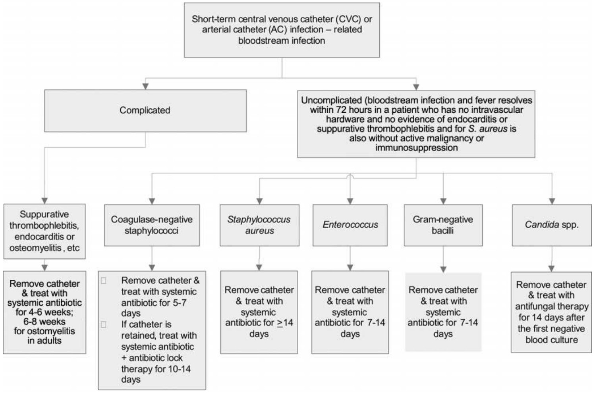
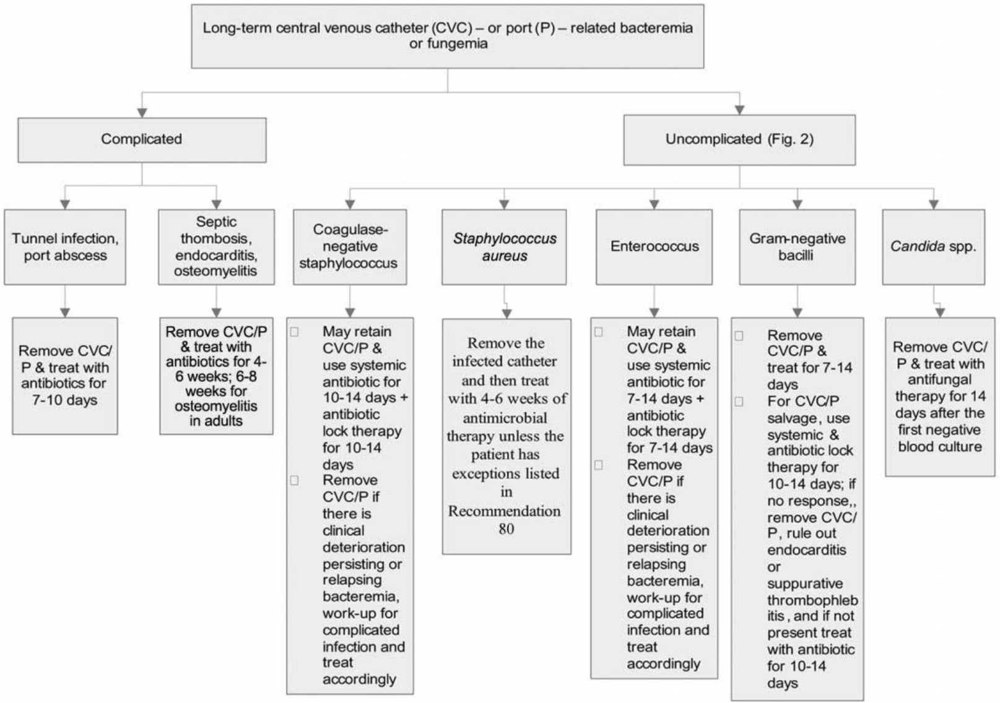
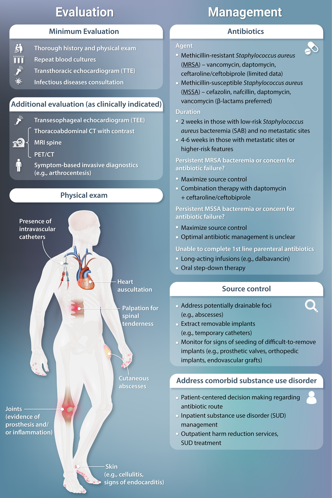
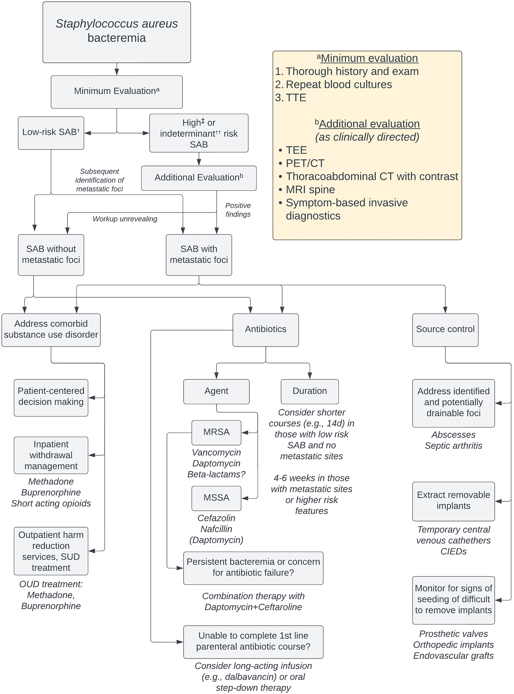

# BACTEREMIA  
  
## Definitions  
  
- Primary bacteremia: bloodstream infection due to direct inoculation of the blood  
- Central line associated bloodstream infection (CLABSI): bacteremia in which the same organism is growing from peripheral and catheter cultures (CID 2009;49:1)  
- Secondary bacteremia: infection of another site (eg, UTI, pneumonia, colitis, etc.) spreading to blood  
- Contaminant: bacteria growing in a blood culture that does not represent a true infection  
  
<!-- more -->  
## Risk factors for bloodstream infections (JAMA 2012;308:502; CID;2020;71)  
  
- Syndromes with high likelihood of bacteremia:  
	- Sepsis  
	- Endovascular infections: endocarditis, infection of pacemaker, vascular graft or IV catheter  
	- Vertebral osteomyelitis, epidural abscess, septic arthritis  
- Risk factors: indwelling lines, IVDU, immunosupp. (neutropenic, transplant)  
- Organisms  
	- More likely pathogenic: *S. aureus*, β-hemolytic strep, enterococci, GNR, *S. pneumo*, *Neisseria*, *Candida*  
	- Less likely pathogenic: coag-neg staph, diphtheroids, Cutibacterium  
- Time to growth: <24 h → higher risk, >72 h → lower risk (except slow-growing, eg, HACEK)  
- Factors increasing likelihood of endocarditis: high-grade bacteremia w/o source, persisting after line removal or drainage of focal source, in hosts at risk for endocarditis or w/ organisms known to cause IE; emboli  
  
## Diagnosis  
  
- ≥2 sets blood culture prior to antibiotics (set = aerobic + aneaerobic culture) at separate puncture sites  
- If proven bacteremia, daily surveillance cultures until **48 hrs of ⊖ cultures**. May not need for GNRs (ClD 2017;65:1776)  
- Transthoracic echocardiography (TTE)/transesophageal echocardiography (TEE) if concern for endocarditis (see IE section)  
- **TTE** and **urgent ophthalmology** evaluation if yeast is growing in blood culture  
  
## Treatment (CID 2009;49:1; JAMA 2020;323:2160)  
  
- Empiric antibiotics based on Gram stain, culture, & clinical syndrome, then tailor based on sensitivity  
  
### CRBSI  
- Definition: a positive result of semiquantitative (>15 cfu per catheter segment) or quantitative (>102 cfu per catheter segment) catheter culture, whereby the same organism (species) is isolated from a catheter segment and a peripheral blood culture; simultaneous quantitative cultures of blood with a ratio of 13:1 cfu/mL of blood (catheter vs. peripheral blood); differential time to positivity (growth in a culture of blood obtained through a catheter hub is detected by an automated blood culture system at least 2 h earlier than a culture of simultaneously drawn peripheral blood of equal volume).  
#### Short-Term Central Venous Catheter-Related Bloodstream Infections  
  
| Pathogen                   | Management                                                                                                                                                                                                                                                                                                                                                                                                  |  
| -------------------------- | ----------------------------------------------------------------------------------------------------------------------------------------------------------------------------------------------------------------------------------------------------------------------------------------------------------------------------------------------------------------------------------------------------------- |  
| **_S. aureus_**            | Risk of endocarditis in bacteremia: ˜25% (_JACC_ 1997;30:1072) ID consult a/w ↓ mortality (_ClD_ 2015;60:1451) Remove CVC, evaluate for endocarditis, osteo, hardware infections Preferred antibiotics: MSSA → nafcillin, oxacillin, or cefazolin. MRSA → vancomycin.  Duration: 2 wks if normal host, no implants, no evidence of endocarditis or metastatic complications. Otherwise 4-6 wks. |  
| **Coag-neg staphylococci** | CVC retention does not ↓ rate of resolution, but a/w ↑ rate of recurrence (_CID_ 2009;49:1187). If CVC left, treat 10-14 days; if removed 5-7 days.                                                                                                                                                                                                                                                         |  
| **_Enterococcus_**         | Remove CVC & treat for 7-14 days                                                                                                                                                                                                                                                                                                                                                                            |  
| **GNR**                    | Remove CVC esp if _Pseudomonas._ Therapy for 14 days (7 if uncomplicated).                                                                                                                                                                                                                                                                                                                                  |  
| **Yeast**                  | Remove CVC & treat for 14 from first ⊖ BCx. ID consult a/w ↓ mortality.                                                                                                                                                                                                                                                                                                                                     |  
- Persistently ⊕ BCx: remove CVCs, look for metastatic infection (endocarditis, septic arthritis, osteo), infected thrombosis, or prosthetic material (vascular graft, PPM)  
- Short-term catheters should be removed from patients with CRBSI due to gram-negative bacilli, *S. aureus*, enterococci, fungi, and mycobacteria  
- For patients with CRBSI for whom catheter salvage is attempted, additional blood cultures should be obtained, and the catheter should be removed if blood culture results (e.g., 2 sets of blood cultures obtained on a given day; 1 set of blood cultures is acceptable for neonates) remain positive when blood samples are obtained 72 h after the initiation of appropriate therapy  
- For patients with unexplained fever, if blood culture results are positive, the CVC or arterial catheter was exchanged over a guidewire, and the catheter tip has significant growth, then the catheter should be removed and a new catheter placed in a new site  
  
  
> Approach to the management of patients with short-term central venous catheter–related or arterial catheter–related bloodstream infection. [@Mermel2009ClinicalPractice]  
  
#### Long-term catheter [@Mermel2009ClinicalPractice]   
- Long-term catheters should be removed from patients with CRBSI associated with any of the following conditions: severe sepsis; suppurative thrombophlebitis; endocarditis; bloodstream infection that continues despite >72 h of antimicrobial therapy to which the infecting microbes are susceptible; or infections due to *S. aureus*, *P. aeruginosa*, fungi, or mycobacteria  
- In uncomplicated CRBSI involving long-term catheters due to pathogens other than *S. aureus*, *P. aeruginosa*, *Bacillus* species, *Micrococcus* species, *Propionibacteria*, fungi, or mycobacteria, because of the limited access sites in many patients who require long-term intravascular access for survival (e.g., patients undergoing hemodialysis or with short-gut syndrome), treatment should be attempted without catheter removal, with use of both systemic and antimicrobial lock therapy  
  
  
> Approach to the treatment of a patient with a long-term central venous catheter (CVC) or a port (P)-related bloodstream infection.  
> Recommendation 80: Patients can be considered for a shorter duration of antimicrobial therapy (i.e., a minimum of 14 days of therapy) if the patient is not diabetic; if the patient is not immunosuppressed (i.e., not receiving systemic steroids or other immunosuppressive drugs, such as those used for transplantation, and is nonneutropenic); if the infected catheter is removed; if the patient has no prosthetic intravascular device (e.g., pacemaker or recently placed vascular graft); if there is no evidence of endocarditis or suppurative thrombophlebitis on TEE and ultrasound, respectively; if fever and bacteremia resolve within 72 h after initiation of appropriate antimicrobial therapy; and if there is no evidence of metastatic infection on physical examination and sign- or symptom-directed diagnostic tests  
  
### Staphylococcus aureus bacteremia [@Minter2023ContemporaryManagement]  
  
Uncomplicated:  
- Exclusion of endocarditis  
- No implanted prostheses  
- Negative follow-up cultures at 2–4 d  
- Defervescence within 72 h of antibiotics  
- No evidence of metastatic sites of infection  
  
  
  
> **Proposed algorithm for the evaluation and management of SAB.**   
All patients should undergo a standardized minimum evaluation[^a] (thorough history and examination, repeat blood cultures, and TTE) that serves to stratify risk of metastatic foci. In those determined to have low-risk SAB (see below), additional workup can potentially be deferred. In those with indeterminant or high-risk SAB, additional evaluation[^b] (guided by the patient’s clinical features) is recommended. Classification of patients as having SAB with or without metastatic foci assists in guiding treatment decisions, which should include antibiotics, source control, and (when applicable) substance-use treatment.   
†Low-risk SAB: no predisposing host factors, negative TTE; blood cultures clear in <48 hours, bacteremia is hospital-acquired; no persistent fever, timely antibiotic start, and no clinical signs of metastatic infection.   
‡High-risk SAB: risk factors and/or suspicion for IE; clinical signs of metastatic infection, implanted prostheses, history of IDU and/or IE; blood cultures are positive >48 hours of therapy, delayed start in antibiotics, persistent fever.   
††Indeterminant-risk SAB: not meeting criteria for low- or high-risk SAB.   
Abbreviations: CIED, cardiac implantable electronic device; CT, computed tomography; MRI, magnetic resonance imaging; MRSA, methicillin-resistant Staphylococcus aureus; MSSA, methicillin-sensitive Staphylococcus aureus; OUD, opioid use disorder; PET/CT, positron emission tomography/computed tomography; SAB, Staphylococcus aureus bacteremia; SUD, substance-use disorder; TEE, transesophageal echocardiogram; TTE, transthoracic echocardiogram.  
  
# References  
  
1. Mermel, L.A., Allon, M., Bouza, E., Craven, D.E., Flynn, P., O’Grady, N.P., Raad, I.I., Rijnders, B.J.A., Sherertz, R.J. & Warren, D.K. (2009) Clinical Practice Guidelines for the Diagnosis and Management of Intravascular Catheter-Related Infection: 2009 Update by the Infectious Diseases Society of America. _Clinical Infectious Diseases_. 49 (1), 1–45. doi:[10.1086/599376](https://doi.org/10.1086/599376).  
2. Minter, D.J., Appa, A., Chambers, H.F. & Doernberg, S.B. (2023) Contemporary Management of _Staphylococcus aureus_ Bacteremia—Controversies in Clinical Practice. _Clinical Infectious Diseases_. 77 (11), e57–e68. doi:[10.1093/cid/ciad500](https://doi.org/10.1093/cid/ciad500).  
3. Sabatine, M. (2022) _Pocket Medicine_. Pocket Notebook Series. 8th ed. Philadelphia, Wolters Kluwer Health.  
  
