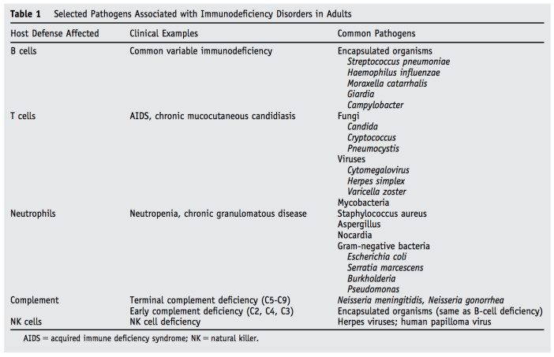
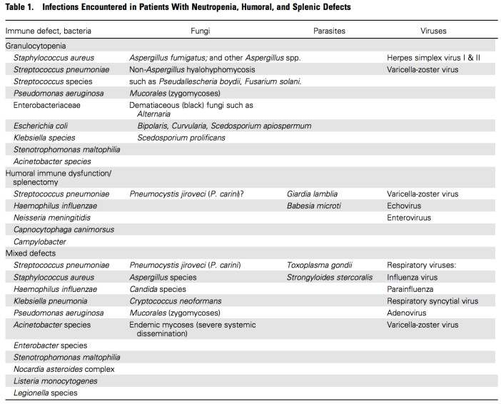

# Infections in Immunocompromised Hosts  
source: Pocket Medicine, 2022  
  
- Many Pts have ≥1 risk (eg, DM, ESRD, transplant, extremes of age)  
- Accurate dx of opportunistic infections and targeted Rx key in this population  
- The following is not an exhaustive list, but a delineation of common or classic etiologies  
  
<!-- more -->  
  
| **Predisposition**                                                                                                    | **Classic Infectious Etiologies**                                                                                                                                                                                                                                                                                                                                                                                                        |  
| --------------------------------------------------------------------------------------------------------------------- | ---------------------------------------------------------------------------------------------------------------------------------------------------------------------------------------------------------------------------------------------------------------------------------------------------------------------------------------------------------------------------------------------------------------------------------------- |  
| **Humoral immune dysfunction** (eg, CVID, myeloma) and **asplenia**                                                   | **Encapsulated bacteria: **_S. pneumo_, _H. flu_, _N. meningitidis_ (vaccinate against these 3, ideally prior to splenectomy)  **Other bacteria:**_E. coli_ and other GNRs, _Capnocytophaga_  **Parasites:** _Babesia, Giardia; _**Viruses: **VZV, echovirus, enterovirus                                                                                                                                                    |  
| **Granulocytopenia or neutropenia** (includes DM, ESRD → functional impairment)                                       | **Bacteria:** _Gram positive_: coag ⊖ staph, _S. aureus_, viridans strep, _S. pneumo_, other strep; _Corynebacterium_ spp., _Bacillus_ spp. _Gram negative_: _E. coli_, _Klebsiella_, _Pseudomonas_  **Fungi:** _Yeast_: _Candida albicans_ and other _Candida_ spp. _Molds_: _Aspergillus, Mucor_ spp., endemic fungi and others  **Viruses:** VZV, HSV1 and 2, CMV                                                         |  
| **Impaired cell-mediated immunity (CMI)** (eg, HIV/AIDS, chronic steroids, posttransplant, DM, ESRD, autoimmune dis.) | **Bacteria:** _Salmonella spp., Campylobacter, Listeria, Yersinia, Legionella_(_Lancet_ 2016;387:376)_, Rhodococcus, Nocardia_, TB, non-TB mycobacteria  **Fungi:** _Candida, Crypto, Histo, Coccidio, Aspergillus, Pneumocystis, Zygomycetes_ spp. and other molds  **Viruses:** HSV, VZV, CMV, EBV, JC virus, BK virus  **Parasites:** _Toxoplasma, Cryptosporidium, Isospora, Microsporidia Babesia; Strongyloides_ |  
| **Organ dysfunction**                                                                                                 | **Liver (esp. cirrhosis):** _Vibrio_ spp., encapsulated bacteria  **ESRD:** impaired granulocyte fxn and CMI as above  Iron overload (or deferoxamine Rx): _Yersinia_, _Zygomycetes_                                                                                                                                                                                                                                         |  
| **Biologics** (eg, TNF inhibitors, anti-B-cell Rx; ✓ for TB before starting)                                          | **Bacteria:** sepsis, septic arthritis, TB, NTM, _Listeria_, _Legionella_  **Fungi:** _Pneumocystis, Histo, Coccidio, Aspergillus_, endemic fungi  **Viruses:** JC virus (PML), EBV, HSV, VZV, HBV  **Parasites:** _Strongyloides_ reactivation                                                                                                                                                                        |  
  
  
