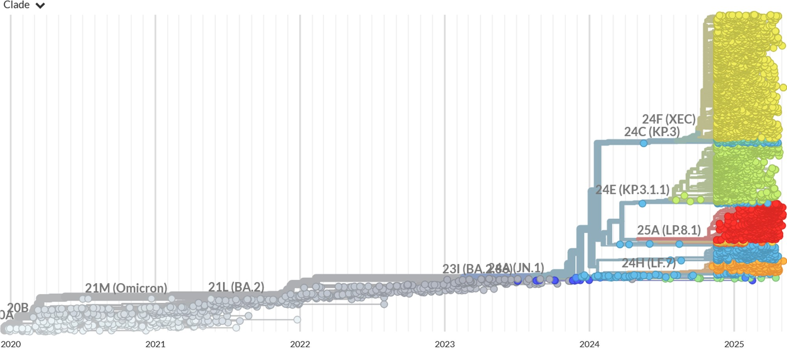
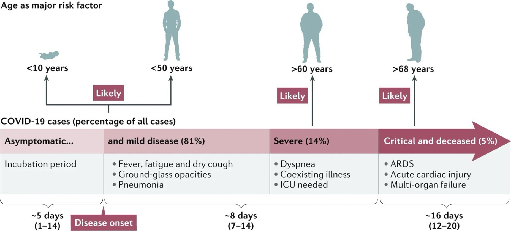
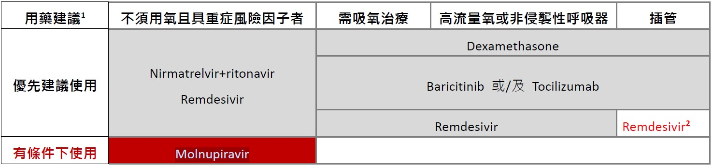

# CORONAVIRUS DISEASE 2019 (COVID-19) / SARS-COV-2 INFECTION  
source: Pocket Medicine, 2022; 台灣診治指引第二十八版  
## 微生物學與流行病學  
  
- 透過呼吸道顆粒在人與人之間傳播；無症狀與症狀前的傳播可能發生    
- 潛伏期：最長可達14天，從暴露到症狀出現的中位時間為4-5天  
- 確診病人發病==前2天==即可能具傳染力  
- 確診病人上呼吸道檢體可持續檢測SARS-CoV-2核酸陽性平均達==兩週==以上，且下呼吸道檢體檢出病毒的時間可能更久  
- 輕症個案在發病==10日後==即無法從上呼吸道檢體成功培養出病毒（部分重症個案或免疫不全者可能延長至20日），此時這些個案的病毒量均很低（ Realtime PCR Ct 值高），目前也沒有證據顯示此時這些個案能傳播疾病  
  
<!-- more -->  
  
### 病毒株  
  
  
> Source: https://nextstrain.org/ncov/open/global/6m  
  
## 傳播途徑  
  

<iframe style='position: absolute; top:0; left: 0; width: 100%; height: 105%; max-width:750px; border:none; margin:0px;' src='https://sandpit.bmj.com/graphics/2021/transEmbed/index.html' scrolling='no'>This infographic will display on browsers that support iframes.</iframe>
  
  
> Source: https://www.bmj.com/content/375/bmj-2021-065312  
## 臨床表現  
  
  
> [@Hu2021CharacteristicsSARSCoV2]  
  
- 範圍從無症狀到重病，出現症狀的患者中，81%為輕至中度，**14%為重症**（缺氧），**5%為危重**（ARDS、休克、多重器官衰竭）(_JAMA_ 2020:323;13)  
- 常見症狀：發燒、寒顫、咳嗽、呼吸困難（約三分之一）、肌肉痛、頭痛、噁心、嘔吐、腹瀉、喪失嗅覺/味覺  
- Omicron 變異株相較於其他變異株之症狀較輕微，無症狀者的比例也較高  
- 重症的危險因素：**年齡≥65歲、心血管疾病、糖尿病、中風、肺病、慢性腎病、肥胖**  
- 兒童感染 SARS-CoV-2 可能出現 multisystem inflammatory syndrome（MIS-C） ，其臨床表現類似川崎症或毒性休克症候群，症狀包括出疹、結膜炎、休克、心肌損傷或冠狀動脈血管瘤等  
- 白血球總數一般不高或降低，淋巴球減少  
- 個案病況可能在發病後==第二周==惡化；一半的患者在發病後8天（範圍：5-13 天）出現呼吸急促，約有三分之一的個案進展為ARDS ，約有二至三成個案需要加護病房治療，特別是有慢性疾病如糖尿病、高血壓、及心血管疾病的患者  
- 在肺炎住院的患者中，疾病致死率可高達一成  
- 實驗室檢查淋巴球減少 (lymphopenia) 合併D-dimer升高與死亡率呈正相關  
- 部分 SARS-CoV-2 患者在急性期康復後，會有持續性或新出現的症狀，稱為 COVID-19 急性感染後徵候群 (post-COVID condition)，通常在發病三個月後發生，症狀需至少持續兩個月以上，且無法以其他病因解釋  
	- 發生率介於一成至二成之間  
	- 主要症狀包括疲倦、呼吸困難、認知功能與睡眠障礙、嗅味覺改變等，但各器官系統均可能出現相關症狀  
	- 常會影響患者日常生活功能  
  
## 嚴重度分類  
  
### 輕度：無併發症之輕症  
- 沒有任何併發症的上呼吸道病毒性感染患者  
  
### 中度：肺炎  
- 沒有嚴重肺炎徵候的肺炎患者，無氧氣設備輔助（room air）下血氧飽和度>94%  
  
### 重度：嚴重肺炎  
青少年或成人：發燒或呼吸道感染，合併下列任一項：  
- 呼吸速率 > 30 下/分鐘  
- 嚴重呼吸窘迫（severe respiratory distress）PaO2/FiO2 <300  
- 無氧氣設備輔助（room air）下血氧飽和度≦ 94%  
- 或肺浸潤(infiltration) > 50%  
  
### 極重度：急性呼吸窘迫症候群（ARDS）  
- 時序：在已知臨床病因之一周內，新發生呼吸道症狀，或原有之呼吸道症狀加劇胸部影像（**X** 光、電腦斷層、肺部超音波等） ：雙側肺部斑塊（opacities） ，且無法只以肋膜積水、肺葉塌陷、或結節解釋  
- 肺水腫原因（**origin of edema**） ：無法完全以心臟衰竭或體液容積過量（fluid overload）解釋之呼吸衰竭，且須客觀之評估證據，以排除靜水性肺水腫（hydrostatic）  
  
#### 氧合度（成人）：  
* 輕度 ARDS：200mmHg < PaO2/FiO2 ≤300mmHg（合併 PEEP 或 CPAP ≥ 5 cmH2O，或未接受機械式呼吸輔助）  
* 中度 ARDS：100mmHg < PaO2/FiO2 ≤200mmHg（合併 PEEP ≥ 5 cmH2O，或未接受機械式呼吸輔助）  
* 重度 ARDS：PaO2/FiO2 ≤ 100mmHg（合併PEEP ≥ 5 cmH2O，或未接受機械式呼吸輔助）  
* 當無 PaO2 之數值時，SpO2/FiO2 ≤ 315 可認為有 ARDS（即便患者未接受機械式呼吸輔助）  
  
## 診斷  
  
- 鼻咽、下呼吸道或前鼻腔的RT-PCR檢測  
- 前鼻腔的快速抗原檢測（敏感度低於PCR）  
- 胸部X光：通常顯示雙側不透明影（特別是外圍），早期可能正常；若診斷不明可考慮CT  
- CT變化不具特異性，可能包括 GGO、肺實質化（consolidation）等。雖病程後期出現間質性變化（interstitial change） ，但目前仍無法確定是否會有肺纖維化（fibrosis）之後遺症  
  
## 治療  
  
- Nirmatrelvir/ritonavir (Paxlovid)：能阻止病毒蛋白酶（protease）複製，ritonavir是cytochrome P450 3A4 (CYP3A4)的強抑制劑，可減緩nirmatrelvir被肝臟cytochrome P450分解代謝的速度，而增強其效果  
- Molnupiravir：藉由其成份的核苷類似物，讓病毒的複製酶在RNA複製時不斷累積突變，導致無法完全複製而自行消失。因有基因突變等考量，不建議使用於孕婦。  
- Remdesivir：抑制病毒聚合酶（RNA polymerase）  
- Nirmatrelvir/ritonavir (Paxlovid)：能阻止病毒蛋白酶（protease）複製，ritonavir是cytochrome P450 3A4 (CYP3A4)的強抑制劑，可減緩Nirmatrelvir被肝臟cytochrome P450分解代謝的速度，而增強其效果  
- Molnupiravir：藉由其成份的核苷類似物，讓病毒的複製酶在RNA複製時產生有缺陷的RNA，因有基因突變等考量，不建議使用於孕婦  
- Remdesivir：抑制病毒聚合酶（RNA polymerase）  
  
  
2 若病毒量仍高，可由治療團隊討論評估治療效益與風險後，決定是否使用。  
  
- 重症風險因子：≧65 歲、氣喘、癌症、糖尿病、慢性腎病、心血管疾病（不含高血壓）、慢性肺疾（間質性肺病、肺栓塞、肺高壓、氣管擴張、慢性阻塞性肺病）、結核病、慢性肝病（肝硬化、非酒精性脂肪性肝炎、酒精性肝病與免疫性肝炎）、失能（注意力不足及過動症、腦性麻痺、先天性缺陷、發展或學習障礙、脊髓損傷）、精神疾病（情緒障礙、思覺失調症）、失智症、吸菸（或已戒菸者）、BMI ≧ 30、懷孕（或產後六周內）、影響免疫功能之疾病（HIV 感染、先天性免疫不全、實體器官或血液幹細胞移植、使用類固醇或其他免疫抑制劑  
- 不需使用氧氣：若有重症風險因子，發病五天內可服用Paxlovid和Molnupiravir（限用於無法使用其他建議藥物者），或發病七天內可給予瑞德西韋**三天**  
- 住院且需要輔助氧氣的患者：==dexamethasone 6mg QD 最多10天== ± 瑞德西韋**五天**（抑制病毒RNA聚合酶）±  tocilizumab（抗IL-6）或baricitinib（JAK inhibitor）  
- 住院且插管或使用ECMO的患者：dexamethasone + baricitinib ± tocilizumab ± 瑞德西韋**五天**  
- 血栓發生率隨疾病嚴重程度上升。建議視個案臨床嚴重程度與相關檢驗數據（如，D-dimer、fibrinogen等），考慮對嚴重肺炎以上程度患者給予預防性劑量抗凝血劑  
- 若患者無休克證據，則採取保守性的輸液治療  
- 對嚴重肺炎以上程度之SARS-CoV-2患者，考慮給予經驗性抗生素/抗病毒藥物以治療其他可能的細菌/病毒感染  
  
## 預防  
  
- 針對刺突蛋白的疫苗非常有效  
- 雖然可能會感染，但病情會輕得多  
  
## TTS/VITT [@Cines2023Vaccineinducedimmune]  
  
- 「血栓與血小板低下症候群（TTS）」是指所有疫苗接種後出現的血小板低下與血栓併發症  
- 根據其與「自體免疫性」或「自發性」肝素誘導性血小板低下症（HIT）在臨床表現上的相似性，科學家很快在 TTS 病人中的一個子群中發現了會與「游離型」血小板第4因子 (PF4) 交叉反應的IgG抗體，這些病人被稱為疫苗誘發免疫性血栓性血小板低下症（VITT）  
- 發生率：< 每百萬劑疫苗中少於 20 例  
  
### 評估與診斷  
  
- 若在接種疫苗後==4-42天==內出現以下任何症狀，應立即進行 VITT之緊急醫療評估：  
	- 嚴重頭痛    
	- 視覺改變    
	- 腹痛    
	- 噁心與嘔吐    
	- 背痛    
	- 呼吸困難    
	- 腿部疼痛或腫脹    
	- 出現紫斑、易瘀傷或出血  
- 初步檢查（若血小板數正常，VITT風險相對較低）：  
	- ==CBC/DC==  
	- 根據臨床徵象進行==血栓影像學檢查 ==  
	- ==Fibrinogen與D-dimer==  
	- PF4-ELISA（HIT檢測）；**治療前先採血檢查**  
- ==在尚未排除 VITT 或找出其他合理診斷前，應避免使用肝素==  
- 若出現血小板低下或血栓，應立即諮詢具有止血專長的血液科醫師  
- 接種疫苗後==出現血栓但血小板數正常==的患者，可能處於VITT的早期階段  
	- 應持續評估是否會發展為血小板低下/VITT  
	- 若患者為疫苗接種後4至42天，且其他症候群特徵尚待PF4 ELISA檢測與後續CBC確認時，可能需要使用非肝素類抗凝劑  
  
### The UK Haematology Expert Group developed consensus diagnostic criteria for VITT [@Pavord2021Vaccineinduced]  
#### 病例定義標準    
- 症狀出現於接種 COVID-19 疫苗後 5–30 天（若為單純 DVT/PE 可放寬至 42 天）    
- 有血栓存在    
- 血小板低下（血小板數 <150 × 109/L）    
- D-dimer >4000 μg/mL (FEU)  
- 抗PF4抗體ELISA陽性    
#### 確定 VITT    
- 符合上述 5 項標準    
#### 可能性高（Probable）    
- D-dimer >4000 FEU，但缺少其中一項標準（時間點、血栓、血小板低下、抗 PF4 抗體），或    
- D-dimer未知或為2000–4000 FEU，其他條件皆符合    
#### 可能性中等（Possible）    
- D-dimer未知或為2000–4000 FEU，且缺少另一項標準，或    
- 有兩項其他標準未達成（時間點、血栓、血小板低下、抗 PF4 抗體）    
#### 不太可能（Unlikely）    
- 血小板數 <150 × 109/L，但無血栓，且D-dimer <2000 FEU，或    
- 有血栓但血小板數 >150 × 109/L，且 D-dimer <2000 FEU，不論抗 PF4 抗體結果為何，和/或  
- 有其他更可能的診斷  
  
### 治療  
#### 確認有血栓  
- 同時符合下列至少一項時，應在等待PF4 ELISA結果期間立即開始使用靜脈注射==免疫球蛋白（1 mg/kg，每日一次，連續 2 天）==與==非肝素類抗凝（如直接性凝血酶抑制劑、口服抗第 Xa 因子藥物、fondaparinux）==治療：  
	- 血小板低下 _或_  
	- D-dimer 顯著升高 _或_  
	- 兩者皆有  
- 若PF4 ELISA為陰性且無血小板低下，則可排除VITT；此時應依標準靜脈血栓栓塞症進行治療  
#### 無已知血栓  
- 若出現血小板低下與極高的D-dimer，但無已知血栓，特別是合併==嚴重頭痛==時，應檢查PF4 ELISA，並考慮開始治療  
- 若有血小板低下但無血栓，且PF4 ELISA為陰性，則可能為ITP  
- 除非已開始其他治療且有生命威脅性出血或緊急手術，否則應==避免輸注血小板==  
- 若確認為VITT，應考慮轉診至第三級醫療中心  
  
## Reference  
  
Cines, D.B. & Greinacher, A. (2023) Vaccine-induced immune thrombotic thrombocytopenia. _Blood_. 141 (14), 1659–1665. doi:[10.1182/blood.2022017696](https://doi.org/10.1182/blood.2022017696).  
  
Hu, B., Guo, H., Zhou, P. & Shi, Z.-L. (2021) Characteristics of SARS-CoV-2 and COVID-19. _Nature Reviews Microbiology_. 19 (3), 141–154. doi:[10.1038/s41579-020-00459-7](https://doi.org/10.1038/s41579-020-00459-7).  
  
Pavord, S., Hunt, B.J., Horner, D., Bewley, S. & Karpusheff, J. (2021) Vaccine induced immune thrombocytopenia and thrombosis: summary of NICE guidance. _BMJ_. n2195. doi:[10.1136/bmj.n2195](https://doi.org/10.1136/bmj.n2195).  
  
# 考古題  
## 專師  
  
## 內科醫師  
  
