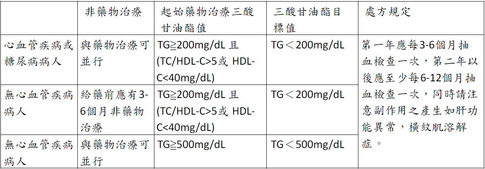
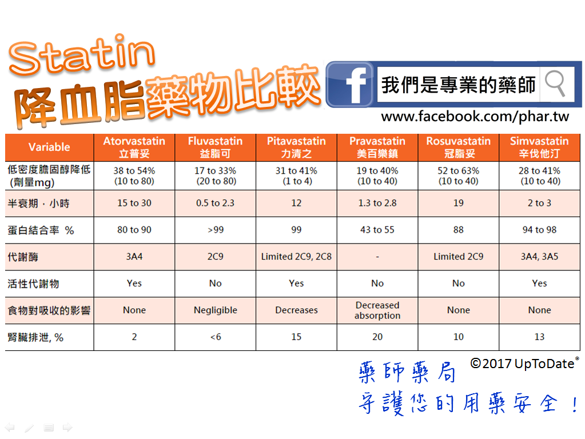
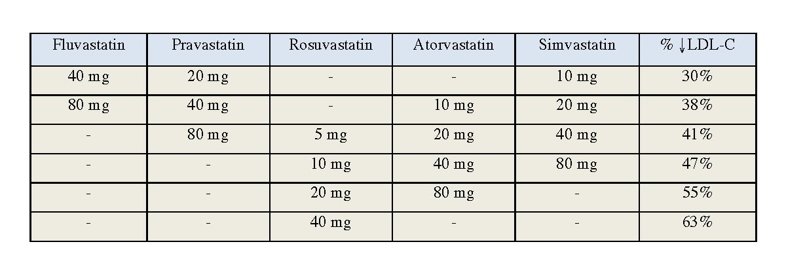
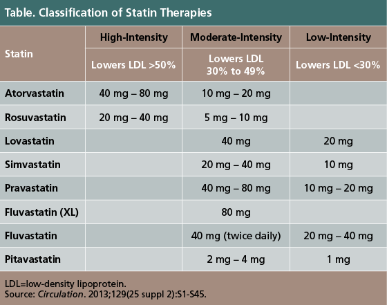

# Dyslipidemia何時要治療  
  
  
<!-- more -->  
  
* 心血管疾病定義：  
	* 冠狀動脈粥狀硬化患者包含：心絞痛病人，有心導管證實或缺氧性心電圖變化或負荷性試驗陽性反應者(附檢查報告)  
	* 缺血型腦血管疾病病人包含：  
		* 腦梗塞。  
		* 暫時性腦缺血患者(TIA)。（診斷須由神經科醫師確立）  
		* 有症狀之頸動脈狹窄。（診斷須由神經科醫師確立）  
* 危險因子定義：  
	1. 高血壓  
	2. 男性≧45歲，女性≧55歲或停經者  
	3. 有早發性冠心病家族史(男性≦55歲，女性≦65歲)  
	4. HDL-C<40mg/dL  
	5. 吸菸（因吸菸而符合起步治療準則之個案，若未戒菸而要求藥物治療，應以自費治療）  
  
  
  
## Ezetimibe  
  
原發性高膽固醇血症、同型接合子家族性高膽固醇血症、同型接合子性麥脂醇血症 （植物脂醇血症）患者並符合下列條件之一者：  
1. 符合全民健康保險降血脂藥物給付規定表且對 Statins 類藥品發生無法耐受藥物不良反應（如 Severe myalgia 、 Myositis ）者。  
2. 符合全民健康保險降血脂藥物給付規定表經使用 Statins 類藥品單一治療 3 個月未達治療目標者，得合併使用本案藥品與 Statins 類藥品。  
  
## 含ezetimibe及statin之複方製劑 (Vytorin, Atozet, Cretrol, Tonvasca)  
  
1. 限用於原發性高膽固醇血症、同型接合子家族性高膽固醇血症 (HOFH) 病患並符合全民健康保險降血脂藥物給付規定表，經使用statin類藥品單一治療3個月未達治療目標者。  
2. 本品不得與gemfibrozil併用。  
  
  
  
