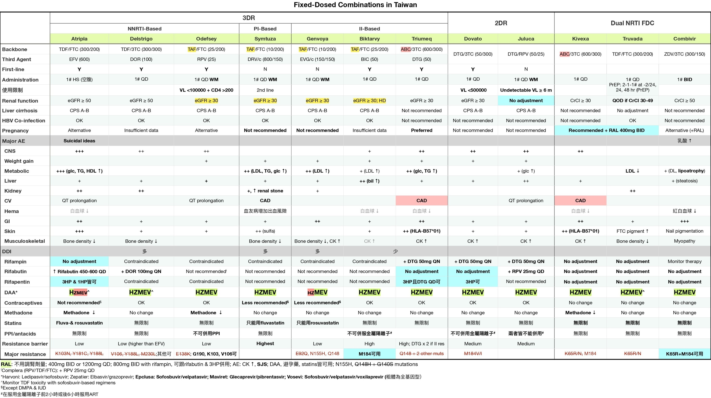
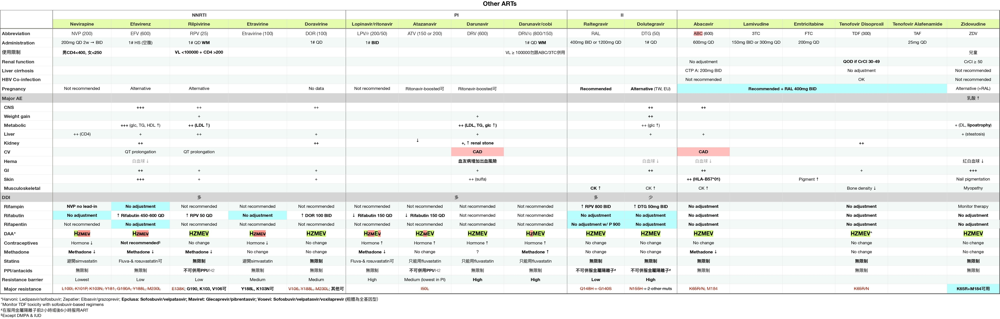

# HIV/AIDS  
source: Pocket Medicine, 2022  
## 定義與臨床表現  
  
- 急性HIV：皮疹、淋巴結腫大、發燒、口腔潰瘍、咽喉炎、肌肉疼痛、腹瀉  
	- 一般在接觸後約2-6週出現；並非所有HIV感染者會出現急性HIV的症狀  
- 愛滋病（AIDS）：HIV + CD4 <200/mm³ 或出現AIDS定義的伺機性感染（OI）或惡性腫瘤  
<!-- more -->  
### AIDS-Defining Opportunistic Illnesses in HIV Infection  
- Encephalopathy attributed to HIV  
- Progressive multifocal leukoencephalopathy  
- Bacterial infections, multiple or recurrent (only among children aged <6 years.)  
- Salmonella septicemia, recurrent  
- Pneumonia, recurrent (only among adults, adolescents, and children aged ≥6 years)  
- Candidiasis of bronchi, trachea, or lungs  
- Candidiasis of esophagus  
- Coccidioidomycosis, disseminated or extrapulmonary  
- Cryptococcosis, extrapulmonary  
- Histoplasmosis, disseminated or extrapulmonary  
- Pneumocystis jirovecii (previously known as "Pneumocystis carinii") pneumonia  
- Cytomegalovirus disease (other than liver, spleen, or nodes), onset at age >1 month  
- Cytomegalovirus retinitis (with loss of vision)  
- Herpes simplex: chronic ulcers (>1 month's duration) or bronchitis, pneumonitis, or esophagitis (onset at age >1 month)  
- Mycobacterium avium complex or Mycobacterium kansasii, disseminated or extrapulmonary  
- Mycobacterium tuberculosis of any site, pulmonary (only among adults, adolescents, and children aged ≥6 years), disseminated, or extrapulmonary  
- Mycobacterium, other species or unidentified species, disseminated or extrapulmonary  
- Cervical cancer, invasive (only among adults, adolescents, and children aged ≥6 years)  
- Kaposi sarcoma  
- Lymphoma, Burkitt (or equivalent term)  
- Lymphoma, immunoblastic (or equivalent term)  
- Lymphoma, primary, of brain  
- Wasting syndrome attributed to HIV  
- Cryptosporidiosis, chronic intestinal (>1 month's duration)  
- Isosporiasis, chronic intestinal (>1 month's duration)  
- Toxoplasmosis of brain, onset at age >1 month  
  
## 流行病學  
  
- 約有120萬美國人與HIV感染共存（13% 不知道自己感染）；全球約3700萬  
- 高風險群體：男性同性戀者、變性女性、靜脈注射毒品者、性工作者、高風險患者的伴侶  
- 傳播途徑：性行為（無抗病毒藥物時風險為0.1-1%）、針扎（職業或靜脈注射毒品）、垂直傳播（無抗病毒藥物時風險為15-40%）、輸血、器官移植（在美國不常見）  
  
## 預防 (NEJM 2015;373:2237; Lancet 2016;387:53; J Infect Dis 2018;218:16; CDC 2021)  
  
- 暴露前預防（PrEP）：每日服用TDF/FTC，若遵守療程可減少超過90%的傳播風險。考慮用於HIV陰性伴侶、無安全套性行為的高風險群體、6個月內有性傳播感染史、靜脈注射毒品且共用針頭者。開始之前需排除HIV，並每3個月檢查腎功能、性病及HIV。  
- 暴露後預防（PEP）：在高風險暴露後盡快（72小時內）開始（如果HIV狀態不明則需要個別決定）。檢查基礎HIV、性病、HBV、HCV。治療：2種NRTI（通常是TDF/FTC）+ RAL或DTG × 4週。考慮後續開始PrEP。  
  
## 篩檢與診斷 (JAMA 2018;320:379)  
  
- 所有13-64歲人群至少篩檢一次，每次懷孕時、若有新性病感染診斷時篩檢；高風險者每年篩檢  
- HIV抗體/p24抗原（ELISA檢測）：感染後1-12週陽性；靈敏度超過99%；為主要篩檢測試  
- 如果結果為陽性，抗體分型檢測可確認並區分HIV-1與HIV-2（MMWR 2013;62:489）  
- 血漿HIV RNA PCR病毒量（VL）：檢測範圍為20-1000萬拷貝/mL；偽陽性可能發生，但通常拷貝數量較少；相比之下，初期感染病毒量應該較高（>75萬）  
- CD4計數：不是診斷測試，因為可能HIV陽性但CD4正常，或HIV陰性但CD4低  
  
## 對新診斷HIV陽性患者的處理 (CID 2020;73:e3572)  
  
- 諮詢關於若服藥遵從性高則治療預後良好、治療選擇及病情披露  
- 實驗室評估：CD4計數、HIV病毒量及基因型、CBC/DC、基礎生化、肝功能、HbA1c、血脂肪、尿液分析、PPD/IGRA、梅毒抗體、披衣菌與淋病（3部位）、A/B/C型肝炎、G6PD（如果是高風險族群）、懷孕篩檢、若使用abacavir則檢查HLA-B＊5701  
	- 如果是AIDS：CMV IgG、Toxo IgG。  
- 確認所有疫苗（包括每年流感疫苗）都是最新的，若CD4 ≤200則避免使用活菌疫苗  
- 及早開始抗病毒藥物（最好在實驗室檢查和基因型結果後，同時得到HIV專家指導），不論CD4數值如何，因為可以降低死亡率（NEJM 2015;373:795）  
- 治療可以預防對伴侶的傳播。當病毒量檢測不到超過6個月時，無保護性行為的傳播風險約為0%（JAMA 2016;316:171；Lancet HIV 2018;5:e438）。  
- 治療方案包括：2種NRTI（如TAF + FTC）+ INSTI或加強型PI（如DRV/r）  
- 開始抗病毒治療可能會因免疫重建發炎症候群（IRIS）暫時加重現有的伺機性感染（TB、MAC、CMV等）。在抗病毒治療的前4週使用類固醇可降低TB相關IRIS的風險，但不建議常規使用（NEJM 2018;379:1915）。  
- 如果擔心有**隱球菌或TB腦膜炎**，不應立即開始抗病毒治療  
- 開始抗病毒治療後，需每4週檢查一次病毒直到達到不可檢測，之後每3-4個月監測一次  
  
## 對之前已知HIV陽性患者的處理  
  
- 病史與體檢（黏膜皮膚、神經認知、伺機性感染、惡性腫瘤、性病）；藥物及依從性  
- 回顧抗病毒藥物（過去和現在）；如果住院，通常繼續使用抗病毒藥物，如果必須停用，則全部停止以降低抗藥性風險  
- 治療失敗：在使用抗病毒藥物幾個月後無法達到不可檢測VL、病毒反彈（在之前的抑制後VL >200拷貝/mL ×2次）、CD4計數下降或臨床惡化  
### 機會性感染預防  
  
| **感染**                             | **指徵**                                   | **初級預防**                                           |  
| ---------------------------------- | ---------------------------------------- | -------------------------------------------------- |  
| 結核                                 | PPD陽性（≥5 mm）、IGRA或高風險暴露                  | 參見潛伏結核的治療                                          |  
| 肺囊蟲肺炎_Pneumocystis jiroveci_ (PCP) | CD4 <200/mm 或 CD4 **<14%** 或 **口腔念珠菌感染** | TMP-SMX（首選）或dapsone或atovaquone或吸入pentamidine       |  
| 隱球菌                                | CD4 <150/mm 且有地方流行/暴露史                   | Itraconazole                                       |  
| 弓形蟲                                | CD4 <100/mm³ 且Toxo IgG陽性                 | TMP-SMX或dapsone 50 mg + pyrimethamine + leucovorin |  
| MAC                                | 若已開始有效抗病毒藥物則不再建議預防                       |                                                    |  
停止預防的時間：若CD4 >200 × 3個月則停止PCP和弓形蟲的預防  
  
## HIV/AIDS的併發症  
  
| **CD4 計數**  | **併發症**                                                                       |  
| ----------- | ----------------------------------------------------------------------------- |  
| **任何**      | _S. pneumonia_、TB、VZV、HPV併發症、卡波西氏肉瘤、淋巴瘤、心血管疾病風險增加、骨密度降低                       |  
| **<500**    | 全身症狀。黏膜皮膚：脂漏性皮膚炎；牛皮癬；口腔毛狀白斑；HSV。反覆的細菌感染                                       |  
| **<200**    | 肺囊蟲肺炎、弓形蟲、進行性多灶性白質腦病（PML）、隱球菌、念珠菌、球黴菌、組織胞漿菌                                   |  
| **<50-100** | 巨細胞病毒（CMV）、鳥型結核菌（MAC）、中樞神經系統淋巴瘤、侵襲性麴菌病、桿菌血管瘤（播散性_Bartonella_感染）、死亡（<50 是醫療急症） |  
  
### HIV/AIDS患者的發燒檢查  
#### 病因 (Infect Dis Clin North Am 2007;21:1013)  
- 感染 (82-90%)：鳥型結核菌（MAC）、TB、巨細胞病毒（CMV）、早期 肺囊蟲肺炎（PCP）、組織胞漿菌（Histoplasmosis）、隱球菌（Cryptococcosis）、球黴菌（Coccidioidomycosis）、弓形蟲（Toxoplasmosis）、心內膜炎  
- 非感染性：淋巴瘤、藥物反應  
- 非急性HIV感染本身很少 (<5%) 是發燒的主要原因  
#### 檢查：根據 CD4 計數、症狀、流行病學及暴露情況進行  
- CBC、基礎生化、肝功能檢查、血液培養、胸部 X 光、尿液分析、分枝桿菌及真菌培養、檢查藥物、必要時檢查胸部及腹部 CT  
- CD4 <100-200 → 血清隱球菌抗原、尿液組織胞漿菌抗原、CMV PCR  
- 呼吸系統症狀 → 胸部 X 光；動脈血氧分析；痰液細菌培養、PJ染色、抗酸桿菌檢查；支氣管鏡檢查  
- 腹瀉 → 糞便培養、卵蟲檢查、抗酸桿菌檢查；如有必要，進行結腸鏡檢查以直接觀察和取樣  
- 血液學異常 → 骨髓切片以進行病理檢查及培養，包括分枝桿菌及真菌的檢查  
- 頭痛/視力變化 → 腰椎穿刺；將腦脊髓液送去細菌/真菌培養、隱球菌抗原、必要時結核菌PCR；從血清中檢查CMV PCR；眼科散瞳檢查  
#### 皮膚  
- 嗜酸性毛囊炎；疣（HPV）；HSV及VZV；MRSA軟組織感染；疥瘡；念珠菌感染；濕疹；結節性瘙癢症；牛皮癬；藥物皮疹；指甲下真菌病  
- 軟疣（poxvirus）：2-5 mm 的珍珠狀丘疹，中央有凹陷  
- 卡波西氏肉瘤（KSHV或HHV8）：紅紫色非褪色結節性病變  
- 桿菌血管瘤（播散性Bartonella）：脆弱的紫藍色血管丘疹  
#### 口腔  
- 鵝口瘡；KS；口腔念珠菌病（凝乳狀斑塊，通常無痛）  
- 口腔毛狀白斑：無痛的乳頭狀增生，附有白色塗層，通常在舌頭側面，由EBV引起，但不是癌前病變  
#### 眼科  
- CMV視網膜炎（CD4通常<50）；治療：ganciclovir或valganciclovir、foscarnet或cidofovir  
- HZV、VZV、梅毒（任何CD4計數，視為神經梅毒）或弓形蟲感染（CD4通常<100）  
#### 內分泌/代謝  
- 性腺功能減退；腎上腺功能不足（CMV、MAC、TB、HIV或藥物相關）；肌肉萎縮；骨質疏鬆/脆性骨折（所有CD4計數）  
- 脂肪重分佈症：中央肥胖、外周脂肪萎縮、血脂異常、高血糖  
#### 心血管 (JACC 2013;61:511)  
- 冠狀動脈疾病、中風、靜脈血栓栓塞、擴張性心肌病；肺動脈高壓；心包炎/心包積液  
#### 呼吸系統  
  
| **影像學模式** | **常見原因**                                                           |  
| --------- | ------------------------------------------------------------------ |  
| 正常        | 早期 PCP                                                             |  
| 擴散性間質浸潤   | PCP、TB、病毒感染，或播散性真菌感染                                               |  
| 焦點性實變或腫塊  | 細菌或真菌感染、TB、KS                                                      |  
| 空洞性病變     | TB、NTM、麴菌感染、其他真菌感染、細菌感染（包括_Staph aureus_、_Nocardia_、_Rhodococcus_） |  
| 胸腔積液      | TB、細菌或真菌感染、KS、淋巴瘤                                                  |  
  
##### Pneumocystis jiroveci (PCP) 肺囊蟲肺炎 (NEJM 1990;323:1444)  
  
- CD4 <200  
- 發燒、夜間盜汗、運動後呼吸困難、乾咳  
- 胸部 X 光顯示間質模式，PaO2 下降，A-a梯度上升，LDH 上升，痰液 PCP 染色陽性，β-glucan 陽性  
- 如果 PaO2 >70：TMP-SMX 15-20 mg/kg，分三次口服  
- 如果 PaO2 <70 或 A-a梯度 >35：在抗生素治療之前使用 prednisone（40 mg 口服兩次，5 天後減少）  
  
##### HIV ⊕ 吸煙者更可能死於肺癌而非伺機性感染 (JAMA 2017;177:1613)  
  
#### 胃腸及肝膽系統  
- 食道炎：念珠菌、CMV（單一、大蛇行）、HSV（多發、小而淺）、巨大鵝口瘡、藥物引起；如果沒有念珠菌感染或對經驗性抗真菌治療無反應則安排胃鏡  
- 腸炎：細菌性（尤其是急性：志賀氏菌、沙門氏菌、困難梭狀桿菌 ）；原蟲性（尤其是慢性：Giardia、Isospora、Cryptosporidium、Cyclospora、Microsporidium、Entamoeba）；病毒性（CMV、腺病毒）；真菌性（Histoplasmosis）；MAC；AIDS 腸病；TB 腸炎  
- 腸胃道出血：CMV、卡波西氏肉瘤、淋巴瘤、Histoplasmosis；直腸炎：HSV、CMV、LGV、淋病  
- 肝炎：HBV、HCV、CMV、MAC、TB、Histoplasmosis、藥物誘發  
- AIDS膽管病：通常與 CMV 或 Cryptosporidium 或 Microsporidium（CD4 下降時）相關  
  
#### 腎臟  
- HIV 相關腎病（塌陷性 FSGS）；腎毒性藥物（如 TDF → 近曲小管功能障礙）  
  
#### 血液學/腫瘤學 (NEJM 2018;378:1029)  
- 血液學異常：ACD、腫瘤/感染（如 MAC/TB）對骨髓的浸潤、藥物毒性、溶血、免疫性血小板減少症  
- 非何杰金淋巴瘤：任何 CD4 計數頻率增加，但隨著 CD4 減少而增加  
- 何杰金淋巴瘤（任何 CD4；ART 的影響尚不明確）  
- 中樞神經系統淋巴瘤: CD4 計數 <50，與 EBV 相關  
- **卡波西氏肉瘤KS（HHV-8）**: 在任何 CD4 計數下，發病率因 CD4 減少而增加，通常為男男性行為者（MSM）；黏膜皮膚（紫色病變）；肺部（結節、浸潤、淋巴結擴大）；胃腸道（出血、阻塞）  
- **子宮頸/肛門癌（HPV 高風險，特別是在 MSM 中）**  
- **肝癌（與 HBV/HCV 相關）**、**胃癌**  
  
#### 神經學/心理學  
- **腦膜炎**：隱球菌（使用腦脊髓液診斷；血清抗原敏感度 90%）、細菌性（包括李斯特菌）、病毒性（HSV、CMV、原發 HIV）、TB、Histoplasmosis、Coccidioidomycosis、淋巴瘤；神經梅毒（顱神經麻痺）  
- **占位性病變**：可能表現為頭痛、局部神經學缺損或意識改變。檢查：MRI，腦部切片僅在懷疑非弓形蟲病病因（弓形蟲血清學陰性）或對2週經驗性抗弓形蟲治療無反應時進行（弓形蟲感染**50% 於第 3 天治療有反應，91% 於第 14 天**；NEJM 1993;329:995）  
  
| **病因**                        | **影像學表現**             | **診斷研究**                                     |  
| ----------------------------- | --------------------- | -------------------------------------------- |  
| **弓形蟲感染**                     | 增強病變，通常在基底神經節（可以是多發性） | ⊕ 弓形蟲血清學（敏感度約 85%）                           |  
| **中樞神經系統淋巴瘤**                 | 增強環狀病變（單發性 60%）       | ⊕ CSF PCR 檢查 EBV      ⊕ SPECT 或 PET 掃描 |  
| **進行性多灶性白質腦病（PML）**           | 白質中多發性非增強病變           | ⊕ CSF PCR 檢查 JC 病毒                           |  
| 其他：膿瘍、分枝桿菌感染、隱球菌感染、TB、CMV、HIV | 不一定                   | 切片                                           |  
  
- **HIV 相關癡呆症**：抑鬱症狀、注意力/集中力受損、精神運動遲緩  
- **抑鬱症**：自殺/抑鬱症發病率增加  
- **脊髓病變**：感染（CMV、HSV）、脊髓壓迫（硬膜外膿瘍、淋巴瘤）  
- **周邊神經病變**：藥物（尤其是第一代NRTIs）、CMV、糖尿病  
  
#### 全身性鳥型分枝桿菌感染（DMAC）  
- 發燒、夜間盜汗、體重減輕、腹痛、腹瀉、全血球減少。可引起局部淋巴結炎  
- 治療：clarithro/azithro + ethambutol ± rifampin/rifabutin  
  
#### 巨細胞病毒（CMV）  
- 視網膜炎、食道炎、結腸炎、肝炎、神經病變、腦炎  
- CMV 病毒量可能為陰性  
- 考慮組織切片  
- 治療：ganciclovir、valganciclovir、foscarnet 或 cidofovir  
  
## 抗病毒藥物  
  
  
  
  
[hiv-long-acting](./hiv-long-acting.md)  
[prep](./prep.md)  
Original: HIV  
  
## 考古題  
### 專師  
  
### 內科醫師  
  
  
  
