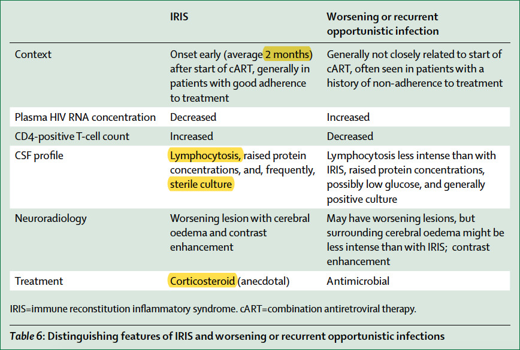
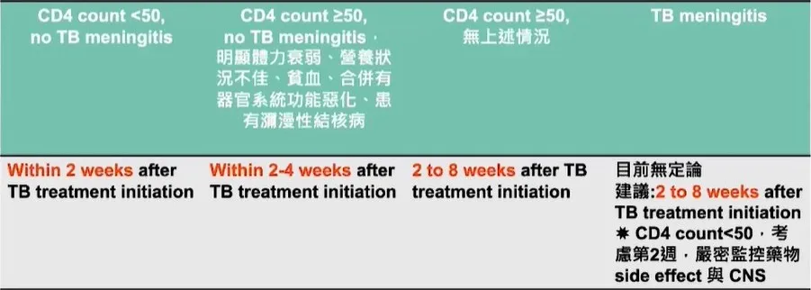

---
date:
  created: 2024-08-09T16:06:58
  updated: 2025-05-22T13:21:51
  finished: 2025-05-22T13:21:53
tags:
  - share
  - teaching
  - medicine/HIV
share: true
categories:
  - medicine
  - hiv
alias: hiv
status: finished
---
# HIV/AIDS  
source: Pocket Medicine, 2022  
## Definition & Clinical Manifestations  
  
- Acute HIV: rash, lymphadenopathy, fever, oral ulcers, pharyngitis, myalgias, diarrhea  
	- Presents ˜2-6 wk after exposure; not all HIV infections result in symptoms of acute HIV  
- AIDS: HIV + CD4 <200/mm3 or AIDS-defining opportunistic infection (OI) or malignancy  
  
<!-- more -->  
## Epidemiology  
  
- ˜1.2 million Americans living w/ HIV (13% unaware); ˜37 million worldwide  
- High risk groups: MSM, transgender women, IVDU, sex worker, partners of high-risk Pts  
- Transmission: sexual (risk 0.1-1% per sex act w/o ARV), needlesticks (occupational or IVDU), vertical (15-40% w/o ARV), transfusions, organ transplant (uncommon in U.S.)  
  
## Prophylaxis (NEJM 2015;373:2237; Lancet 2016;387:53; J Infect Dis 2018;218:16; CDC 2021)  
  
- Pre-exposure (PrEP): TDF/FTC daily, ↓ transmission >90% if adherent. Consider for serodiscordant partners, condomless sex in high-risk groups, STI w/in 6 mo, IVDU w/ equipment sharing. Rule out HIV prior to initiation, ✓ renal function, STIs, & HIV q3 mo.  
- Post-exposure (PEP): start ASAP (within 72 hr) after high-risk exposure from HIV ⊕ source (case-by-case decision if HIV status ?). Test baseline HIV, STIs, HBV, HCV. Rx: 2 NRTIs (usually TDF/FTC) + RAL or DTG × 4 wks. Consider initiating PrEP afterwards.  
  
## Screening and Diagnosis (JAMA 2018;320:379)  
  
- Screen all 13-64 yo at least once, every preg, if new STI dx; screen high risk annually  
- HIV Ab/p24Ag (ELISA assay): ⊕ 1-12 wk after acute infxn; >99% Se; 1° screening test  
- If ⊕, Ab differentiation assay confirms and differentiates HIV-1 vs. -2 (MMWR 2013;62:489)  
- HIV RNA PCR viral load (VL) in plasma; assay range is 20-10 million copies/mL; false ⊕ can occur, but usually low # copies; in contrast, VL should be high (>750 k) in 1° infection  
- CD4 count: not a diagnostic test, because can be HIV ⊕ with normal CD4 or be HIV ⊖ with low CD4  
  
## Approach to newly diagnosed HIV ⊕ Pt (CID 2020;73:e3572)  
  
- Counsel re: excellent prognosis w/ adherence to treatment, treatment options, & disclosure  
- Lab evaluation: CD4 count, HIV viral load & genotype, CBC w/ diff., basic metabolic panel, LFTs, HbA1c, lipids, U/A, PPD/ IGRA, syphilis Ab, Chlamydia & gonorrhea (3 site), Hep A/B/C, G6PD (if high-risk ethnicity), preg screen, HLA-B\*5701 if therapy w/ abacavir. If AIDS: CMV IgG, Toxo IgG.  
- Confirm all vaccinations (including annual flu) are up to date, avoid live vax if CD4 ≤200  
- Initiate ARV early (same day, preferably after labs/genotype and w/ guidance from HIV specialist) regardless of CD4 level because ↓ mortality (NEJM 2015;373:795)  
- Treatment prevents transmission to partners. Risk of transmission w/ unprotected sex w/ undetectable VL >6 months is ˜0% (JAMA 2016;316:171; Lancet HIV 2018;5:e438).  
- Regimens include: 2 NRTI (eg, TAF + FTC) + either INSTI or boosted PI (eg, DRV/r)  
- Initiation of ARVs may transiently worsen existing OIs (TB, MAC, CMV, others) due to immune reconstitution inflammatory syndrome (IRIS). Prednisone during 1st 4 wks of ARVs ↓ risk for TB-associated IRIS, but not routinely given (NEJM 2018;379:1915).  
- Do not start ARVs immediately if concern for ==**cryptococcal or TB meningitis**==  
- After ARV initiation, check VL **q4 wks** until undetectable, then monitor q3-4 mos  
  
## Approach to previously established HIV ⊕ Pt  
  
- H&P (mucocutaneous, neurocognitive, OIs, malignancies, STDs); meds and adherence  
- Review ARVs (past and current); if hospitalized typically continue ARVs, if any must be held, stop all to ↓ risk of resistance  
- Regimen failure: cannot achieve undetectable VL after months on ARVs, viral rebound (VL >200 copies/mL ×2 after prior suppression), ↓ CD4 count or clinical worsening  
### OI Prophylaxis  
  
| **OI**                        | **Indication**                                              | **1° Prophylaxis**                                                                          |  
| ----------------------------- | ----------------------------------------------------------- | ------------------------------------------------------------------------------------------- |  
| Tuberculosis                  | ⊕ PPD (≥5 mm), IGRA, _or_ high-risk exposure                | See treatment for latent TB                                                                 |  
| _Pneumocystis jiroveci_ (PCP) | CD4 <200/mm _or_ CD4 **<14%** or **thrush**                 | TMP-SMX DS qd (first line) _or_ dapsone qd _or_ atovaquone qd _or_ pentamidine inhaled q4wk |  
| Histoplasmosis                | CD4 <150/mm + endemic/exposure                              | Itraconazole qd                                                                             |  
| Toxoplasmosis                 | CD4 <100/mm3_and_ ⊕ _Toxo_ IgG                              | TMP-SMX DS qd _or_ dapsone 50 mg qd + pyrimeth. qwk + leucovorin 25 qwk                     |  
| MAC                           | Prophylaxis no longer recommend if effective ARVs initiated |                                                                                             |  
When to stop prophylaxis: PCP and toxo if CD4 >200 × 3 mos; Histo if CD4 >150 × 6 mos  
  
## HAART  
  
  
  
## COMPLICATIONS OF HIV/AIDS  
  
| **CD4 Count** | **Complications**                                                                                                                      |  
| ------------- | -------------------------------------------------------------------------------------------------------------------------------------- |  
| **Any**       | _S. pneumo_, TB, VZV, HPV complications, Kaposi's sarcoma, lymphoma, ↑ CVD risk, ↓ bone density.                                       |  
| **<500**      | Constitutional symptom(s). Mucocutaneous: seborrheic dermatitis; psoriasis; oral hairy leukoplakia; HSV. Recurrent bacterial infection |  
| **<200**      | PCP, Toxo, PML, Crypto, candida, Histo/Coccidio (endemic areas)                                                                        |  
| **<50-100**   | CMV, MAC, CNS lymphoma, invasive aspergillosis, bacillary angiomatosis (dissem. _Bartonella_), death (<50 is medical emergency)        |  
### Fever workup in patient with HIV/AIDS  
#### Etiologies (Infect Dis Clin North Am 2007;21:1013)  
- Infection (82-90%): MAC, TB, CMV, early PCP, Histo, Crypto, Coccidio, Toxo, endocarditis  
- Noninfectious: lymphoma, drug reaction.  
- Non 1° HIV itself rarely (<5%) cause of fever.  
#### Workup: guided by CD4 count, s/s, epi, & exposures  
- CBC, basic metabolic panel, LFTs, blood culture, CXR, urine analysis, mycobact. & fungal culture, ✓ meds, ? ✓ chest & abd CT  
- CD4 <100-200 → serum crypto Ag, urinary Histo Ag, CMV PCR  
- Pulmonary s/s → CXR; ABG; sputum for bacterial culture, PJ stain, AFB; bronchoscopy  
- Diarrhea → stool cx, O&P, AFB; direct visualization with bx on colonoscopy  
- Cytopenias → BM biopsy for path & culture of aspirate including for mycobacteria & fungi  
- Headache/visual Δs→ LP; send CSF for bacterial/fungal culture, CrAg, ? MTb PCR; send CMV PCR from serum; dilated eye exam with Ophtho  
#### Cutaneous  
- Eosinophilic folliculitis; warts (HPV); HSV & VZV; MRSA SSTI; scabies; candidiasis; eczema; prurigo nodularis; psoriasis; drug eruption; subungual onychomycosis  
- Molluscum contagiosum (poxvirus): 2-5 mm pearly papules w/ central umbilication  
- Kaposi's sarcoma (KSHV or HHV8): red-purple nonblanching nodular lesions  
- Bacillary angiomatosis (disseminated Bartonella): friable violaceous vascular papules  
#### Oral  
- Aphthous ulcers; KS; thrush/oral candidiasis (curd-like patches, often painless)  
- Oral hairy leukoplakia: painless proliferation of papillae w/ adherent white coating usually on lateral tongue, caused by EBV but not precancerous  
#### Ophthalmologic  
- CMV retinitis (CD4 usually <50);  therapy: ganciclovir or valganciclovir, foscarnet, or cidofovir  
- HZV, VZV, syphilis (any CD4 count, treat as neurosyphilis) or Toxo (CD4 usually <100)  
#### Endocrine/metabolic  
- Hypogonadism; adrenal insufficiency (CMV, MAC, TB, HIV, or med-related); sarcopenia; osteopenia/porosis/fragility fractures (at all CD4 counts)  
- Lipodystrophy: central obesity, peripheral lipoatrophy, dyslipidemia, hyperglycemia  
#### Cardiovascular (JACC 2013;61:511)  
- Higher rates of CAD, stroke, VTE, dilated CMP; pulm. HTN; pericarditis/effusion  
#### Pulmonary  
  
| **Radiographic Pattern**         | **Common Causes**                                                                             |  
| -------------------------------- | --------------------------------------------------------------------------------------------- |  
| Normal                           | Early PCP                                                                                     |  
| Diffuse interstitial infiltrates | PCP, TB, viral, or disseminated fungal                                                        |  
| Focal consolidation or masses    | Bacterial or fungal, TB, KS                                                                   |  
| Cavitary lesions                 | TB, NTM, aspergillus, other fungal, bacterial (incl. _Staph aureus_, _Nocardia, Rhodococcus_) |  
| Pleural effusion                 | TB, bacterial or fungal, KS, lymphoma                                                         |  
##### Pneumocystis jiroveci (PCP) pneumonia (CD4 <200) (NEJM 1990;323:1444)  
  
- fever, night sweats, dyspnea on exertion, dry (“doorstop”) cough  
- CXR w/ interstitial pattern, ↓ PaO2, ↑ A-a ▽, ↑ LDH, ⊕ PCP sputum stain, ⊕ β-glucan  
- Therapy if PaO2 >70: TMP-SMX 15-20 mg of TMP/kg divided tid, avg dose = DS 2 tabs PO tid  
- Therapy if PaO2 <70 or A-a gradient >35: prednisone before abx (40 mg PO bid; ↓ after 5 d)  
##### HIV ⊕ smokers much more likely to die from lung cancer than OI (JAMA 2017;177:1613)  
  
#### Gastrointestinal & hepatobiliary  
- Esophagitis: Candida, CMV (solitary, lg serpiginous), HSV (multiple, small shallow), giant aphthous ulcers, pills; EGD if no thrush or no response to empiric antifungals  
- Enterocolitis: bacterial (esp. if acute: Shigella, Salmonella, C. diff); protozoal (esp. if chronic: Giardia, Isospora, Cryptosporidium, Cyclospora, Microsporidium, Entamoeba); viral (CMV, adeno); fungal (histo); MAC; AIDS enteropathy; TB enteritis  
- GI bleeding: CMV, KS, lymphoma, histo; proctitis: HSV, CMV, LGV, N. gonorrhoeae  
- Hepatitis: HBV, HCV, CMV, MAC, TB, histo, drug-induced  
- AIDS cholangiopathy: often a/w CMV or Cryptosporidium or Microsporidium (at ↓ CD4)  
#### Renal  
- HIV-assoc. nephropathy (collapsing FSGS); nephrotoxic drugs (eg, TDF → prox tub dysfxn)  
#### Hematologic/oncologic (NEJM 2018;378:1029)  
- Cytopenia: ACD, BM infiltration by tumor/infection (eg, MAC/TB), drug toxicity, hemolysis, ITP  
- Non-Hodgkin lymphoma: ↑ frequency with any CD4 count, but incidence ↑ with ↓ CD4  
- Hodgkin lymphoma (any CD4; impact of ART unclear)  
- CNS lymphoma: CD4 count <50, EBV-associated  
- Kaposi's sarcoma (HHV-8): at any CD4 count, incidence ↑ because CD4 ↓, usually MSM; mucocutaneous (violacious lesions); pulmonary (nodules, infiltrates, LAN); GI (bleed, obstruct.)  
- Cervical/anal CA (HPV high risk in MSM)  
- ↑ rates of liver CA (a/w HBV/HCV), gastric CA  
#### Neurologic/Psychologic  
- Meningitis: Crypto (diagnosis w/ CSF; serum CrAg 90% Se), bacterial (inc. Listeria), viral (HSV, CMV, 1° HIV), TB, histo, Coccidio, lymphoma; neurosyphilis (cranial nerve palsies)  
- Space-occupying lesions: may present as HA, focal deficits or Δ MS. Workup: MRI, brain biopsy only if suspect non-Toxo etiology (Toxo sero ⊖) or no response to 2 wk of empiric anti-Toxo therapy (if Toxo, **50% respond by d3, 91% by d14**; NEJM 1993;329:995)  
  
| **Etiology**                                         | **Imaging Appearance**                                          | **Diagnostic Studies**                       |  
| ---------------------------------------------------- | --------------------------------------------------------------- | -------------------------------------------- |  
| **Toxoplasmosis**                                    | Enhancing lesions, typically in basal ganglia (can be multiple) | ⊕ _Toxo_ serology (Se) ˜85%)                 |  
| **CNS lymphoma**                                     | Enhancing ring lesion (single 60% of the time)                  | ⊕ CSF PCR for EBV  ⊕ SPECT or PET scan |  
| **Progressive multifocal leukoencephalopathy** (PML) | Multiple nonenhancing lesions in white matter                   | ⊕ CSF PCR for JC virus                       |  
| Other: abscess, nocardiosis, crypto, TB, CMV, HIV    | Variable                                                        | Biopsy                                       |  
  
- HIV-assoc. dementia: depressive symptoms, impaired attention/concentration, psychomotor slowing  
- Depression: ↑ rates of suicide/depression  
- Myelopathy: infection (CMV, HSV), cord compression (epidural abscess, lymphoma)  
- Peripheral neuropathy: meds (esp 1st gen NRTIs), CMV, diabetes  
#### Disseminated Mycobacterium avium complex (DMAC)  
- Fever, night sweats, wt loss, abd pain, diarrhea, pancytopenia. Can cause localized lymphadenitis  
- Therapy: clarithro/azithro + ethambutol ± rifampin/rifabutin  
#### Cytomegalovirus (CMV)  
- Retinitis, esophagitis, colitis, hepatitis, neuropathies, encephalitis  
- CMV viral load may be ⊖  
- Consider tissue biopsy  
- Therapy: ganciclovir, valganciclovir, foscarnet, or cidofovir  
### Immune Reconstitution Inflammatory Syndrome (IRIS)  
- **Paradoxical:** worsening of an existing clinical condition  
- **Unmasking:** abrupt appearance of a new clinical finding following the initiation of antiretroviral therapy  
- Occurs weeks to months following the initiation of antiretroviral therapy  
- Most common in patients starting therapy with a CD4+ T cell count **<50/μL** who experience a precipitous drop in viral load  
- Frequently seen in the setting of **tuberculosis**; particularly when cART is starting soon after initiation of anti-TB therapy  
- Can be fatal  
- 愛滋病毒感染合併結核且CD4淋巴球數<100 cells/μL的病人，排除Kaposi’s sarcoma與活動性B型肝炎後，可考慮預防性類固醇使用避免IRIS（開始給予抗愛滋病毒藥物的48小時內同時加上prednisolone 40 mg/day x 14天，之後prednisolone 20 mg/day x 14天）  
  
  
