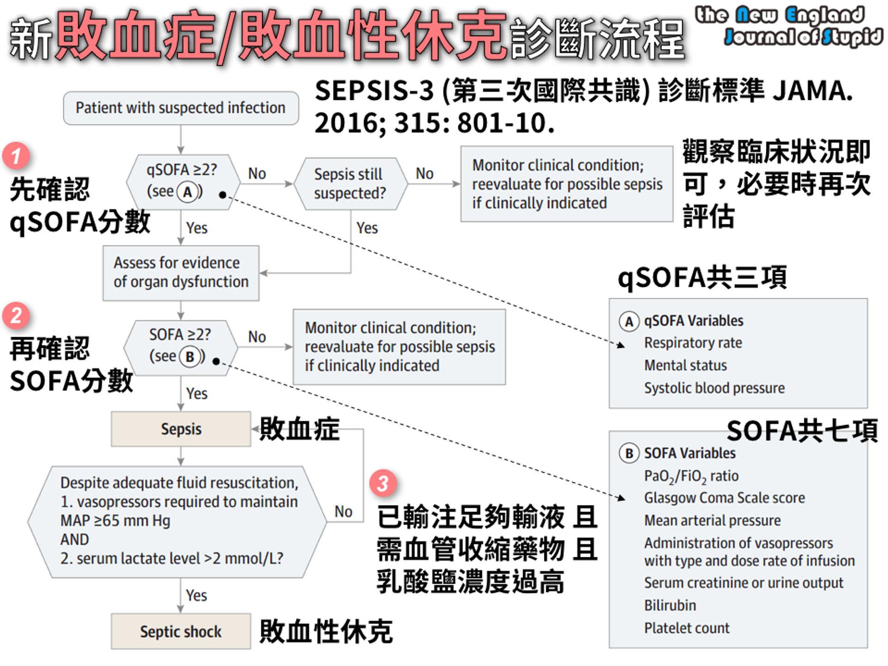

# 敗血症與休克  
source: Pocket Medicine, 2022  
  
## 休克  
  
* 組織缺氧，因為組織灌流降低，進而降低組織氧氣供應和/或增加氧氣消耗或氧氣利用不當  
* 典型的體徵包括低血壓（收縮壓 <90 mmHg 或收縮壓下降 >40 mmHg）、心搏過速、少尿（尿量 <0.5 cc/kg/h）、意識變化、代謝性酸中毒 ± 乳酸增加  
* 診斷困難，因為全身性血管阻力（SVR）增加可能維持收縮壓，但組織灌流差；休克指數（心率/收縮壓）>0.9 和脈壓[(收縮壓 - 舒張壓)/收縮壓] <25% 是顯著休克的線索  
  
<!-- more -->  
  
### 各種休克形式的血流動力學特徵 (_NEJM_ 2013;369:1726)  
  
| **休克類型**     | **右心房** | **肺微血管楔壓** | **心輸出量**        | **全身血管阻力** |  
| ------------ | ------- | ---------- | --------------- | ---------- |  
| 低血容量性休克      | ↓       | ↓          | ↓               | ↑          |  
| 心因性休克        | 正常或 ↑   | ↑          | ↓               | ↑          |  
| 右心室梗塞/大範圍肺栓塞 | ↑       | 正常或 ↓      | ↓               | ↑          |  
| 心包填塞         | ↑       | ↑          | ↓               | ↑          |  
| 分布性休克        | 變化不定    | 變化不定       | 通常 ↑（在敗血症中可能 ↓） | ↓          |  
  
替代指標：右心房壓 ≈ 頸靜脈壓（1 mmHg = 1.36 cm H2O）；胸部X光顯示肺水腫暗示肺微血管楔壓 (PCWP) ↑；尿量 ∝ 心排出量（排除急性腎損傷）；延遲毛細血管充盈時間（即 >2-3秒）暗示系統性血管阻力 ↑  
  
## 定義  
  
### 系統性發炎反應症候群 (SIRS)  
  
定義為符合以下任兩項標準：  
- 體溫高於 38°C 或低於 36°C  
- 心跳超過 90 次/分鐘  
- 呼吸速率超過 20 次/分鐘 或 二氧化碳分壓低於 32 mmHg  
- 白血球數量超過 12000 或低於 4000 /微升，或未成熟細胞或帶狀核白血球超過 10%  
  
### 敗血症  
  
* 由感染引起的具生命威脅器官功能障礙（SOFA ≥2）  
* ==qSOFA：符合呼吸頻率 ≥22，意識變化，收縮壓 ≤100 mmHg==任兩項或以上  
  
### 敗血性休克  
  
* 敗血症引起的循環和細胞/代謝異常，足以增加死亡率；即使在適當的液體復甦後，仍==需使用升壓劑以使平均動脈壓（MAP） ≥65且乳酸 >2==   
* **Sequential Organ Failure Assessment (SOFA)**：呼吸（P/F ratio降低）；凝血（==血小板==降低）；肝臟（膽紅素升高）；心血管（MAP下降或升壓劑增加）；中樞神經系統（GCS 降低）；腎臟（肌酐升高或尿量下降）  
  
  
[Source: NEJS](https://www.nejs.app/2021/11/2021-sepsis-guideline.html)  
  
## 處置 (Crit Care Med 2021;49:e1063)  
  
### 液體  
- 在發病後3小時內進行積極的靜脈液體復甦（==30 mL/kg==），以bolus劑量給藥  
- 晶體溶液在復甦效果上與膠體溶液相當（JAMA 2013;310:1809; NEJM 2014;370:1412）；==不考慮使用明膠（gelatin）復甦== (CritCareMed 2021;49:e1063)  
- 平衡晶體液（乳酸林格液、Plasma-Lyte）與生理鹽水在死亡率、器官衰竭或需要腎替代療法方面未顯示一致的好處（NEJM 2018;378:829 & 2022:386:815）  
- NaHCO3 可能在急性腎損傷及pH <7.2的情況下降低死亡率和對腎替代療法的需求（Lancet 2018;392:31）  
- 液體反應性預測因子：脈壓變化 >13% 與呼吸（Chest 2008;133:252）；靜脈腔（IVC）直徑的呼吸變化，或在被動抬腿時脈壓上升 >10%。靜態中心靜脈壓（CVP）是較差的替代指標。  
- 在早期復甦後，如果出現急性肺損傷/急性呼吸窘迫綜合症（ALI/ARDS），目標中心靜脈壓（CVP）為4-6 mmHg，因為額外的液體可能有害 → 增加呼吸器/ICU天數（NEJM 2006;354:2564; Chest 2008;133:252）  
  
### 升壓劑與強心劑  
- 目標MAP ==65 mmHg== 與 80-85 mmHg 一樣好，且可減少心房顫動（NEJM 2014;370:1583; JAMA 2020;323:938）  
- ==Norepinephrine==：相比於dopamine 減少心律失常與死亡率（NEJM 2010;362:779; Crit Care Med 2012;40:725），並且是敗血性休克的首選升壓劑  
- ==Vasopressin==：添加至 norepinephrine（而不是使用高劑量 norepinephrine）可減少心房顫動與腎替代療法的風險約¼（JAMA 2018;319:1889）  
- 若在適當的液體與升壓劑治療後未達目標（見下文），考慮使用強心劑  
  
### 目標  
- 乳酸清除率（≥20%/2 小時）與ScvO2 指導復甦效果一樣好（JAMA 2010;303:739）  
- 目標==毛細血管充盈時間 ≤3秒==（每30分鐘檢查）與乳酸清除率效果相當或更好（JAMA 2019;321:654）  
  
### 抗生素  
- 在確認重症敗血症或敗血性休克後，儘快開始經靜脈抗生素治療；每小時延遲抗生素給藥與死亡率增加7.6% 相關（Crit Care Med 2006;34:1589），在急診部門發病後3小時內給予抗生素與降低住院死亡率相關（NEJM 2017;376:2235）  
- 很可能敗血症或敗血性休克成人，建議==**1小時內**==投與抗生素；可能敗血症（但非休克）成人，考慮==3小時內==投與抗生素；感染低風險且沒有休克成人，考慮延後使用抗生素、緊密觀察 (CritCareMed 2021;49:e1063)  
- 如有可能，在緊急開始抗生素前獲取2組血液培養（但不要延遲抗生素給藥）  
- 廣效抗革蘭氏陽性菌（包括MRSA）與革蘭氏陰性菌（包括高度耐藥菌）覆蓋，±厭氧菌  
- 以降鈣素原為指導的抗生素==**停用**==（而非啟動）可降低死亡率（Crit Care Med 2018;46:684）  
  
### 類固醇  
- Hydrocortisone 50 mg 靜脈注射每6小時一次 + fludrocortisone 50 μg 透過鼻胃管每日一次，可縮短休克持續時間並可能降低死亡率（NEJM 2018; 378:797 & 809）  
- ==敗血性休克成人且有持續使用血管收縮藥物需求，考慮使用IV類固醇== (CritCareMed 2021;49:e1063)  
  
### 早期目標導向治療 (EGDT)  
- 歷史上：在==**6小時**==內使用液體與升壓劑達到MAP ≥65 mmHg，CVP 8-12 mmHg，尿量 ≥0.5 mL/kg/h；使用強心劑與紅血球濃縮液達到ScvO2 ==**≥70%**== （NEJM 2001;345:1368）  
- 然而，現在在早期抗生素和充分液體復甦的時代，EGDT相對於目前的常規護理並未降低死亡率，且增加醫院成本（NEJM 2017;376:2223）  
  
### 其他  
- 敗血症引起的低血氧呼吸衰竭，考量使用高流量鼻氧（HFNC）優於非侵入性通氣 (CritCareMed 2021;49:e1063)  
- 血糖控制目標為最高不要超過==**180 mg/dl**==，最低不要低於==110 mg/dl==  
- 輸血小板時機：  
    - 血小板 < 10,000，不管有無出血  
    - 血小板 < 20,000，有出血風險   
    - 血小板 < 50,000，有出血或執行侵入性處置  
- **紅血球輸血**只在血紅素低於 ==**7.0 g/dL**== 時進行，目標是將血紅素提高到 7.0 ~ 9.0 g/dL 之間  
  
Original: Sepsis and Shock  
  
## 考古題  
### 專師  
