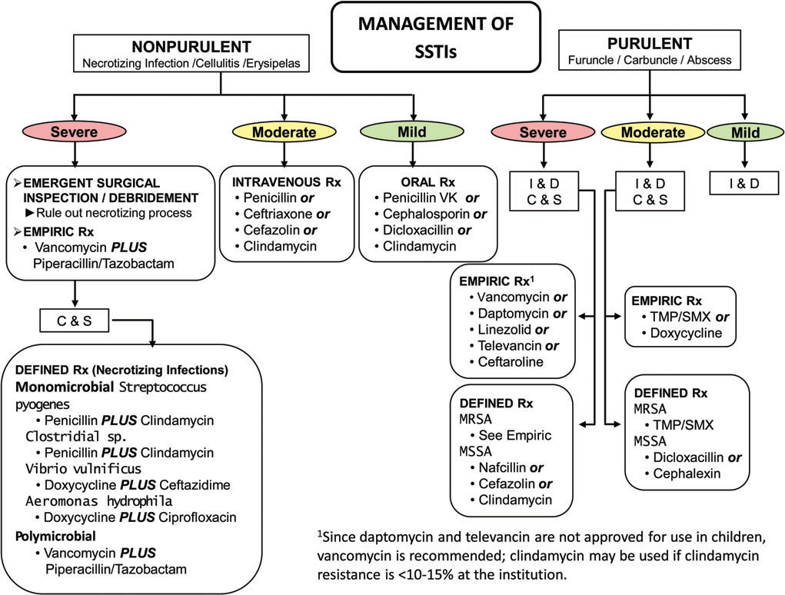

# Skin and soft tissue infections  
  
## Definitions  
  
- Cellulitis: infection of dermis and subcutaneous tissue characterized by erythema, warmth, tenderness, and swelling; often occurs as a result of skin breaches (JAMA 2016;315:3)  
- Skin abscess: subcutaneous collection of pus  
- Staph toxic shock syndrome: rapid onset fever, rash, hypotension, and multiorgan injury. Staph aureus culture are not necessary for diagnosis. Often associated with packing (tampon, nasal packing). Management may require surgical debridement + antibiotics  
  
<!-- more -->  
  
## Risk Factors (CID 2014;59:e10)  
  
- Trauma  
- Edema  
- Preceding skin inflammation or infection  
- Obesity  
- DM  
- Other immunosupp.  
  
## Microbiology  
  
- Purulent: MRSA (NEJM 2006;355:666) causes up to 75% of purulent skin/soft tissue infections, followed by MSSA and strep  
- Non-purulent: Strep, MSSA, aerobic GNRs. MRSA less commonly unless significant risk factors (prior MRSA infection, IVDU, HD, recent abx or hospitalization).  
- Bites: skin (Strep , Staph [MRSA only if risk factors]) and oral flora (including anaerobes) + special exposures:  
  
| **Feature**                  | **Microbiology**                  | **Clinical**                                                                             | **Treatment**                                                |  
| ---------------------------- | --------------------------------- | ---------------------------------------------------------------------------------------- | ------------------------------------------------------------ |  
| Cat bit^                     | _Pasturella spp_                  | Rapid onset erythema, swelling, lymphangitis, fever                                      | Amox/clav                                                    |  
| Dog bite                     | _Pasturella & Capnocytophaga spp_ | Can cause severe sepsis with DIC & gangrene in asplenic/cirrhotics and other immunosupp. | Amox/clav  If Capno. suspected: pip/tazo or carbapenem |  
| Penetrating injury           | _Pseudomonas_                     | Can be associated with deep tissue abscess                                               | Directed based on suscept.                                   |  
| Gardening                    | _Sporothrix_                      | Ulcerating nodules, lymphatic spread                                                     | Itraconazole                                                 |  
| Salt H2O or raw oysters/fish | _V. vulnificus_                   | Hemorrhagic bullae & sepsis (esp. in cirrhotics)                                         | Doxy + Ceftazidime/ceftriaxone                               |  
|                              | _Mycobacterium marinum_           | Indolent, nodules on extremities/superficial lymphadenitis                               | Macrolide + rifampin/ethambutol                              |  
| Fresh H2O                    | _Aeromonas_                       | Myonecrosis/rhabdo can occur.                                                            | FQ, TMP-SMX, or ceftriaxone                                  |  
^Cat scratch disease caused by _Bartonella_ acquired via cat scratch or bite. Results in lymphadenitis.  
  
## Diagnosis  
  
- Clinical diagnosis based on physical examination  
- Cultures from intact skin are not helpful and should not be performed (CID 2014;59:e10)  
- Blood culture are typically low yield (˜5-10%)  
- Ultrasound can be used to identify deep abscesses and facilitate drainage. If abscess is found, incision/drainage is key to treatment.  
- Aspirate from an abscess may provide microbiologic diagnosis  
  
## Cellulitis Treatment (_NEJM_ 2014;370:2238; _CID_ 2014;59:e10; _JAMA_ 2016;316:325 & 2017;317:2088)  
  
| **Purulent** | **Usual Microbiology**                          | **Severity** | **Treatment**                                                              |  
| ------------ | ----------------------------------------------- | ------------ | -------------------------------------------------------------------------- |  
| No           | β-hemolytic _Strep_ >_S. aureus_                | Mild         | Oral: penicillin VK, cephalosporin                                         |  
|              |                                                 | Mod          | IV: penicillin, ceftriaxone, cefazolin                                     |  
|              |                                                 | Severe       | IV: vanc + pip/tazo (± clinda for toxic shock syndrome)                    |  
| Yes          | _S. aureus_ (incl. MRSA) >> β-hemolytic _Strep_ | Mild         | Consider I&D only vs. I&D + clinda or TMP-SMX (_NEJM_ 2017;376:2545)       |  
|              |                                                 | Mod          | I&D + TMP-SMX or doxycycline                                               |  
|              |                                                 | Severe       | I&D + IV vanc, daptomycin or linezolid (± clinda for toxic shock syndrome) |  
  
Mild: abscess <2 cm, no systemic signs of infection, immunocompetent, no indwelling hardware; moderate: systemic signs; severe: SIRS or immunosuppressed  
  
  
- Purulent skin and soft tissue infections (SSTIs)  
	- Mild infection: for purulent SSTI, incision and drainage is indicated.   
	- Moderate infection: patients with purulent infection with systemic signs of infection.   
	- Severe infection: patients who have failed incision and drainage plus oral antibiotics or those with systemic signs of infection such as temperature >38°C, tachycardia (heart rate >90 beats per minute), tachypnea (respiratory rate >24 breaths per minute) or abnormal white blood cell count (>12000 or <4000 cells/μL), or immunocompromised patients.   
- Nonpurulent SSTIs  
	- Mild infection: typical cellulitis/erysipelas with no focus of purulence.   
	- Moderate infection: typical cellulitis/erysipelas with systemic signs of infection.   
	- Severe infection: patients who have failed oral antibiotic treatment or those with systemic signs of infection (as defined above under purulent infection), or those who are immunocompromised, or those with **clinical signs of deeper infection such as bullae, skin sloughing, hypotension, or evidence of organ dysfunction**.  
- Abbreviations: C & S, culture and sensitivity; I & D, incision and drainage; MRSA, methicillin-resistant Staphylococcus aureus; MSSA, methicillin-susceptible Staphylococcus aureus; Rx, treatment; TMP/SMX, trimethoprim-sulfamethoxazole.  
  
- Limb elevation; erythema may worsen after starting abx b/c bacterial killing → inflam.  
- In obese Pts, adequate drug dosing important to avoid treatment failure (J Infect 2012;2:128)  
- Duration: 5 to up to 14 d based on severity and response to treatment. Take pictures & draw margins to track progress.  
  
# NECROTIZING SOFT-TISSUE INFECTIONS (NEJM 2017;377:2253)  
  
## Definition  
  
* Fulminant tissue destruction, systemic toxicity & high mortality. Surgical emergency.  
* May include cellulitis, fasciitis, myositis, myonecrosis (gas gangrene).  
  
## Risk factors  
- Can affect healthy individuals via skin/mucosal breach or traumatic wound, but ↑ risk w/ DM, PVD, alcohol abuse, IVDU, cirrhosis, or other immunosupp.  
  
## Microbiology  
### Necrotizing fasciitis  
  
- Type I: polymicrobial (mixed aerobes & anaerobes), typically in older Pts w/ above RFs.  
	- Fournier's gangrene involves genitalia and/or perineum  
	- Head and neck NSTI evolve from oral flora including anaerobes  
- Type II: monomicrobial, usually group A strep, less likely Staph, Vibrio, Aero.; a/w TSS  
- Clostridial myonecrosis (gas gangrene): C. perfringens; C. septicum (large Gram ⊕ rods w/ blunt ends on Gram stain). A/w traumatic wounds that create an anaerobic environment ideal for Clostridia.  
  
## Clinical manifestations  
- Erythema, edema, warmth + systemic illness ± crepitus, bullae, necrosis  
- Rapid progression of clinical signs  
- Pain out of proportion to apparent cellulitis; skin hyperesthetic and later anesthetic  
  
## Diagnosis  
- Clinical diagnosis is sufficient to initiate urgent surgical exploration  
- Aspiration of necrotic center; blood culture; Gram stain; lactate, AST, & CK for deep tissue necrosis  
- Imaging: noncontrast CT, but do not delay Rx/surgery (Arch Surg 2010;145:452)  
- Microbiologic diagnosis from Gram stain and culture of surgical specimens  
  
## Treatment (CID 2014;60:169)  
  
- Urgent surgical exploration with debridement of necrotic tissue and ID consultation  
- Empiric antibiotics: [pip/tazo or ceftriaxone + metronidazole or carbapenem] + [vanco or linezolid]. For Group A Strep: penicillin + clindamycin + consideration of IVIG for toxic shock.  
  
# DIABETIC FOOT INFECTIONS  
  
## Microbiology and severity (CID 2004;39:885)  
- Mild (superficial ulcer, no involvement of deeper structures, surrounding erythema <2 cm, and no systemic illness): usually S. aureus or aerobic streptococci  
- Moderate (ulcer with involvement of deeper structures, surrounding erythema >2 cm, or lymphangitic streaking and no systemic illness): more likely to be chronic and polymicrobial (PsA, enterococci, enteric GNR , anaerobes)  
- Severe (moderate + systemic illness or metabolic instability): anaerobic streptococci, enteric GNR, PsA, Bacteroides, Clostridium  
  
## Initial evaluation  
- Cleanse, debride, probe, and obtain deep anaerobic + aerobic cultures  
- Assess for peripheral vascular disease: sensation, pulses, ABIs  
  
## Diagnosis  
  
- Deep tissue wound culture at time of debridement (ideally prior to antibiotics). Superficial swabs are typically of limited utility due to colonization.  
- For mod/severe: obtain blood cx, ESR, CRP  
- Osteomyelitis should always be ruled out. At ↑ risk if: grossly visible bone or able to probe to bone, ulcer >2 cm, ulcer duration >1-2 wk, ESR >70. If suspicious for osteo, obtain plain films ± MRI (see osteomyelitis below).  
  
## Treatment (CID 2012;54:e132)  
  
- Mild infxn: oral abx. Target GPCs (diclox, cephalexin, or amox/clav); use TMP-SMX or doxy for MRSA.  
- Mod/severe infxn: IV abx. Target GPCs (vanco, linezolid,dapto) + GNRs (CTX, levo, or amp/sulb) ± anaerobes (metronidazole or clinda). Add PsA coverage (cefepime or piptazo) if: macerated wound, significant water exposure, warm climate  
- Elevation, non-weight-bearing status, wound care, glycemic control, Rx for venous insufficiency and arterial ischemia  
- Many require surgery: early, aggressive, and repeated debridement; revascularization or amputation may be necessary  
  
# OSTEOMYELITIS  
  
- Infection of bone due to hematogenous seeding or direct spread from contiguous focus  
  
## Etiology (Lancet 2004;364:369)  
- Hematogenous: ***S. aureus***; mycobacterial infection of vertebral body = Pott's disease  
- Contiguous focus (may be acute or chronic)  
	- Open fracture, orthopedic surgery, etc.: ***S. aureus*** and ***S. epi***  
	- Skin breakdown + vasc. insuffic. (eg, diabetic foot, pressure ulcer): polymicrobial  
	- GU source (GNR, Enterococcus)  
  
## Clinical manifestations  
- Surrounding soft-tissue compromise ± fistula to superficial skin  
- ± Fever, malaise, and night sweats (more common in hematogenous than contiguous)  
- Vertebral osteomyelitis (esp. IVDU): unremitting, focal back pain, ± fever (NEJM 2010;362:1022)  
  
## Diagnosis (JAMA 2008;299:806)  
  
- Crucial to obtain culture data of causative organism to avoid long-term empiric abx  
- Bone biopsy or tissue culture obtained surgically or via percutaneous biopsy (send aerobic, anaerobic, mycobacterial, and fungal cultures + pathology) unless ⊕ blood cx. Do not rely on swabs of ulcers or fistulae drainage.  
- Physical exam: high suspicion in diabetic foot (see above) if can **probe ulcer to bone** or **ulcer >2 cm2** (Sp 83%, 90% PPV)  
- Blood cultures before antibiotics (more often ⊕ w/ acute hematogenous osteomyelitis)  
- CBC, CRP, ESR (==**>70**== greatly ↑ likelihood of osteo)  
- Imaging  
	- Plain radiographs: normal early in disease; lytic lesions seen after 2-6 wk  
	- MRI: preferred imaging study (overall Se 90%, Sp 82%; Archives 2007;167:125)  
	- CT: can demonstrate periosteal reaction and cortical and medullary destruction  
	- CT & MRI very Se but ↓ Sp; false ⊕ if contig focus w/ periosteal reaction, Charcot Δs  
	- Radionuclide imaging: very Se but non-Sp (false ⊕ if soft-tissue inflammation)  
  
## Treatment  
  
- Antibiotics: based on culture data. If clinically stable, consider holding antibiotics until bone bx obtained. Duration depends on Rx strategy/goals of Rx management (eg, 6 wks for vertebral osteo; Lancet 2015;385:875). After ≥7 days from either start of IV abx or surgery, if doing well consider (in consultation with ID!) Δ'ing IV to PO (if good bioavailability and bone penetration) (NEJM 2019;380:425).  
- Surgery should be considered for any of the following: acute osteo that fails to respond to medical Rx, chronic osteo, complications of pyogenic vertebral osteo (eg, neurologic compromise, spinal instability, epidural abscess) or infected prosthesis  
  
# EPIDURAL ABSCESS  
  
## Etiology  
- Hematogenous spread (⅔): skin infection, soft tissue (dental abscess), or endocarditis  
- Direct extension (⅓): vertebral osteo, sacral ulcer, spinal anesthesia or surgery, LP  
- Risk factors: IVDU diabetes, renal failure, alcoholism, immunosuppression  
- *S. aureus* most common pathogen; in immunosuppressed, consider fungal, TB, and Nocardia  
  
## Clinical manifestations  
- Back pain with spinal or paraspinal tenderness + fever ± followed by radiculopathy. Sx of cord compression or cauda equina is a surgical emergency.  
  
## Diagnostic studies  
- MRI with contrast  
- Aspiration of abscess fluid for Gram stain & culture or operative Gram stain & culture  
- Blood culture (frequently ⊖)  
  
## Treatment  
  
- Antibiotics (typically MRSA and gram-negative coverage initially then narrowed based on culture data) ± surgery (decompressive laminectomy and debridement) for failure to improve on medical therapy. Emergent surgery for early s/s of cord compression (w/ vertebral osteo and epidural abscess).  
