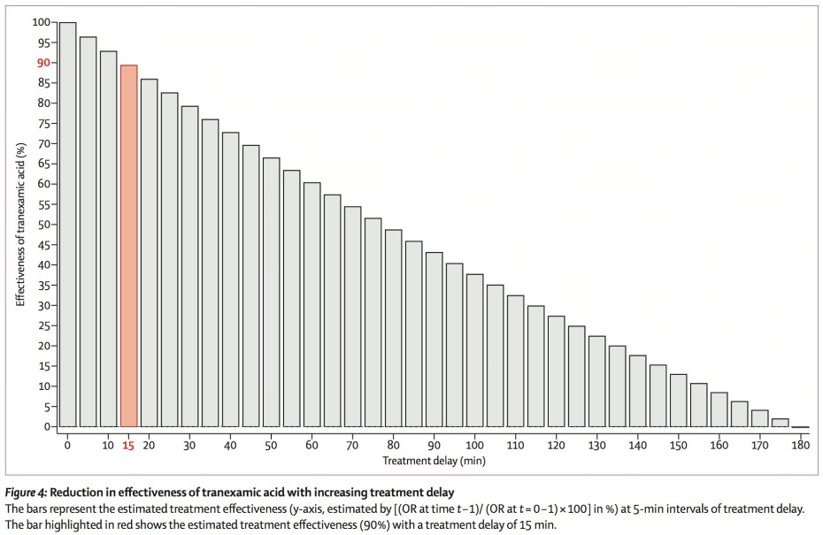

---
date:
  created: 2025-11-17T17:03:12
  updated: 2025-11-17T17:04:56
  finished: 2025-11-17T17:04:57
tags: share
share: true
categories:
  - medicine
  - trauma
alias: bleeding
status: finished
---
  
# 創傷輸血工作坊  
  
## 創傷的死亡三角  
  
  
  
<!-- more -->  
  
- Hypothermia  
	- 每輸500ml冰血會讓體溫下降1 ℃  
	- 體溫每下降1 ℃凝血因子活性下降10%  
- Coagulopathy  
- Metabolic acidosis  
  
## Antifibrinolytics  
  
  
[@Gayet-A2018Effecttreatment]  
  
- Transamin越早給越好，每延遲15分鐘效果下降10%，出血超過3小時再給對存活沒有幫助  
- 用法：1g IVP st → 1g IVD run 8 hrs（若沒有辦法連續輸注也可改成一次給2g）  
  
## Transfusion  
  
- 優先順序：冷藏全血 > 新鮮全血 > balanced transfusion > 等比例pRBC + FFP > 有什麼輸什麼  
- Massive transfusion protocol使用的balanced transfusion: O型pRBC 6U（血球上沒有A, B抗原）+ AB型FFP 6U（血漿中沒有anti-A, anti-B）+ PH 1U，但缺少第八因子  
- Low-titer group O whole blood (LTOWB): 事先從O型捐血者中篩選anti-A, anti-B抗體效價低者，這樣的全血就可以輸給任何血型的受血者，含有第八因子、volume略少、antigen exposure更少因此優於balanced transfusion。但是台灣的全血目前一律減白，血小板會一起濾掉 QQ  
  
## Crystalloid  
  
- 大量使用會造成dilutional coagulopathy，因此復甦出血性休克時要謹慎使用  
  
## Permissive hypotension (hypotensive resuscitation)  
  
- 前提：  
	- 患者暫時無法進行確切止血（反例：打上止血帶後肢體不再出血）  
	- 暫時沒有可用血品  
	- 不是兒童  
	- 沒有traumatic brain injury  
- 原則：  
	- 不延誤確切止血方法（如開刀）  
	- 減少crystalloid灌注，採取單次少量 (100-200 ml) 給予  
	- 維持SBP 90mmHg即可  
	- 密切監測患者休克徵象  
  
## 外傷大量輸血適應症  
  
- ABC score ≥ 2  
	- 穿刺傷1分  
	- FAST陽性1分  
	- SBP < 90 1分  
	- HR > 120 1分  
  
## Walking blood bank  
  
- 真的沒有冷藏LTOWB或其他合適血品可用的備用方案  
- Donor哪裡來？最好是平常就有接受過完整pre-screening（包含血型、AB抗體效價、問卷評估和傳染病篩檢），例如美軍是定期監測  
- 血牛被徵召來之後還是要輸血前快速篩檢，使用Eldon card快速篩檢ABO及Rh血型，做即時身體評估排除急性症狀和風險行為，若有能力可再做一次HIV/HBV/HCV/(日本還有做梅毒和HTLV)篩檢，國外已有POC試劑  
	- [Eldon card video](https://vimeo.com/1053782120?fl=pl&fe=sh)  
- 檢測都有空窗期，因此輸完血後要監測有無被感染上述傳染病  
- 大量輸血需要18 Fr以上的管路  
- 美軍有在用一台加溫加壓機器，最快每分鐘可輸進750ml，但一般CVC管徑和管路長度無法承受這個速度的壓力（超過300 mmHg紅血球會破），機器可以自己偵測目前用的管路可以承受的壓力和速度；目前廠商也在向健保署申請腸胃道出血和產後大出血適應症  
- 實際操作：  
	1. Eldon card上有四個圓形區域，上面各自有Anti-A, B, D抗體和一個control，先滴一滴清水或生理食鹽水，再扎指尖血滴上去，用攪拌棒劃開來  
	2. 確認血型後on 16號或18號IC，打上後接上血袋，血袋可以放在低處促進流動，並且用手或腳搖晃血袋模擬震盪，讓血可以均勻接觸抗凝劑  
	3. 收集至少半滿的血後才可以輸，否則裡面的檸檬酸與血比例不對，收好後打三個結，在第二個和第三個結之間剪掉  
- More info:  
	- [All about walking blood banks](https://www.isbtweb.org/resource/all-about-walking-blood-banks.html)  
	- [One year in LA - Whole Blood Academy](https://www.facebook.com/share/p/17fm665nn4/?mibextid=wwXIfr)  
	- [One year in LA - 輸血檢驗](https://www.facebook.com/share/p/1D3xh6n9Fo/?mibextid=wwXIfr)