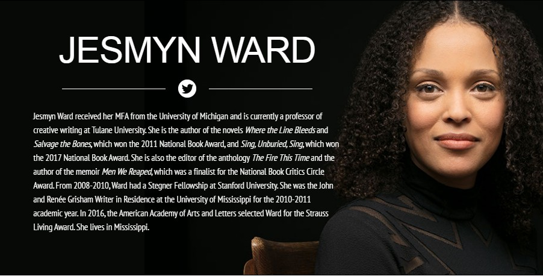

> [!quote]  
> ***白人文明與西方文化在黑人身上強加了存在性的偏差意識，我只能說黑人的靈魂只是白人的創造物。***    
> ***─***─***─*** [弗朗茲．法農](https://search.books.com.tw/search/query/cat/all/key/%E5%BC%97%E6%9C%97%E8%8C%B2%EF%BC%8E%E6%B3%95%E8%BE%B2/adv_author/1)[《黑皮膚，白面具》](https://www.books.com.tw/exep/assp.php/OKAPI/products/0010288209)（*[Black Skin, White Masks](https://www.books.com.tw/exep/assp.php/OKAPI/products/F010976340)*, 1967）  
  
[[./docs/posts/100-best-books|100-best-books]]  
  
2020是人類世必定會註記的一年，一種新型的冠狀病毒奪走數十萬人的性命，還參與改寫人類的政治與經濟體制。病毒似乎沒有促進跨國跨種族間的一體感，國際間的對抗競合暗潮洶湧，城市生活節奏遽變，反而更讓人覺得寂寞疏離。  
  
正當年中人們以為疫情終將逐漸減緩之際，美國發生了一件並非「突如其來」的事件，它藉由Covid-19爆發，而讓美國這樣的西方強權正視了自身的隱疾。  
  
疫情發生後美國數千萬人口失業，明尼蘇達州一名高大、被伙伴們稱為溫柔巨漢的非裔黑人[佛洛伊德（George Floyd）](https://zh.wikipedia.org/wiki/%E4%B9%94%E6%B2%BB%C2%B7%E5%BC%97%E6%B4%9B%E4%BC%8A%E5%BE%B7%E4%B9%8B%E6%AD%BB)也是其中之一。他因為持一張20美元的偽鈔到熟識超市買菸而引發糾紛，在警察到場處理時被壓制在地，而在一陣莫名所以的混亂後遭白人警察[紹文（Derek Chauvin）](https://en.wikipedia.org/wiki/Derek_Chauvin)壓頸長達八分多鐘致死。  
  
佛洛伊德的死引發全美各地示威活動不斷，激烈的抗議者開始攻擊警方，並且搶劫、放火。與上個世代類似案件常會因為缺乏現場畫面而流於見證者的各自陳述不同，社群媒體將那八分多鐘，不同角度、不同拍攝者錄下的影片透過強大的即時流量傳遍世界──白人警察以膝壓制黑人脖子，直至他停止呼吸為止──這樣的畫面必然喚起錐心的話語：**不是黑奴解放了歧視就一併消弭**。這影像話語自有生命，因為它同時喚醒我們想起其他事，人類文化至今的諸多陰影，譬如性別、階級、文化、帝國、人權……敏感的人們會不禁自問，此刻的人類是活在曙光還是夕陽之下？  
  
當[潔思敏．沃德](https://search.books.com.tw/search/query/key/%E6%BD%94%E6%80%9D%E6%95%8F%E2%80%A7%E6%B2%83%E5%BE%B7/adv_author/1/)（Jesmyn Ward）寫出[《黑鳥不哭》](https://www.books.com.tw/exep/assp.php/OKAPI/products/0010867572)時，距離[史托夫人](https://search.books.com.tw/search/query/key/%E6%B9%AF%E5%A7%86%E5%8F%94%E5%8F%94%E7%9A%84%E5%B0%8F%E5%B1%8B/cat/all)（[Harriet Elisabeth Beecher Stowe](https://zh.wikipedia.org/wiki/%E5%93%88%E9%87%8C%E7%89%B9%C2%B7%E4%BC%8A%E4%B8%BD%E8%8E%8E%E7%99%BD%C2%B7%E6%AF%94%E5%BD%BB%C2%B7%E6%96%AF%E6%89%98)）發表[《湯姆叔叔的小屋》](https://search.books.com.tw/search/query/key/%E6%B9%AF%E5%A7%86%E5%8F%94%E5%8F%94%E7%9A%84%E5%B0%8F%E5%B1%8B/cat/all)（[*Uncle Tom's Cabin*](https://www.books.com.tw/exep/assp.php/OKAPI/products/F016389570), 1852），已經接近170年。《湯姆叔叔的小屋》提出了黑奴處境問題，引發了廣度的共鳴，甚至有人認為它是促成了北方將解放黑奴視為[南北戰爭](https://zh.wikipedia.org/zh-hant/%E5%8D%97%E5%8C%97%E6%88%98%E4%BA%89)主軸的力量。正如我在[《林肯在中陰》的導讀](https://okapi.books.com.tw/article/11888)裡就提過，現今史學家多半不會認為林肯當時指揮的是一場廢奴戰爭，而是階級、經濟、文化上落差所造成的複雜衝突。  
  
值得注意的是，因為這本書引發的政治效應，當時不少南方作家投入了「反湯姆小說」（[Anti-Tom literature](https://en.wikipedia.org/wiki/Anti-Tom_literature)）的創作。因為他們認為這部作品虛構不實，因而寫作黑人奴隸活在幸福的主人家庭之中的故事。《湯姆叔叔的小屋》甚至引發了國際效應，許多英國評論者支持這部作品，是由於對美國的厭惡，而非它的文學成就。  
  
更值得一提的是，一部作品在時間之中流轉的評價轉變。一百年後，當初史托夫人創造的正直、高貴的湯姆叔叔，在黑人的藝術運動裡被視為負面形象，許多人批判這個角色刻板化黑人，只是被動地接受命運。尤有甚者，「湯姆叔叔」這個詞變成了「投靠白人的非裔美國人」的綽號。這種轉變意味著從制度平權、自我覺醒到建立自我意識漫漫長路裡的諸多變化。  
  
過去我讀到另一本迥異《湯姆叔叔的小屋》的作品是[童妮．摩里森](https://search.books.com.tw/search/query/key/%E7%AB%A5%E5%A6%AE%EF%BC%8E%E6%91%A9%E9%87%8C%E6%A3%AE/adv_author/1/)（[Toni Morrison](https://en.wikipedia.org/wiki/Toni_Morrison)）的[《寵兒》](https://www.books.com.tw/exep/assp.php/OKAPI/products/0010219386)，這部小說讓我對黑奴文學有了全新的認識。摩里森《在黑暗中競賽：白人與其文學想像》（[*Playing in the Dark: whiteness and the Literary Imagination*](https://www.amazon.com/Playing-Dark-Whiteness-Literary-Imagination/dp/0679745424)）提到，在她研究了諸多美國文學作品後（包括[梅爾維爾](https://search.books.com.tw/search/query/cat/all/key/%E8%B5%AB%E7%88%BE%E6%9B%BC%EF%BC%8E%E6%A2%85%E7%88%BE%E7%B6%AD%E7%88%BE/adv_author/1)、[海明威](https://search.books.com.tw/search/query/cat/all/key/%E6%B5%B7%E6%98%8E%E5%A8%81/adv_author/1)等人），發現這些作品雖然都觸及「自由、個人主義、男子氣概、天真純潔」等人性議題，卻對黑人了無意義。因為**黑是附屬於白人的白**，只是一種背景，只是用來替白人的恐懼和欲望做為注解而已。摩里森說：「**我認為在白人作家的想像裡，黑人根本就沒有意義，或意義很稀薄，不過像叢林熱一樣，偶爾發作時才會注意。或者，只不過藉此提供一些地方色彩，呈現某種逼真的效果，一些必須的道德姿態、幽默及感傷。而黑人終究沒有真的被表現出來。**」  
  
《寵兒》的故事說的是蓄奴時代，肯塔基州農場「甜蜜之家」的故事。與《湯姆叔叔的小屋》不同，這本小說的開頭很像是那些「反湯姆小說」，農場主人加納夫婦很愛護且信任黑奴。不過，這一切在加納先生死亡，他的妹夫「學校老師」進了「甜蜜之家」之後發生改變。《寵兒》的主角是一個幽魂，那是因為逃亡的黑奴母親發現追捕者到來時，為免女兒將來遭到和自己一樣的命運，遂將女兒殺死，之後女兒遂化為幽魂與母親痛苦糾纏。  
  
這本小說裡最驚人的莫過於**「殺死女兒」的母親**。在美國的蓄奴時代，奴隸被任意買賣，黑奴無法維繫正常家庭，產下的子嗣決定權也在於奴隸主身上。許多黑奴孩子並不知其父，母親是他們記憶裡唯一的親族。《寵兒》描述了「母性」（Motherhood），只是這母性最大的慈悲卻是殺害自己的小孩，這種恐怖讓人至今讀來戰慄。  
  
隨著時間過去，現今黑人在美國社會中擁有經濟與政治地位的都不乏其人，種族壓迫的年代看似逝去了，但昔日的創傷幽魂已獲重生了嗎？惡靈已然驅逐了嗎？或許，佛洛伊德在社群媒體上痛苦地吐露的那句「**我不能呼吸了**」的話語，會是一個警醒。  
  
    
潔思敏．沃德《黑鳥不哭》獲得2017年美國國家圖書獎。（圖片來源 / [Jesmyn Ward官網](https://www.jesmynwardauthor.com/#about)）  
  
沃德的[《黑鳥不哭》](https://www.books.com.tw/exep/assp.php/OKAPI/products/0010867572)，在整體的概念上，我個人認為有不少和《寵兒》對話之處，或者說，是和從《湯姆叔叔的小屋》以來，黑人處境文學的漫長對話。沃德在訪談裡提到，她從三歲起就在密西西比州的迪來爾（DeLisle）長大，這是一個人口僅一千多人的地方。因為成績優異，從小白人和黑人孩子都會霸凌她。也就是說，**她感受不到和自己站在一起的黑人朋友，而在膚色上，她又受到白人的差異對待。**  
  
外貌、文化行為、身分（經濟階級、社會階級），構成了今天種族間歧異的複雜面貌，[白色霸權](https://zh.wikipedia.org/wiki/%E7%99%BD%E4%BA%BA%E5%84%AA%E8%B6%8A%E4%B8%BB%E7%BE%A9)（White Hegemony）指的不只是膚色，也包括後兩者。許多黑色人種在認同白人文化，取得身分地位後，與底層黑人分道揚鑣，也因此，底層黑人對「像白人」的黑人有著不同的情感反應。族群辨識是一種矛盾、衝突、競合反覆出現的複雜過程。  
  
血緣複雜的[蘭斯頓．休斯](https://search.books.com.tw/search/query/key/%E8%98%AD%E6%96%AF%E9%A0%93%E2%80%A7%E4%BC%91%E6%96%AF/cat/all)（[James Mercer Langston Hughes](https://zh.wikipedia.org/wiki/%E6%9C%97%E6%96%AF%E9%A1%BF%C2%B7%E4%BC%91%E6%96%AF)）是20世紀美國黑人民權運動的代表作家，他反對部分知識分子用迎合西方主流趣味的文化表現和思想觀念來提高黑人地位，他強調**反映黑人底層社會的真實生活場景，突出和張揚黑人下層階級的思想和感情，是一個黑人作家的責任。**  
  
休斯這樣的觀念建立充滿矛盾，他的父親身為黑人，卻鄙視黑人文化、非裔生活方式，甚至是自身承繼的黑人血統，為了避開歧視，甚至舉家遷移墨西哥。休斯長大後回到美國讀書，但他刻意在日常生活的言行舉止中，保留和發揚黑人的做派和非洲元素。1923年，年輕的休斯踏上他的「歸鄉」之旅，「回到」父裔所在的非洲，但他在法屬塞內加爾上岸時，當地人都說他是「白人」，因為塞內加爾的黑人把外來的黑人都視為白人的幫助者，等同於白人。休斯受到衝擊，從而漸漸從創作與思考中找出身體裡那條血脈，那條「黑色的河流」，他已不等同於在黑色大陸的同胞，他是美國黑人，是「西方價值」、「西方體系」下存活的黑人。  
  
沃德做為台灣讀者陌生的作家（我在讀本書之前也一樣陌生），這部作品給我的啟示正是如此：**做為一個敏銳的作家，沃德當知黑人的處境早已不是《湯姆叔叔的小屋》那時的意識型態，她得找出那條黑暗之河來自哪裡，流過哪裡，此刻她身處何方。她得寫出摩里森《寵兒》裡那個「不可跳過的故事」（This is not a story to pass on）的故事。**  
  
《黑鳥不哭》正是屬於她的「不可跳過的故事」。  
  
**※以下不可避免提到部分情節，建議初讀小說的讀者可跳過※**  
  
《黑鳥不哭》的主述者是黑人婦女莉歐妮，以及她的混血兒子喬喬，除了第六、九、十二章標題是由「阿財的鬼魂」所敘述，其餘皆由這兩人的觀點交錯展開。小說從喬喬對其外祖父「阿拔」如父的崇拜寫起（這個名字是譯者別具巧思的譯法），這讓我們警覺到這是一個「失父」的故事。隨著敘事開展，我們知道他的白人父親邁可入獄，而小說的動能正是莉歐妮與好友蜜絲蒂，帶著喬喬與小娜這對感情深厚的兄妹出發迎接缺席的父親出獄。  
  
在這趟旅程中，我們漸漸看到這家族的概貌，而兩人敘事的不足，除了由喬喬視角裡的阿拔轉述外，還有兩個幽魂加以「補足」，他們分別是和「阿拔」同獄的阿財，以及莉歐妮的兄長阿賜。阿賜的死是莉歐妮與白人邁可相戀而生下兩個孩子的關鍵，作者把謎題放在阿財的身上。和溫柔的阿拔同在甘可仁監獄的阿財，又是如何死去的呢？  
  
沃德的筆觸詩意迷人，也因此更顯殘酷。年輕時我相信一些評論，誤以為「讓特定人說特定話語」是小說成功的關鍵，但那不過是某種寫實主義的寫法而已，這在沃德以詩意驅動的魔幻寫實裡就不必然。**我們得拋掉對教育程度不高的莉歐妮，以及十來歲少年喬喬的身分質疑，自願性地沉浸在沃德的筆觸裡，才能漸漸地進入那個陰陽相處的車廂裡，也才會逐漸體會這對兄妹是如何活在一個「母性」與「父性」俱皆欠缺的家庭裡，在顛簸與高熱中成長，漸漸面對謎底真相的苦痛。**  
  
這篇文章的標題，我原本把它定為「不能呼吸，只好歌唱」，但不能呼吸的狀況下，其實是無法歌唱的，因此這樣的標題顯得不合理。但我想起許多弱勢族群、弱勢文明往往在強勢者的壓制下，被刻意強調某些部分的優秀，比方說黑人很會唱歌、運動（台灣人提到台灣原住民時亦然），其實是暗示著他們除了唱歌與運動一無可取，讓我們遺忘了他們與我們同等的文化尊嚴與生命權利，是一種歧視的偽裝術。於是，我將標題再改為「不能呼吸，豈能歌唱？」。  
  
確實，時至今日，黑人文化（與其他原住民文化）已經成為全球流行文化的重要元素，帝國與殖民，種族主義時代「看似」離我們遠去了。那是因為遠方的我們，只會看到諸如NBA或是好萊塢明星的身影。著名的思想家法農的[《黑皮膚，白面具》](https://www.books.com.tw/exep/assp.php/OKAPI/products/0010288209)就表達過黑人自身也帶有這種文化崇拜、對白人的過剩迷戀，裡頭往往帶著的是對自我尊嚴的否定。  
  
潔思敏．沃德的「作品真實」，正是奠基在這種感受之上，因此莉歐妮對邁可的愛戀帶有我們做為遠方觀看者感覺上「不合理」，而喬喬對於阿拔的崇拜，也終究帶著潛藏的苦痛與破滅。  
  
我常跟學生說，要去讀世界上和自己年紀相當的優秀作家的作品，那會讓我們自省、自卑，並且啟發而成長。做為美國年輕一輩的作者，我認為沃德從童妮．摩里森的手中，接下了這個探索那條流經每個黑人內心黑色河流的任務，那條河流流經之處皆長滿了樹，樹上棲息了難以盡數的黑鳥。這是一部啟發性的作品，沃德用文學的詩意，把它昇華成一首唱不出來的歌。一首安魂曲。